# Makecode 教程

## 代码与编程

以下的步骤说明基于Windows操作系统，如果你使用的是其他操作系统，可以将其作为参考。

快速开始 

本节介绍如何为micro：bit编写程序以及如何将其下载到micro：bit。
micro：bit官方网站上有非常详细的教程，
您可以参考：[Https://microbitorg/guide/quick/](https://microbitorg/guide/quick/)

Step 1: 连接micro：bit

USB线将micro：bit连接到电脑，（[使用移动动设备对micro:bit进行编码，请移步查看](https://microbitorg/guide/mobile/)：<https://microbitorg/get-started/user-guide/mobile/>）
Macs、PCs、 Chromebooks and Linux系统（包括Raspberry Pi）都支持micro：bit。

micro:bit主板背后的红色LED会显示，表明micro:bit主板有电了。

Micro:bit
将在您的电脑上显示为一个名为'MICROBIT'的驱动器。但请注意，它不是普通的USB磁盘！如下图：

Step 2: 编写程序

，然后单击“新建项目”，出现“创建项目”对话框，在对话框中输入“heartbeat”，单击“创建”并开始编程。

App进行编程，这与在浏览器上进行编程完全相同:
[https://wwwmicrosoftcom/zh-cn/p/makecode-for-micro-bit/9pjc7sv48lcx?ocid=badgep&rtc=1&activetab=pivot:overviewtab](https://wwwmicrosoftcom/zh-cn/p/makecode-for-micro-bit/9pjc7sv48lcx?ocid=badgep&rtc=1#activetab=pivot:overviewtab)

（以下是以Google Chrome为例，其他浏览器类似）

使用MakeCode编辑器，写一个micro:bit代码。
例如，从模块区拖放一些指令方块放入代码编辑区，然后在MakeCode编辑器中的Simulator上尝试你的程序，如下演示了如何对heartbeat进行编程的全过程。

下一节将进一步介绍Makecode。

如果你的编程界面是英文界面需要切换到中文界面

操作：如下图点击右上角1（设置）图标，再点击2 Language,然后选择简体中文，这样就切换到中问界面了

1点击基础拖出两个
显示图标方块放入无线循环中，点击第二个方块下拉按钮换成

图标，效果如图一

2点击“ JS JavaScript”，你可以看到对应的JavaScript语言代码程序，如下图二

图一

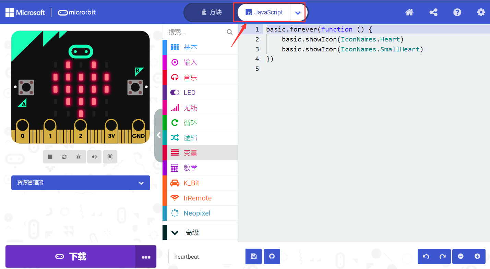

图二

你还可以点击“JavaScript
”，再点击下拉按钮选择“Python”，你还可以看到对应的Python语言代码程序，如下图：

Step 3: 下载代码

如果使用Windows 10 App编写程序，则只需单击“下载”按钮，该代码程序将直接下载到micro:bit主板，而无需任何其他操作。

如果使用浏览器编写程序，请按照以下步骤操作：

单击编辑器中的“下载”按钮。
这将下载一个“hex”文件，该文件是micro：bit可以读取的紧凑程序格式。
十六进制文件下载后，将其复制到你的micro：bit，就像将文件复制到USB驱动器一样。
在Windows上，你还可以右键单击并选择“发送到→MICROBIT（E）”将“hex”文件拷贝到micro：bit。

也可以将“hex”文件直接拖入MICROBIT（E）磁盘中。

将下载好的“hex”文件拷贝到micro：bit过程中，micro:bit主板背面的电源信号灯会闪烁，当拷贝完成后电源信号灯停止闪烁，保持长亮。

Step 4: 运行程序

代码程序上传micro: bit 主板后，通过micro USB线或外接电源供电给micro: bit 主板供电，micro: bit主板上5 x 5 LED点阵显示heartbeat的图案。

micro USB线供电 外接电源供电（3V）

每次编程时，MICROBIT驱动器都会自动弹出并返回，但是你的hex文件将会消失。
micro:bit 只能接收hex文件，不会存储任何其他文件！

本小节向你展示了如何开始使用micro:bit，但是除了MakeCode之外，您还可以使用Python和基于文本的JavaScript来编写micro:bit。转到：<https://microbitorg/code/>查看不同的语言，或查看：<https://microbitorg/projects/>，了解你可能想要尝试的一些内容。

Makecode

，打开makecode在线版本

Project”,出现“创建项目”对话框，在对话框中输入“heartbeat”，单击“创建”进入Makecode
编译器，Makecode 编译器如下:

 

在代码编辑区中，有两个固定的指令方块“当开机时”和“无限循环”。

上电或复位后，“当开机时”指令方块中的代码将仅执行一次；并且“无限循环”指令方块中的代码将循环执行。

快速下载

如前所述，如果使用makecode的Windows 10 App，则可以通过单击“下载”按钮将代码快速下载到micro:bit主板。

使用makecode的浏览器版本下载编写好的代码程序可能需要更多步骤。
但是，如果您将Google Chrome 用于Android，ChromeOS，Linux，macOS和Windows 10系统，则可以实现快速下载功能。

USB硬件设备。
我们将按照以下步骤完成micro：bit设备与网页的连接和配对。

配对装置

用micro USB线连接电脑和micro：bit。

单击“下载”后面的“”，然后单击“设备配对”。

然后继续单击“设备配对”按钮。

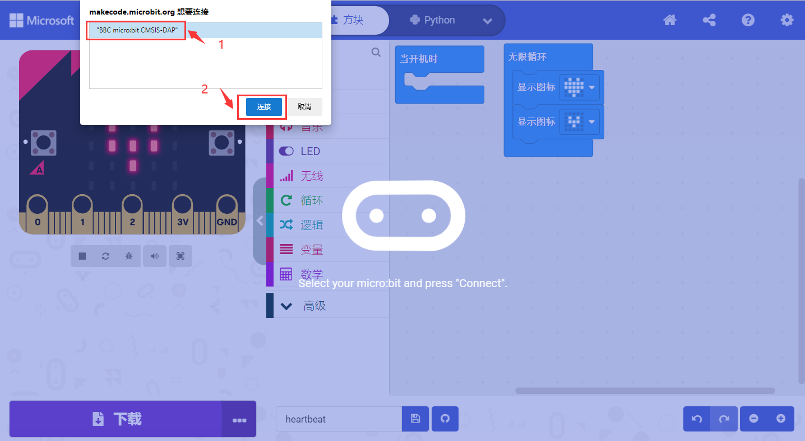

在弹出窗口中选中“设备”，然后单击“连接”按钮。
如果弹出窗口中没有设备，请参考以下内容：[https://makecodemicrobitorg/device/usb/webusb/troubleshoot](https://makecodemicrobitorg/device/usb/webusb/troubleshoot)

当然，如果你不想点击链接进入相关页面中查看，你也可以本教程的文件夹中直接阅读“Troubleshooting downloads with WebUSBpdf”。

https://microbitorg/guide/firmware/](https://microbitorg/guide/firmware/)

连接成功后，单击“下载”按钮，程序将直接下载到Micro:
bit，同时还会出现“下载成功!”提示语。

Makecode扩展

为了轻松使用turtle-bit，我们为turtle-bit制作了一个makecode扩展

turtle-bit
扩展

您可以通过以下方法添加turtle-bit扩展。

打开makecode，在任何项目下，先点击右上角的齿轮图标（设置），再点击扩展。

https://githubcom/Keyes-team/pxt-turtle-bit](https://githubcom/mworkfun/pxt-turtle-bitgit)

然后单击搜索。
其中，可以在不输入链接的情况下直接添加蓝牙，Servo，neopixel等扩展库，只需在扩展首页上单击相应扩展库库的图标即可。

单击搜索结果turtle-bit以下载并安装。
该过程可能需要几秒钟。

安装完成后，您可以在左侧找到K-bit扩展库（包括K_Bit、IrRemote、Neopixel）。

注意：

添加到项目中的扩展库仅对该项目有效，而不会出现在其他项目中。
因此，当您创建K-bit的新项目时，需要再次添加K-bit扩展库。

更新或删除turtle-bit扩展

如果您需要更新或删除turtle-bit扩展程序，请按照以下说明进行操作。

点击 "Js JavaScript" 按钮切换到文本代码。

点击左边的 资源管理器

在扩展列表中找到扩展。

单击垃圾箱图标以删除turtle-bit扩展程序（包括turtleBit、IrRemote、Neopixel）。
单击刷新图标以更新turtle-bit扩展程序。

资源和代码

该工具包的资源和代码可以在下面查看和下载：
https://panbaiducom/s/1LBZKBWd5IF8YSzgnhyZ3hA   
提取码：zusy

KE3021（KE3022）
Keyes套件 turtle-bit Micro bit 小乌龟 多功能 智能小车”的文件夹。
您可以将其放在电脑磁盘上的任何位置。

导入代码

我们为每个项目提供十六进制文件（项目文件）。
十六进制文件包含项目的所有内容，可以直接导入，您也可以手动完成项目代码。如果选择通过拖动代码块来完成代码，则可能需要添加必要的扩展库。

对于简单项目，建议通过拖动代码块来完成项目。

对于复杂的项目，建议通过导入十六进制代码文件来完成项目

接下来，我们以“
Heatbeat”项目为例，介绍如何加载代码。

打开Web版本的makecode。

在弹出的对话框中，单击“导入文件”。

/1Makecode
教程\micro：bit测试程序\81：闪烁的心\microbit-Heartbeat hex”。
然后点击“继续！”

除了上述将提供的项目代码程序文件直接导入到Makecode
编译器中的方法之外，也可以将提供的项目代码程序文件直接拖入到Makecode
编译器中，如下图所示：

几秒钟后，项目成功加载。

注意：如果你的电脑系统是Windows7/8而不是Windows 10，则在Google Chrome中是无法进行设备配对，从而读取不了一些传感器/模块的数字信号或模拟信号，可是又需要读取相应的传感器/模块的数字信号或模拟信号，那怎么办呢？这里就可以使用CoolTerm软件来读取串口的，下面是CoolTerm安装方法。

CoolTerm安装方法：

1  现在，让我们来安装CoolTerm程序，这里我们是以PC     Window系统为例，选择下载安装CoolTerm Win，下载后解压并打开。（PC     Mac系统和PC Linux系统也类似）

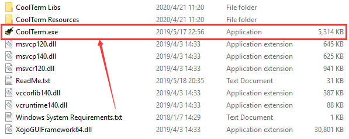

（2）左键双击程序文件

。（注意：必须保证micro:bit驱动已安装和micro:bit已用micro USB数据线连接到电脑上）

The functions of each button on the Toolbar are listed below:

||Opens up a new Terminal|
|-|-|
||Opens a saved Connection|
||Saves the current Connection to disk|
||Opens the 串行 Connection|
||Closes the 串行 Connection|
||Clears the Received Data|
||Opens the Connection Options Dialog|
||Displays the Terminal Data in Hexadecimal 顺序|
||Displays the Help Window|

## 课程介绍

实验81至812是使用micro：bit主板自带的传感器模块和LED点阵。

### 1：闪烁的心

1  实验说明：

首先先来练习一个不需要其他辅助元件，只需要一块micro：bit主板和一根micro USB数据线的简单实验，让micro：bit显示“闪烁的心”，这是一个让micro：bit主板和PC机通信的实验，这也是一个入门实验，希望可以带领大家进入micro：bit的魔幻世界。

2  准备：

（1）通过micro USB线连接micro：bit主板和电脑。

（2）打开Web版本的Makecode。

如果选择通过导入Hex文件来加载项目，请单击“导入”。

如果要一一拖动代码块，请单击“新建项目”。

3  实验代码：

根据下表加载代码（如何加载？）如下图：

|文件类型|路径|文件名|
|-|-|-|
|Hex file|bit测试程序完整版\81：闪烁的心|microbit-Heart beathex|

也可以自己通过拖动代码块来编写代码程序，操作步骤如下：

（1）点击“基础”模块，找到并拖出指令方块“显示图标”放入“无线循环”指令方块中，再复制指令方块“显示图标”1次也放入“无线循环”指令方块中并且点击“❤”图案后面的下拉三角形按钮选择“

”图案

完整的代码程序：

①“无限循环”指令方块仅运行一次以启动程序。

②在“当开机时”指令方块之内，程序循环运行。

③LED点阵显示“❤”图案

④LED点阵显示“”图案

点击micro:
bit在线编程工具的“JSJavaScript”,你可以看到对应的JavaScript语言代码程序：

4  实验结果:

按照之前的方式将代码下载到micro：bit，micro USB数据线不要拔下来，利用micro USB数据线上电，micro:bit主板上的LED点阵屏切换显示“❤”图案和“

”图案，循环进行。

(如何下载？如何快速下载？)

如果存在下载问题，请断开micro USB线和Micro：bit，然后重新连接它们并重新打开Makecode，以尝试再次下载。

### 2：LED点阵中单个LED显示

1  实验说明：

Micro:bit的LED点阵共由25个发光二极管组成，5个一组，分别对应X和Y方向，形成一个5×5的矩阵，且每个发光二极管是放置在行线（X）和列线（Y）的交叉点上，我们可以通过设置坐标点来实现对25个LED中某一个LED的控制。例如，想要LED点阵中第1行第1个LED点亮，可以设置坐标点为（0，0）；第1行第3个LED点亮，可以设置坐标点为（2，0）；第1列第5个LED点亮，可以设置坐标点为（0，4）；第3列第2个LED点亮，可以设置坐标点为（2，1），依此类推。

2  准备：

（1）通过micro USB线连接micro：bit主板和电脑。

（2）打开Web版本的Makecode。

如果选择通过导入Hex文件来加载项目，请单击“导入”。

如果要一一拖动代码块，请单击“新建项目”。   3 实验代码：

根据下表加载代码（如何加载？）如下图：

|文件类型|路径|文件名|
|-|-|-|
|Hex file|/1Makecode 教程\Micro bit测试程序完整版\82：LED点阵中单个LED显示|microbit-LED点阵中单个LED显示hex|

也可以自己通过拖动代码块来编写代码程序，操作步骤如下：

（1）先点击“Led”模块，再点击“Led”模块下的“更多”，找到并拖出指令方块“led
启用
fasle”放入“”指令方块中，点击“false”后面的下拉三角形按钮选择“true”。

2  点击“Led”模块，找到并拖出指令方块“切换x 0y     0”放入“无限循环”指令方块中，将“x 0”改成“x 1”。

3  点击“基础”模块，找到并拖出指令方块“暂停 (ms)     100”放入代码块

中，设置延时500毫秒。

4  复制代码串

1次放入“无限循环”指令方块中。

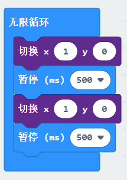

5  点击“Led”模块，找到并拖出指令方块“绘图x 0y     0”放入“无限循环”指令方块中，将“x 0 y 0”改成“x 3 y 4”。

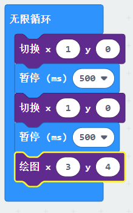

（6）复制指令方块“暂停 (ms) 500”1次“无限循环”指令方块中。

（7）点击“Led”模块，找到并拖出指令方块“取消绘图x 0 y 0”放入“无限循环”指令方块中，将“x 0 y 0”改成“x 3 y 4”，并复制指令方块“暂停 (ms) 500”1次放入“无限循环”指令方块中。

完整的代码程序：

①“当开机时”指令方块仅运行一次以启动程序。

②打开LED点阵屏。

③在“无限循环”指令方块之内，程序循环运行。

④切换处于坐标x 1 y 0的LED亮度。

⑤延时时间500毫秒。

⑥切换处于坐标x 1 y 0的LED亮度。

⑦延时时间500毫秒。

⑧点亮处于坐标x3，y4的LED。

⑨延时时间500毫秒。

⑩熄灭处于坐标x3 y4的LED。

⑪延时时间500毫秒。

点击micro:
bit在线编程工具的“JSJavaScript”,你可以看到对应的JavaScript语言代码程序：

4实验结果：

按照之前的方式将代码下载到micro：bit，micro USB数据线不要拔下来，利用micro USB数据线上电，我们就可以看到切换坐标点(1,0)的LED的亮灭状态，持续05s，再次切换坐标点(1,0)的LED的亮灭状态，持续05s；点亮坐标点(3,4)的LED，持续05s，熄灭坐标点(3,4)的LED，持续05s。循环进行。

4实验结果：

按照之前的方式将代码下载到micro：bit，micro USB线不要从micro：bit上拔下来，利用micro USB线上电，我们就可以看到切换坐标点(1,0)的LED的亮灭状态，持续05s，再次切换坐标点(1,0)的LED的亮灭状态，持续05s；点亮坐标点(3,4)的LED，持续05s，熄灭坐标点(3,4)的LED，持续05s。循环进行。

### 3：5 x 5 LED点阵图案显示

1  实验说明：

点阵在我们生活中很常见，很多都有用到它，比如LED广告显示屏，电梯显示楼层，公交车报站等等。

micro：bit主板的LED点阵共由25个发光二极管组成，上一课我们已经讲过通过设置坐标点来实现对LED点阵的25个LED中的某个LED的控制，这样可以通过设置多个坐标点控制多个LED的亮灭使得LED点阵能够显示图案、数字、字符串。我们也可以在特定代码中通过点击
LED点阵的灰白色小正方形点亮
LED点阵对应的LED来实现LED点阵显示图案、数字、字符串。除了上述方法还可以使用自定义图案使LED点阵显示图案。

2  准备：

（1）通过micro USB线连接micro：bit主板和电脑。

（2）打开Web版本的Makecode。

如果选择通过导入Hex文件来加载项目，请单击“导入”。

如果要一一拖动代码块，请单击“新建项目”。

3  实验代码：

代码1：

根据下表加载代码（如何加载？）如下图：

|文件类型|路径|文件名|
|-|-|-|
|Hex file|/1Makecode 教程\Micro bit 测试程序完整版\83：5 x 5 LED点阵图案显示\microbit-5 x 5 LED点阵图案显示-1|microbit-Code-1hex|

也可以自己通过拖动代码块来编写代码程序，操作步骤如下：

（1）先点击“Led”模块，再点击“Led”模块下的“更多”，找到并拖出指令方块“led
启用
fasle”放入“当开机时”指令方块中，点击“false”后面的下拉三角形按钮选择“true”。

（2）点击“Led”模块，找到并拖出指令方块“绘图 x 0 y 0”放入“无限循环”指令方块中，复制“绘图 x 0 y 0”指令方块8次并且放入“无限循环”指令方块中，将“x 0”y 0”分别改成“x 2”y 0”、“x 2”y 1”、“x 2”y 2”、“x 2”y 3”、“x 2”y 4”、“x 1”y 3”“x 0”y 2”、“x 3”y 3”、“x 4”y 2”。

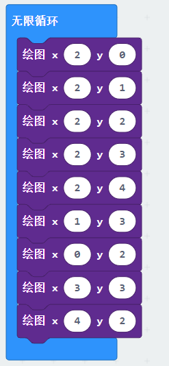

完整的代码程序：

①“当开机时”指令方块仅运行一次以启动程序。

②打开LED点阵屏。

③在“无限循环”指令方块之内，程序循环运行。

④点亮处于坐标x 2，y 0的LED。

⑤点亮处于坐标x 2，y 1的LED。

⑥点亮处于坐标x 2，y 2的LED。

⑦点亮处于坐标x 2，y 3的LED。

⑧点亮处于坐标x 2，y 4的LED。

⑨点亮处于坐标x 1，y 3的LED。

⑩点亮处于坐标x 0，y 2的LED。

⑪点亮处于坐标x 3，y 3的LED。

⑫点亮处于坐标x 4，y 2的LED。

点击micro:
bit在线编程工具的“JSJavaScript”,你可以看到对应的JavaScript语言代码程序：

代码2：

根据下表加载代码（如何加载？）如下图：

|文件类型|路径|文件名|
|-|-|-|
|Hex file|/1Makecode 教程\micro：bit测试程序\83：5×5 LED点阵图案显示\5 x 5 LED点阵图案显示-2|microbit-5 x 5 LED点阵图案显示-2hex|

也可以自己通过拖动代码块来编写代码程序，操作步骤如下：

1  点击“基础”模块，找到并拖出指令方块“显示数字”放入“当开机时”指令方块中，并且复制指令方块“显示数字”4次，将数字0分别改成1、2、3、4、5。

2  从“基础”模块，拖出指令方块“显示LED”放入“当开机时”指令方块中，点击灰蓝色小方框变白色，点亮LED点阵对应的LED，形成“↓”图案。

3  从“基础”模块，拖出指令方块“显示字符串Hello!”放入“当开机时”指令方块中。

4  从“基础”模块，拖出指令方块“显示图标”放入“当开机时”指令方块中。

5  点击“基础”模块，找到并拖出指令方块“显示箭头北”放入“当开机时”指令方块中，复制指令方块“显示箭头北”3次，点击“北”后面的下拉三角形按钮分别选择“东北”、“东南”、“西南”、“西北”。

6  先点击“基础”模块，找到并拖出指令方块“清空屏幕”放入“当开机时”指令方块中，点击“基础”模块，找到并拖出指令方块“暂停
    (ms) 100”放入“当开机时”指令方块中，设置延时500毫秒。

完整的代码程序：

①“当开机时”指令方块仅运行一次以启动程序。

②在LED点阵显示数字1。

③在LED点阵显示数字2。

④在LED点阵显示数字3。

⑤在LED点阵显示数字4。

⑥在LED点阵显示数字5。

⑦在LED点阵点亮对应的LED，显示“↓”图案。

⑧在LED点阵滚动显示字符串“Hello!”。

⑨在LED点阵点亮对应的LED显示“❤”图案。

⑩在LED点阵点亮对应的LED显示“东北”方向箭头图案。

⑪在LED点阵点亮对应的LED显示“东南”方向箭头图案。

⑫在LED点阵点亮对应的LED显示“西南”方向箭头图案。

⑬在LED点阵点亮对应的LED显示“西北”方向箭头图案。

⑭清空屏幕。

⑮延时500毫秒。

点击micro:
bit在线编程工具的“JSJavaScript”,你可以看到对应的JavaScript语言代码程序：

4  实验结果：

按照之前的方式将代码1下载到micro：bit，micro USB线不要从micro：bit上拔下来，利用micro USB线上电，我们就可以看到micro：bit主板的5×5 LED点阵显示“向下”图案

；

用同样的方法将代码2下载到micro：bit，micro USB线不要从micro：bit上拔下来，利用micro USB线上电，我们就可以看到micro：bit主板的5×5 LED点阵开始显示数字1、2、3、4、5，然后循环显示“向下”图案

和“西北”方向图案

。

([How to download?](#A11) [How to quick download?](#快速下载))

### 4：micro：bit的可编程按键

1  实验说明：

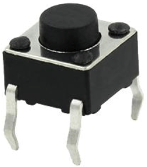按键可以控制电路的通断，把按键接入电路中，不按下按键的时候电路是断开的，一按下按键电路就通啦，但是松开之后就又断了。可是为什么按下才通电呢？这得从按键的内部构造说起。没按下之前，电流从按键的一端过不去另一端，按键的两端就像两座山，中间隔着一条河，我们在这座山过不去另一座山；按下的时候，按键内部的金属片把两边连接起来让电流通过，就像搭了一座桥，把两座山连接起来。

按键内部结构如图：

，未按下按键之前，1、2就是导通的，3、4也是导通的，但是1、3或1、4或2、3或2、4是断开（不通）的；只有按下按键时，1、3或1、4或2、3或2、4才是导通的。

micro：bit主板有三个按键，反面的是复位按钮，正面的是两个可编程按键，通过对两个可编程按键组合可以有三种组合，作为输入元件。我们结合上节课的LED点阵，一起来学习按键吧。我们做一个按键三连，分别按A、B和AB同时按，对应显示屏分别显示A、B和AB。

2  准备：

（1）通过micro USB线连接micro：bit主板和电脑。

（2）打开Web版本的Makecode。

如果选择通过导入Hex文件来加载项目，请单击“导入”。

如果要一一拖动代码块，请单击“新建项目”。

3  实验代码：

代码1：

按下micro：bit上的按键，让micro：bit上
LED点阵显示字符串。

根据下表加载代码（如何加载？）如下图：

|文件类型|路径|文件名|
|-|-|-|
|Hex file|/1Makecode 教程\Micro bit测试程序完整版\84：micro：bit的可编程按键\Code-1|microbit-micro：bit的可编程按键-1hex|

也可以自己通过拖动代码块来编写代码程序，操作步骤如下：

（1）先删除指令方块“当开机时”和“无限循环”，然后点击“输入”模块，找到并拖出“当按钮A被按下时”指令方块。

（2）点击“基础”模块，找到并拖出指令方块“显示数字”放入“当按钮A被按下时”指令方块中，将“Hello!”改成“A”。

（3）复制代码串

1次，点击“A”后面的下拉三角形按钮选择“B”，并将字符“A”改成“B”。

（4）再复制代码串

1次，点击“A”后面的下拉三角形按钮选择“A+B”，并将字符“A”改成“AB”。

完整的代码程序：

①按下micro: bit主板上的按键A。

②LED点阵显示字符“A”。

③按下micro: bit主板上的按键B。

④LED点阵显示字符“B”。

⑤同时按下micro: bit主板上的按键A和B。

⑥LED点阵显示字符“AB”

点击micro:
bit在线编程工具的“JSJavaScript”,你可以看到对应的JavaScript语言代码程序：

代码2：

按下micro：bit主板上正面按键A，条形图高度值增加5，表现为LED点阵亮的行数增加；按下正面按键B，减少条形图高度，表现为LED点阵亮的行数减少。根据下表加载代码（如何加载？）如下图：

|文件类型|路径|文件名|
|-|-|-|
|Hex file|/1Makecode 教程\Micro bit测试程序完整版\84：micro：bit的可编程按键\Code-2|microbit-micro:bit的可编程按键-2hex|

也可以自己通过拖动代码块来编写代码程序，操作步骤如下：

（1）先点击“Led”模块，再点击“Led”模块下的“更多”，找到并拖出指令方块“LED启用false”放入“当开机时”指令方块中，点击“false”后面的下拉三角形按钮选择“true”。

2  点击“输入”模块，找到并拖出“当按钮A被按下时”指令方块。

3  点击“变量”模块，找到并拖出“以1为幅度更改item”指令方块放入“当按钮A被按下时”指令方块中。将数字1改成5。

（5）复制代码串

1次，先点击“A”后面的下拉三角形按钮选择“B”，再将数字5改成-5。

4  点击“Led”模块，找到并拖出指令方块“绘制条图形”放入“无限循环”指令方块中，从“变量”模块中拖出变量指令方块“item”放入of后面的0处，再把to后面的0改成25。

5  ”右侧的数字0改成25；最后从“变量”模块中拖出变量指令方块“将inem设为”放入“如果为then则”指令方块中，将数字0改成25。

（7）复制代码串1次放入

”改成“\<”，数字25都改成0。

完整的代码程序：

①“当开机时”指令方块仅运行一次以启动程序。

②打开LED点阵屏。

③设置变量“item”的初始值为0。

④按下micro: bit主板上的按键A。

⑤以5为幅度更改变量值。

⑥按下micro: bit主板上的按键B。

⑦以 -5为幅度更改变量值。

⑧在“无限循环”指令方块之内，程序循环运行。

⑨点亮LED点阵中LED绘制条形图，最高点亮25个LED。

⑩当变量“item”值大于25是正确的，就运行then下的程序。

⑪将变量“item”值设置为25。

⑫当变量“item”值小于0是正确的，就运行then下的程序。

⑬将变量“item”值设置为0。

点击micro:
bit在线编程工具的“JSJavaScript”,你可以看到对应的JavaScript语言代码程序：

4  实验结果：

按照之前的方式将代码1下载到micro：bit，micro USB线不要从micro：bit上拔下来，利用micro USB线上电，按下micro：bit主板上正面按键A，我们可以看到5×5 LED点阵显示字符“A”；按下micro：bit主板上正面按键B，我们可以看到5×5 LED点阵显示字符“B”，同时按下micro：bit主板上正面按键A和B，我们就可以看到5×5 LED点阵显示字符“AB”。

用同样的方式将代码2下载到micro：bit，micro USB线不要从micro：bit上拔下来，利用micro USB线上电，按下micro：bit主板上正面按键A，条形图高度值增加5，表现为LED点阵亮的行数增加；按下正面按键B，减少条形图高度，表现为LED点阵亮的行数减少。

### 5：microbit学习测温度

1  实验说明：

micro:bit主板实际上并不带温度传感器，而是采用NFR51822芯片内置的温度传感器进行温度检测，所以检测的温度更接近芯片的温度，可能与周围环境温度存在一定的误差。在这一课程中，我们先利用该传感器测试当前环境中的温度，并将测试结果在显示数据(设备)中显示，再通过设置该传感器检测的温度范围来控制LED点阵显示不同的图案。

注意：micro:bit主板的温度传感器在这里：

2  准备：

（1）通过micro USB线连接micro：bit主板和电脑。

（2）打开Web版本的Makecode。

如果选择通过导入Hex文件来加载项目，请单击“导入”。

如果要一一拖动代码块，请单击“新建项目”。

3  实验代码：

代码1：

Micro:bit检测温度

根据下表加载代码（如何加载？）如下图：

|文件类型|路径|文件名|
|-|-|-|
|Hex file|/1Makecode 教程\Micro bit测试程序完整版\85：microbit学习测温度\Code-1|microbit-micro:bit学习测温度-1hex|

也可以自己通过拖动代码块来编写代码程序，操作步骤如下：

（1）点击“高级”下的“串行”模块，找到并拖出指令方块“串行
重定向到 USB”放入“当开机时”指令方块中。

（2）再点击“串行”模块，找到并拖出“串行写入数值
x=0”指令方块放入“无限循环”指令方块中。

（3）点击“输入”模块，找到并拖出指令方块“温度(℃)”放入=后面的数字0处，将x改成Temperature。

（4）点击“基础”模块，找到并拖出指令方块“暂停 (ms) 100”放入“无限循环”指令方块中，设置延时500毫秒。

完整的代码程序：

①“当开机时”指令方块仅运行一次以启动程序。

②串行 重定向到USB。

③在“无限循环”指令方块之内，程序循环运行。

④串行写入数值Temperature=温度（℃）。

⑤延时时间500毫秒。

点击micro:
bit在线编程工具的“jsJavaScript”,你可以看到对应的JavaScript语言代码程序：

按照之前的方式将代码1下载至micro: bit，micro USB线不要从micro：bit上拔下来，利用micro USB线上电，接下来点击显示数据(设备)按钮：

将显示温度数据，如下图所示：

在以上的测试中，将Micro:bit的NFR51822芯片接触，一段时间后，温度开始慢慢上升，此时室温约为35摄氏度，与水杯外侧接触后，温度上升到37摄氏度，符合预期。

如果你的电脑系统是Windows7/8而不是Windows 10，则在Google Chrome中是不能进行设备配对，从而读取不了相应的数字信号或模拟信号，可是又需要读取相应的传感器/模块的数字信号或模拟信号，那怎么办呢？这里就可以使用CoolTerm软件来读取串口的。

打开CoolTerm，点击Options，选择串行Port，设置COM口和波特率，波特率设置为115200（经过测试，micro:bit的USB串口通讯波特率是115200），点击OK后，最后点击Connect。CoolTerm的串口监视器显示当前环境中的温度值，如下图：

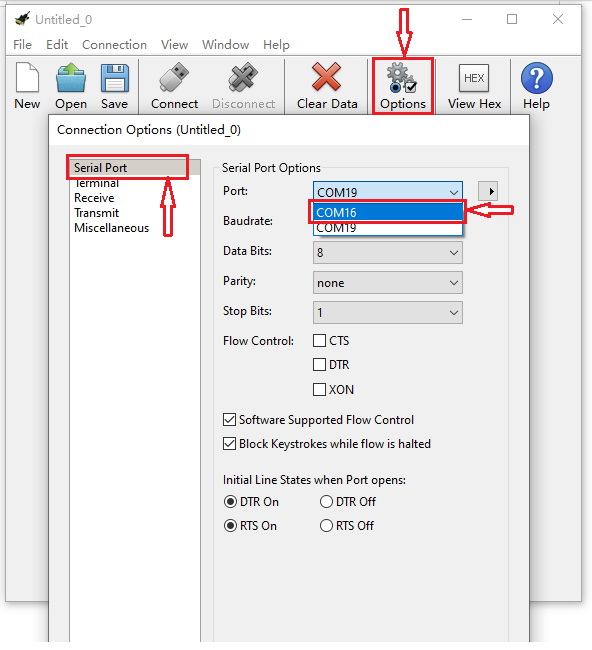

代码2：

通过温度控制mirco：bit上点阵显示不同图案（注意：代码程序中的温度值可以根据当地环境适当的调整）

根据下表加载代码（如何加载？）如下图：

|文件类型|路径|文件名|
|-|-|-|
|Hex file|/1Makecode 教程\Micro bit测试程序完整版\85：microbit学习测温度\Code-2|microbit-micro:bit学习测温度-2hex|

也可以自己通过拖动代码块来编写代码程序，操作步骤如下：

（1）先点击“Led”模块，再点击“Led”模块下的“更多”，找到并拖出指令方块“led
启用
fasle”放入“当开机时”指令方块中，点击“false”后面的下拉三角形按钮选择“true”。

2  点击“逻辑”模块，先找到并拖出指令方块“如果为then否则”放入“无限循环”指令方块中，再拖出“=”方块放入“true”方框中。

3  点击“输入”模块，找到并拖出指令方块“温度(℃)”放入“=”的左侧，点击“=”后面的下拉三角形按钮选择“≥”，再将“≥”右侧的0改成35。

4  点击“基础”模块，找到并拖出指令方块“显示图标”放入如果为下面，又复制指令方块“显示图标”1次放入否则下面并点击“❤”图案后面的下拉三角形按钮选择“

”图案。

完整的代码程序：

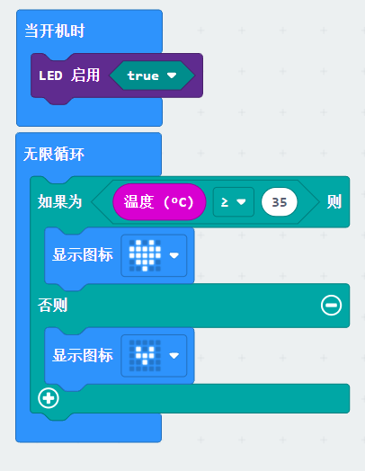

①“当开机时”指令方块仅运行一次以启动程序。

②打开LED点阵屏。

③在“无限循环”指令方块之内，程序循环运行。

④当温度传感器检测到的外界温度≥35℃是正确的，就运行如果为下的程序。

⑤LED点阵显示“❤”图案

⑥当温度传感器检测到的外界温度≥35℃是不正确的，就运行否则下的程序。

⑦LED点阵显示“”图案

点击micro:
bit在线编程工具的“JSJavaScript”,你可以看到对应的JavaScript语言代码程序：

4  实验结果：

按照之前的方式将代码2下载到micro：bit，micro USB线不要从micro：bit上拔下来，利用micro USB线上电，外界环境中的温度小于35℃时，micro：bit主板的5×5LED点阵中显示图案

，用手按住micro：bit主板的温度传感器，温度大于等于35℃时，5×5LED点阵中显示图案

。

### 6：micro:bit的地磁传感器（磁力计/指南针）

1  实验说明：

本实验主要介绍micro:bit地磁传感器的使用，地磁传感器除了检测地磁场强度外，还能当作指南针确定方向，同时也是航姿参考系统(AHRS)的重要组成部分。micro:bit主板采用的是FreescaleMAG3110三轴磁力计，I2C接口与外部通信，量程为±1000µT，最大数据更新速率为80Hz，与加速计结合使用可在任意姿态下计算方位。在micro:bit中，磁力检测、指南针积木块均用到了磁力计模块，本实验中，将先介绍指南针，然后查看磁力计原始数据。常见的指南针主要部件是一根磁针，在地磁场的作用下可以转动并指向北方（指南针其实是指北的），用来辨别方向。micro:bit内部的一个地磁传感器（磁力计、指南针），我们可以读取这个磁力计的读数来判断方位，得到相对于北磁极的数值。返回值是0到360之间的数值，在磁力计首次开始工作（带到新位置后）时系统会自动要求我们对micro:bit主板校准，正确的校准方式是旋转micro:bit主板。需要注意的是，附近要是有金属物件可能会影响读数和校准准确性。

一些地球物理学家们确信，地球磁场是因为固态铁质内核被液态金属“海”所包围而形成的。磁力计指向的北是地磁北极，目前地磁南北极位置位于地理南北极地区，但并不与地球的南北极点完全重合，磁北极和真正的地理北极之间存在一个磁偏角。需要指出的是磁极位置是一直在变化的，历史上还出现过地磁逆转的情况。

我们称呼上的地磁南极，其实是物理上的磁北极，而地磁北极是物理上的磁南极，磁力线从磁北极出射，从磁南极进入，即地磁场从地理南极出来从地理北极进去。地磁南北级与地理南北级基本相反，但不在同一条线上也就是说地磁南极在地理北极附近，地磁北极在地理南极附近，地理南北极的连线和地磁南北级的连线构成磁偏角，即地磁北极（指南针指的方向）与地理北极间的夹角。

2  准备：

（1）通过micro USB线连接micro：bit主板和电脑。

（2）打开Web版本的Makecode。

如果选择通过导入Hex文件来加载项目，请单击“导入”。

如果要一一拖动代码块，请单击“新建项目”。

3  实验代码：

代码1：

按下按键A的时候，可以在屏幕上显示磁力计的读数。

根据下表加载代码（如何加载？）如下图：

|文件类型|路径|文件名|
|-|-|-|
|Hex file|/1Makecode 教程\Micro bit测试程序完整版\86：microbit的地磁传感器（磁力计指南针）\Code-1|microbit-Code-1hex|

也可以自己通过拖动代码块来编写代码程序，操作步骤如下：

1  先点击“输入”模块，再点击“输入”模块下的“更多”，找到并拖出指令方块“校准指南针”放入“当开机时”指令方块中。

A
被按下时”指令方块。

（3）点击“基础”模块，找到并拖出指令方块“显示数字”放入“当按扭
A
被按下时”指令方块中，再点击“输入”模块，找到并拖出指令方块“指南针朝度(℃)”放入指令方块“显示数字”中。

完整的代码程序：

①“当开机时”指令方块仅运行一次以启动程序。

②校准指南针。

③按下micro:bit主板上的按键A。

④LED点阵显示指南针朝向角度。

点击micro:
bit在线编程工具的“JSJavaScript”,你可以看到对应的JavaScript语言代码程序：

代码说明：首先必须对micro:bit进行校准，因为每个地方地磁场不同，对结果有比较大的的影响，如果是第一次使用指南针，micro:bit会自动提示需要校准。

按照之前的方式将代码1下载至micro: bit，micro USB线不要从micro：bit上拔下来，利用micro USB线上电，按下micro:bit主板上正面按键A时，micro:bit主板首先提示校准，屏幕(LED点阵)提示:“TILT TO FILL SCREEN”,然后进入校准界面，校准方式为：旋转micro:bit主板，使得屏幕(LED点阵)画一个封闭的正方形（25个LED都点亮），如下图所示：

当封闭的正方形画好后，会显示一个“笑脸”图案

，表示校准完成。

校准完成后，当按下按键A的时候，直接在屏幕上显示磁力计读数，北、东、南、西对应0°、90°、180°、270°。

代码2：

朝不同的方向旋转磁力计，LED点阵显示对应的方向图案。

根据下表加载代码（如何加载？）如下图：

|文件类型|路径|文件名|
|-|-|-|
|Hex file|/1Makecode 教程\Micro bit测试程序完整版\86：microbit的地磁传感器（磁力计指南针）\Code-2|microbit-Code-2hex|

这个模块意思是，在循环中，不断读取磁力计的读数，并根据读数范围判断所指方向，让箭头指向当前的地磁北方。

如图所示，如果读数在2925和3375之间，就让显示屏显示一个指向右上方的箭头，由于代码里不能输入05，所以取的判断数值是293和338。之后再加入其它逻辑判断条件，就得到了完整的代码。

也可以自己通过拖动代码块来编写代码程序，操作步骤如下：

（1）先点击“输入”模块，再点击“输入”模块下的“更多”，找到并拖出指令方块“校准指南针”放入“当开机时”指令方块中。

2  先点击“变量”模块，找到并拖出“将 X     设为0”放入无限循环指令模块中

（3）点击“输入”模块，找到并拖出指令方块“指南针朝度(℃)”放入指令方块“将
X 设为0”中。

（4）点击“逻辑”模块，找到并拖出指令方块“如果为then则”放入“无限循环”指令方块中，点击

标志6次。

x\<203
”、“x≥203 and x\<248 ”、“x≥248 and x\<293 ”。

（6）点击“基础”模块，找到并拖出指令方块“显示LED”放入第一个
与 下面，点击指令方块“显示
led”上灰蓝色小方框变成白色组成“

”图案。

（7）再从“基础”模块，找到并拖出指令方块“显示LED”7次分别放入第二个、第三个、第四个、第五个、第六个then下面和else下面，对应的分别点击指令方块“x leds”上灰蓝色小方框变成白色组成“

”图案、“

”图案。

完整的代码程序：

①“当开机时”指令方块仅运行一次以启动程序。

②校准指南针。

③在“无限循环”指令方块之内，程序循环运行。

④将指南针朝向的角度存储到变量x中。

⑤当293≤x\<338成立时，就运行与下的程序。

⑥LED点阵显示“”图案

⑦当23≤x\<68成立时，就运行与下的程序。

⑧LED点阵显示“”图案

⑨当68≤x\<113成立时，就运行与下的程序。

⑩LED点阵显示“”图案

⑪当113≤x\<158成立时，就运行与下的程序。

⑫LED点阵显示“”图案

⑬当158≤x\<203成立时，就运行与下的程序。

⑭LED点阵显示“”图案

⑮当203≤x\<248成立时，就运行与下的程序。

⑯LED点阵显示“”图案

⑰当248≤x\<293成立时，就运行与下的程序。

⑱LED点阵显示“”图案

⑲当以上的x范围都不成立时，就运行 否则 下的程序。

⑳LED点阵显示“”图案

点击micro:
bit在线编程工具的“JSJavaScript”,你可以看到对应的JavaScript语言代码程序：

4  实验结果：

按照之前的方式将代码2下载到micro：bit，micro USB线不要从micro：bit上拔下来，利用micro USB线上电，提示校准（校准方法请参考:上面代码1部分），校准完成后，旋转移动micro:bit主板，可以看到micro:bit主板上LED点阵显示方向图案。

### 7：micro: bit的加速度传感器（加速度计）

1  实验说明：

micro:bit主板内置有Freescale MMA8653FC三轴加速度传感器（加速度计），I2C接口与外部通信，10位ADC精度，可设置量程为±2g、±4g,、±8g，数据最大更新速率为800Hz。

当micro:bit处于静止或匀速运动状态时，加速度计仅检测到重力加速度；将micro:bit轻微甩动，加速度计检测到甩动的加速度远小于重力加速度，可忽略不计。因此，在使用micro:bit过程中，主要是检测当姿态变化时，重力加速度在x、y、z轴上的变化，并在此基础上应用。

本实验，将介绍加速度传感器（加速度计）对几个特殊姿态的检测，之后来查看加速度传感器输出的三轴原始数据。

2  准备：

（1）通过micro USB线连接micro：bit主板和电脑。

（2）打开Web版本的Makecode。

如果选择通过导入Hex文件来加载项目，请单击“导入”。

如果要一一拖动代码块，请单击“新建项目”。

3  实验代码：

代码1：

对micro：bit不同的操作，LED点阵显示对应的数字。

根据下表加载代码（如何加载？）如下图：

|文件类型|路径|文件名|
|-|-|-|
|Hex file|/1Makecode 教程\Micro bit 测试程序完整版\87：micro bit的加速度传感器（加速度计）\Code-1|microbit-Code-1hex|

也可以自己通过拖动代码块来编写代码程序，操作步骤如下：

（1）点击“输入”模块，找到并拖出指令方块“当震动”。

（2）点击“基础”模块，找到并拖出指令方块“显示数字”
放入指令方块“当震动”中，将数字0改成1。

（3）复制代码串

7次，先后分别点击“震动”后面的下拉三角形按钮选择“logo up”、“logo down”、“screen up”、“screen down”、“tilt left”、“tilt right”、“free fall”，再将数字1分别对应的改成2、3、4、5、6、7、8。

完整的代码程序：

①振动microbit主板。

②LED点阵显示数字1。

③microbit主板的徽标朝上。

④LED点阵显示数字2。

⑤microbit主板的徽标朝下。

⑥LED点阵显示数字3。

⑦microbit主板屏幕朝上。

⑧LED点阵显示数字4。

⑨microbit主板屏幕朝下。

⑩LED点阵显示数字5。

⑪microbit主板向左倾斜。

⑫LED点阵显示数字6。

⑬microbit主板向右倾斜。

⑭LED点阵显示数字7。

⑮microbit主板自由落体。

⑯LED点阵显示数字8。

点击micro:
bit在线编程工具的“JSJavaScript”,你可以看到对应的JavaScript语言代码程序：

代码2：

检测加速度在X轴，Y轴，Z轴的不同的值

根据下表加载代码（如何加载？）如下图：

|文件类型|路径|文件名|
|-|-|-|
|Hex file|/Makecode代码/87：micro:bit的加速度传感器（加速度计）/micro:bit的加速度传感器（加速度计）-2|microbit-micro:bit的加速度传感器（加速度计）-2hex|

也可以自己通过拖动代码块来编写代码程序，操作步骤如下：

(1)点击“高级”下的“串行”模块，找到并拖出指令方块“串行
重定向到USB”放入“当开机时”指令方块中。

(2)再从“串行”模块，找到并拖出指令方块“串行写入数值
x =0”放入指令方块“无限循环”中。

x
=0”中0处，并将“=”左侧的“x”改成大写的“X”。

(4)点击“基础”模块，找到并拖出指令方块“暂停(ms) 100”放入“无限循环”指令方块中，设置延时100毫秒。

(5)复制代码串

2次放入“无限循环”指令方块中，将先“=”左侧的“X”分别改成“Y”、“Z”，再分别对应的点击“x”后面的下拉三角形按钮选择“y”、“z”。

完整的代码程序：

①“当开机时”指令方块仅运行一次以启动程序。

②串行重定向到USB。

③在“无限循环”指令方块之内，程序循环运行。

④串行写入数值X=x轴的加数度值（mg）

⑤延时时间100毫秒。

⑥串行写入数值Y=y轴的加数度值（mg）

⑦延时时间100毫秒

⑧串行写入数值Z=z轴的加数度值（mg）

⑨延时时间100毫秒

点击micro:
bit在线编程工具的“JSJavaScript”,你可以看到对应的JavaScript语言代码程序：

按照之前的方式将代码1下载到micro：bit，micro USB线不要从micro：bit上拔下来，利用micro USB线上电，打开数据显示(设备)按钮。

首先，查阅MMA8653FC数据手册，以及micro:bit的硬件原理图得知，micro:bit加速度计坐标如下图所示：

显示出如下界面：分别显示了加速度在X轴，Y轴，Z轴的分解，以及加速度的合成(重力加速度及其它外力作用的加速度合成)，如下图:

实验中，先将加速计Z轴朝上，然后再将加速计X轴朝上，最后将加速计Z轴朝上，可得数据变化如上图所示

如果你的电脑系统是Windows7/8而不是Windows 10，则在Google Chrome中是不能进行设备配对，从而读取不了相应的数字信号或模拟信号，可是又需要读取相应的传感器/模块的数字信号或模拟信号，那怎么办呢？这里就可以使用CoolTerm软件来读取串口的。

打开CoolTerm，点击Options，选择串行Port，设置COM口和波特率，波特率设置为115200（经过测试，micro:bit的USB串口通讯波特率是115200），点击OK后，最后点击Connect。CoolTerm串口监视器分别显示了加速度在X轴、Y轴、Z轴的分解，以及加速度的合成(重力加速度及其它外力作用的加速度合成)，先将加速计Z轴朝上，然后再将加速计X轴朝上，最后将加速计Z轴朝上,可得数据变化如下图：

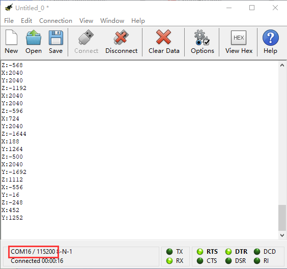

4  实验结果：

按照之前的方式将代码1下载到micro：bit，micro USB线不要从micro：bit上拔下来，利用micro USB线上电，将micro:bit主板晃动，则可见micro:bit显示数字1（表明只要有晃动，无论朝哪个方向晃动，该条件都将满足）。

([How to download?](#A01) [How to quick download?](#快速下载))

徽标指的是micro:bit主板上的micro:bit这几个字以及Logo，徽标朝上示意图如下所示：

由图可得，当徽标朝上的时候，能够显示数字2。

同理，徽标朝下指的是micro:bit主板上的micro:bit这几个字以及Logo朝下，徽标朝下示意图如下所示：

由图可得，当徽标朝下的时候,显示的是数字3(倒立的3)。

当屏幕朝上（指的是LED点阵朝上）时，显示数字4。

同理，当屏幕朝下（指的是LED点阵朝下）时，显示数字5。

当向左倾斜时，如下图为micro:bit向左倾斜示意图:

注意micro:bit向左倾斜为正面朝上，徽标朝前，然后再往左边倾斜，当向左倾斜时，micro:bit显示数字6。

当向右倾斜时，如下图为micro:bit向右倾斜的示意图:

注意micro:bit向右倾斜为正面朝上，徽标朝前，然后再往右边倾斜，当向右倾斜时，micro:bit显示数字7。

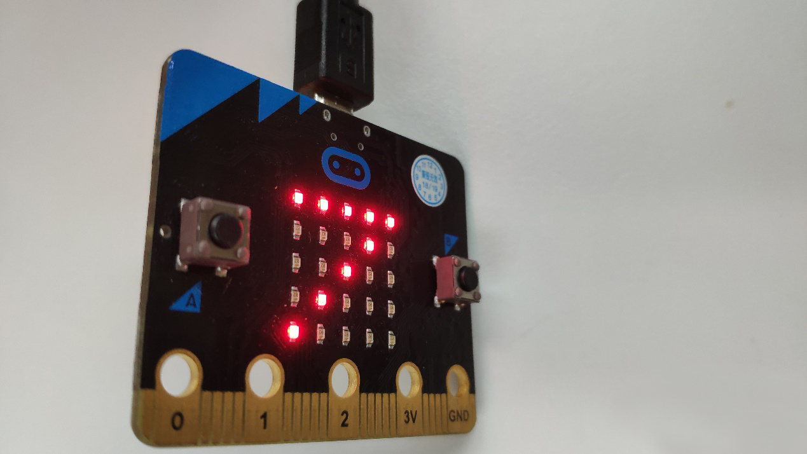

当不小心碰到micro:bit主板使其从桌面掉落，则为做自由落体运动，此时，满足自由落体的条件，将显示数字8。（注意：此方法操作时，很容易把micro:bit主板摔坏，不建议操作）

注意：（3g、6g、8g，
如果需要满足此条件，则需要达到3倍，6倍，8倍重力加速度甩动micro：bit。如果你们有兴趣的话，这部分代码可以自己添加）

### 8：micro:bit的光照强度检测

1  实验说明：

本实验将介绍micro:bit对外界光照强度的检测，由于micro:bit并不自带光敏传感器，对外界光照强度的检测是通过LED矩阵进行的，LED矩阵被用来感知周围的光，并反复地将LED转换成输入，并采样电压衰减时间。这样检测出来的光照强度是一个相对值。

2  准备：

（1）通过micro USB线连接micro：bit主板和电脑。

（2）打开Web版本的Makecode。

如果选择通过导入Hex文件来加载项目，请单击“导入”。

如果要一一拖动代码块，请单击“新建项目”。

3  实验代码：

根据下表加载代码（如何加载？）如下图：

|文件类型|路径|文件名|
|-|-|-|
|Hex file|/1Makecode 教程\Micro bit测试程序完整版\88：microbit的光照强度检测microbit的光照强度检测|microbit-micro：bit的光照强度检测hex|

也可以自己通过拖动代码块来编写代码程序，操作步骤如下：

（1）点击“高级”下的“串行”模块，找到并拖出指令方块“串行写入数值
USB”放入“当开机时”指令方块中。

x
=0”放入指令方块“无限循环”中。

（3）点击“输入”模块，找到并拖出指令方块“亮度级别”放入指令方块“
串行写入x =0”中0处，并将“=”左侧的“x”改成大写的“Light intensity”。

（4）点击“基础”模块，找到并拖出指令方块“暂停 (ms) 100”放入“无限循环”指令方块中，设置延时100毫秒。

完整的代码程序：

①“当开机时”指令方块仅运行一次以启动程序。

②串行重定向到USB。

③在“无限循环”指令方块之内，程序循环运行。

④串行写入数值Light intensity=光照强度。

⑤延时时间100毫秒。

点击micro:
bit在线编程工具的“JSJavaScript”,你可以看到对应的JavaScript语言代码程序：

4  实验结果：

按照之前的方式将代码下载到micro：bit，micro USB线不要从micro：bit上拔下来，利用micro USB线上电，打开数据显示(设备)按钮。

数据显示器显示亮度级别值，用手全部遮住micro:bit的LED点阵，亮度级别约为0；然后将micro:bit的LED点阵放置于光照下，随着光照强度增强，亮度级别值也在逐渐增大。

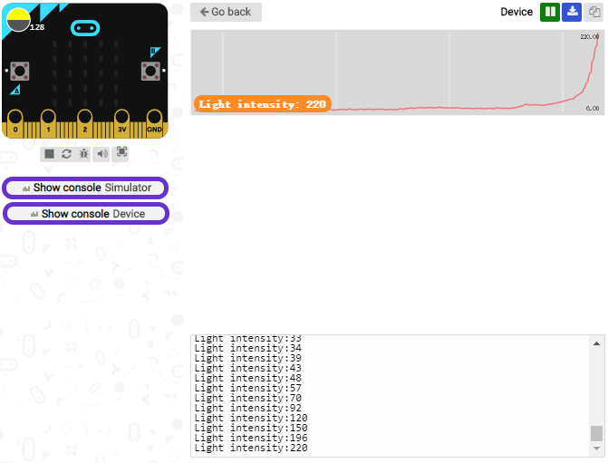

如果你的电脑系统是Windows7/8而不是Windows 10，则在Google Chrome中是不能进行设备配对，从而读取不了相应的数字信号或模拟信号，可是又需要读取相应的传感器/模块的数字信号或模拟信号，那怎么办呢？这里就可以使用CoolTerm软件来读取串口的。

打开CoolTerm，点击Options，选择串行Port，设置COM口和波特率，波特率设置为115200（经过测试，micro:bit的USB串口通讯波特率是115200），点击OK后，最后点击Connect。这样，CoolTerm串口监视器显示光线亮度级别值。

### 9：扬声器

1实验说明：

micro:bit主板有内置扬声器，这使得在你的项目中添加声音变得非常容易。通过编程使扬声器发出各种各样的音调，例如编写一首歌曲：《欢乐颂》，让扬声器播放出来。

2准备：

（1）通过micro USB线连接micro：bit和电脑。

（2）打开Web版本的Makecode。

如果选择通过导入Hex文件来加载项目，请单击“导入”。

[(How to import?) ](#资源和代码)

如果要一一拖动代码块，请单击“新建项目”。

3实验代码：

根据下表加载代码（如何加载？）如下图：

|文件类型|路径|文件名|
|-|-|-|
|Hex file|/1Makecode 教程\Micro bit测试程序完整版\89：扬声器|microbit-扬声器hex|

也可以自己通过拖动代码块来编写代码程序，操作步骤如下：

（1）从“基础”模块中找到并拖出指令方块“显示图标”放入“当开机时”指令方块中，点击下拉三角形选择“

”图案。

（2）点击“音乐”模块，找到并拖出指令方块“播放声音
咯咯声
值到结束”放入“”指令方块中，再从“基础”模块中找到并拖出指令方块“暂停(ms) 100”放入“无限循环”指令方块中，将100改成1000。

（3）复制代码串

3次也放入“无限循环”指令方块中，点击下拉三角形分别选择“快乐”,”你好”,”打哈欠”。

完整的代码程序：

①“当开机时”指令方块仅运行一次以启动程序。

②LED点阵屏显示“”图案。

③在“无限循环”指令方块之内，程序循环运行。

④蜂鸣器发出“咯咯声”音

⑤延时1000毫秒

⑥蜂鸣器发出“快乐”音

⑦延时1000毫秒

⑧蜂鸣器发出“你好”音

⑨延时1000毫秒

⑩蜂鸣器发出“打哈欠”音

⑪延时1000毫秒

点击micro:
bit在线编程工具的“JSJavaScript”,你可以看到对应的JavaScript语言代码程序：

4实验现象:

按照之前的方式将实验代码下载到micro：bit板，利用micro USB数据线上电，micro:bit主板上的扬声器发出声音且LED点阵显示音乐标志图案。

### 10：触摸感应logo

1  实验说明：

如果你有了micro:bit主板，你可以在你的项目中使用金色的触摸感应logo作为另一个输入，这就像多了一个按钮。触摸感应采用的是电容式触摸传感器，当你手指按下（或触摸）它时，它就能感应到电场的微小变化----就像你的手机或平板电脑屏幕一样。当你像按按钮一样按下它时，你可以在程序中触发事件。

2准备：

（1）通过micro USB线连接micro：bit和电脑。

（2）打开Web版本的Makecode。

如果选择通过导入Hex文件来加载项目，请单击“导入”。

如果要一一拖动代码块，请单击“新建项目”。

3实验代码：

根据下表加载代码（如何加载？）如下图：

|文件类型|路径|文件名|
|-|-|-|
|Hex file|/1Makecode 教程\Micro bit测试程序完整版\810：触摸感应logo|microbit-触摸感应LOGOhex|

也可以自己通过拖动代码块来编写代码程序，操作步骤如下：

（1）删除掉“当开机时”指令方块和“无限循环”指令方块。

（2）从“输入”模块中找到并拖出“当微标
被按下”指令方块，点击下拉三角形按钮选择 被触摸。

3  先点击“变量”模块，再点击“设置变量”按钮，在出现的对话框中输入start，点击OK，这样就创建了变量“start”。从“变量”模块中拖出变量指令方块“将start     设为 0”放入指令方块“当微标被触摸”中。

4  点击“输入”模块下的更多，找到并拖出“运行时间(ms)”放入变量指令方块“将start     设为 0”的数字0处。

5  从“基础”模块中找到并拖出指令方块“显示图标❤”放入“当微标被触摸”指令方块中。

6  从“输入”模块中找到并拖出“当微标被按下”指令方块，选择被松开，接着用同样的方法再创建变量“time”。从“变量”模块中拖出变量指令方块“将
    time     设为0”放入指令方块“当微标被松开”中，并从“数学”模块中找到并拖出“0-0”方块放入变量指令方块“将
    time 设为0”的数字0处。

7  点击“输入”模块下的更多，找到并拖出“运行时间(ms)”放入“0-0”方块的左侧数字0处，再从“变量”模块中拖出变量指令方块“start”放入右侧数字0处。

8  先从“基础”模块中找到并拖出指令方块“显示数字”放入“当微标被松开”指令方块中，再从“数学”模块中找到并拖出方块“平方根
    0 ”放入数字0处，点击下拉三角形按钮选择 整数÷。

9  从“变量”模块中找到并拖出变量指令方块“time”放入右侧数字0处，再把右侧的数字0改成1000。

完整的代码程序：

①手触摸microbit主板上的logo标志

②将running time值赋给于变量start

③microbit主板的LED点阵显示“❤”图案

③手释放microbit主板上的logo标志

④将running time－变量start的值赋给于变量time

⑤LED点阵屏显示变量time除于1000的取整

点击micro:
bit在线编程工具的“JSJavaScript”,你可以看到对应的JavaScript语言代码程序：

4实验现象:

按照之前的方式将实验代码下载到micro：bit板，利用micro USB数据线上电，手指按住micro:bit主板上“Logo”标志处，micro:bit主板上的LED点阵显示“❤”图案；手指松开micro:bit主板上“Logo”标志处，会出现数字。

### 11：麦克风

1实验说明：

micro:bit
主板有一个内置麦克风，可以测量环境的声音程度。你可以使用它作为一个简单的输入---当你鼓掌时，micro:bit主板上前面内置麦克风LED指示灯会被打开。它还可以测量声音的强度，所以你可以制作一个噪音等级表或与音乐合拍的迪斯科灯光。麦克风是在micro:bit
主板的背面，而在前面，你会发现一个内置麦克风LED指示灯，还有紧挨着让声音进入麦克风的孔。当你micro:bit主板在测量声音级别时，它就会亮起来。

2准备：

（1）通过micro USB线连接micro：bit主板和电脑。

（2）打开Web版本的Makecode。

如果选择通过导入Hex文件来加载项目，请单击“导入”。

[(How to import?) ](#资源和代码)

如果要一一拖动代码块，请单击“新建项目”。

3实验代码：

根据下表加载代码（如何加载？）如下图：

<table style="width:100%;">

|文件类型|路径|文件名|
|-|-|-|
|Hex file|/1Makecode 教程\Micro bit测试程序完整版\811：麦克风\811：麦克风-1|microbit-麦克风-1hex|

也可以自己通过拖动代码块来编写代码程序，操作步骤如下：

（1）删除掉“当开机时”指令方块和“无限循环”指令方块。

（2）先从“输入”模块中找到并拖出“大声
声音”指令方块，再从“基础”模块中找到并拖出指令方块“显示图标”放入“但开机时”指令方块中。

1  复制代码串

1次，点击“大声”后面的下拉三角形按钮选择“安静”，再点击❤后面的下拉三角形按钮选择

。

完整的代码程序：

①microbit主板上的麦克风检测到声音

②LED点阵屏显示“❤”图案

③microbit主板上的麦克风未检测到声音

④LED点阵屏显示“”图案

点击micro:
bit在线编程工具的“JSJavaScript”,你可以看到对应的JavaScript语言代码程序：

4实验现象1：

USB数据线上电，当你鼓掌时，micro:bit
主板上的LED点阵显示“❤”图案；当外界环境安静时，micro:bit
主板上的LED点阵显示“

”图案。

5  实验代码2:

根据下表加载代码（如何加载？）如下图：

|文件类型|路径|文件名|
|-|-|-|
|Hex file|/1Makecode 教程\Micro bit测试程序完整版\811：麦克风\811：麦克风-2|microbit-麦克风-2hex|

也可以自己通过拖动代码块来编写代码程序，操作步骤如下：

（1）点击“高级”下的“串行”模块，找到并拖出指令方块“串行
重新 定向到 USB”放入“当开机时”指令方块中。

（2）先点击“变量”模块，再点击“设置变量”按钮，在出现的对话框中输入maxSound，点击OK，这样就创建了变量“maxSound”。从“变量”模块中拖出变量指令方块“将maxSound
设为 0”放入指令方块“当开机时”中。

2  先点击“逻辑”模块，找到并拖出“如果为则否则”放入“无限循环”指令方块中，再从“输入”模块中找到并拖出“当按钮
    A 被按下”指令方块放入then处。

3  先从“基础”模块中找到并拖出指令方块“显示数字”放入如果为下，再从“变量”模块中拖出变量指令方块“maxSound”放入数字0处。

4  设为
    0”放入否则下，然后从“输入”模块中找到并拖出“声音响度”指令方块放入数字0处。

5  先点击“Led”模块，找到并拖出指令方块“绘制条形图值为
    0 最高
    0”也放入否则下，再从“变量”模块中拖出变量指令方块“soundLevel”放入值为后面的数字0处，然后将
    最高 后面的数字0改成255。

6  则
    ”放入“否则”下，再从“逻辑”模块中拖出“0 \>
    0”方块放入then处，然后从“变量”模块中拖出变量指令方块“soundLevel”放入左侧的数字0处，最后从“变量”模块中拖出变量指令方块“maxSound”放入右侧的数字0处。

7  从“变量”模块中拖出变量指令方块“将 maxSound     设为0”放入第2个如果为下，接着又从“变量”模块中拖出变量指令方块“soundLevel”放入数字0处。

完整的代码程序：

①“当开机时”指令方块仅运行一次以启动程序。

②串行重定向到USB。

③将变量maxSound初始值为0

④在“无限循环”指令方块之内，程序循环运行

⑤如果按键A按下时，执行then下程序

⑥LED点阵屏显示麦克风检测到的此时环境中最大声音级别值

⑦上述条件不成立时，执行else下程序

⑧将声音级别值赋给于变量soundLevel

⑨LED点阵中LED点亮的亮度级别，最高亮度为255。

⑩否则如果麦克风检测到的声音级别值大于此时环境中最大声音级别值

⑪将变量麦克风检测到的声音级别值赋给于变量soundLevel

点击micro:
bit在线编程工具的“JSJavaScript”,你可以看到对应的JavaScript语言代码程序：

6  实验现象2：

按照之前的方式将实验代码2下载到micro：bit板，利用micro USB数据线上电，点击“显示控制台(设备)”按钮：

串口输出数据，当外界环境的声音增大时，串口输出的声音级别值也增大，如下图所示：

LED点阵显示检测到的此时环境中最大声音级别值（这里需要注意：通过按micro:bit背面的重置按钮重置最大值。）；当鼓掌时，LED点阵显示声音级别大小图案。

### 12：micro:bit的蓝牙无线通信

1  实验说明：

micro:bit主板自带了[nRF52833](https://wwwnordicsemicom/Products/Low-power-short-range-wireless/nRF52833)处理器（内置蓝牙51低功耗的BLE(Bluetooth Low Energy)设备）以及24GHz天线，可进行蓝牙无线通信和24GHz无线通信。使得micro:bit主板可以与各种蓝牙设备进行通信，包括智能手机和平板电脑。

在本实验中，主要讲解新款的micro:bit主板实现蓝牙无线通信功能，我们可以通过连接蓝牙，实现无线传输代码（信号）功能。我们利用一个苹果系统设备（手机/iPad）和micro:bit
主板连接，实现无线传输功能。设置安卓系统手机实现无线传输方法和苹果系统设备（手机/iPad）类似，这里就不一一介绍了。

2  准备：

1  通过micro     USB线将micro:bit主板连接到电脑上。

2  苹果系统设备（手机/iPad）或安卓系统手机。

3  实验步骤：

，点击“Download pairing HEX file”下载micro:bit的固件到创建的文件夹中或电脑桌面上，并将下载好的micro:bit固件烧入micro:bit主板中。（这一步只针对于苹果系统的智能手机/iPad）

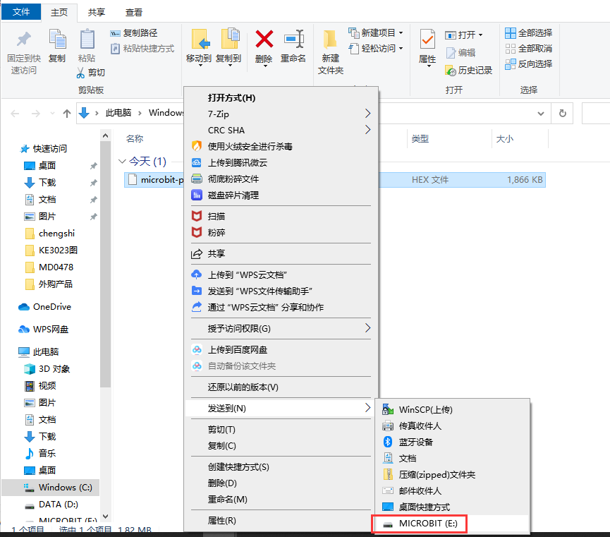

（2）在苹果系统设备（手机/iPad）上打开

bit”，然后选中micro:bit
选项，会出现下载界面（如下图所示：），点击“

”，就可以下载安装对应的APP。

（3）苹果系统设备（手机/iPad）和micro:bit主板配对连接。

1  打开苹果系统设备（手机/iPad）上的蓝牙。

2  APP安装成功后，点击

打开APP，先确定micro     USB数据线已经将micro:bit主板和电脑连接上，再点击APP的第一项“Choose     micro:bit”，开始配对蓝牙。

3  点击配对一个新的micro:bit，开始配对。

4  根据提示，首先同时按住micro:bit主板上的按键A和B，然后按下micro:bit主板后面的复位&电源按钮几秒钟（按键A和B不能松开），再松开复位&电源按钮，micro:bit主板上LED点阵会显示一个密码图案。最后松开micro：bit主板上的按键A和B，接着点击“下一步”。

5  在苹果系统手机/iPad上设置密码图案，使图案和micro:bit主板上显示的密码图案一样，点击“下一步”。

6  点击“下一步”，出现对话框，在对话框中点击“Pair”。几秒钟后，配对成功，同时micro:bit主板上的LED点阵显示“√”图案。

（3）蓝牙配对成功后，开始利用APP编写代码，并上传代码。

a点击第二项“Create Code”，进入编程界面，开始编写代码程序。（点击

，出现对话框

，在对话框中直接点击“Create
√”后就进入编程界面）

b
将代码程序项目名称设置为“1”，点击保存图案“

”，保存代码程序。

c项目代码程序保存成功后，点击第三项“Flash”进入上传代码程序界面。默认选择代码程序是刚刚保存的项目名称为“1”的代码程序，然后点击“Flash”上传代码程序“1”。

d几秒钟后，代码程序“1”上传成功，会显示如下图。然后micro:bit主板上的LED点阵显示跳跃的“心”对应图案。

上面的实验是使用micro：bit自带的传感器模块和LED点阵，接下来的实验都是micro:bit与keyes micro:bit 迷你智能乌龟车上的传感器模块、无源蜂鸣器、4个WS2812 RGB灯和2个RGB灯等的拓展实验。

USB
线与micro：bit主板的连接和关闭micro:bit电机驱动扩展板上的电源（拨动POWER拨码开关到OFF一端）；同理，micro：bit主板从小车扩展板拿下来之前也要先断开micro USB
线与micro：bit主板的连接和关闭micro:bit电机驱动扩展板上的电源（拨动POWER拨码开关到OFF一端）。）

### 13：无源蜂鸣器播放音乐

1实验说明：

我们可以用micro:bit制作许多互动作品，其中最常用的是声光显示。之前所有的实验都和LED有关。然而，这个实验中的电路可以产生声音。通常情况下，实验是用蜂鸣器或扬声器进行的，而蜂鸣器更简单、更容易使用。

我们这里介绍的蜂鸣器是无源蜂鸣器。它不能由自身驱动，而是由外部脉冲频率驱动。不同的频率产生不同的声音。我们可以使用micro:bit来编码歌曲的旋律，这实际上是非常有趣和简单的。

蜂鸣器可分为有源蜂鸣器和无源蜂鸣器两种。无源蜂鸣器利用电磁感应现象，为音圈接入交变电流后形成的电磁铁与永磁铁相吸或相斥而推动振膜发声，接入直流电只能持续推动振膜而无法产生声音，只能在接通或断开时产生声音。

　　有源蜂鸣器往往比无源蜂鸣器的贵，就是因为里面多个震荡电路，只需接入额定电压的直流电即可发出指定频率的声音，频率由内部振荡电路决定，无法改变。而无源蜂鸣器内部不带振荡源，直流信号无法令其鸣叫，须用方波驱动。

　　（1）制作成本低；  
　　（2）声音频率范围宽，可高分贝的发出某些频率的超声波以及可以做出“多来米发索拉西”的效果；  
　 （3）在一些特例中，可以和LED复用一个控制IO口。

无源蜂鸣器频率是由英文和数字组成的音名，选择不同的音名就能改变不同的频率啦。声音频率的高低叫做音调。在音乐课上，老师教过我们唱“1（Do）、2（Re）、3(Mi)、4(Fa) 、5(Sol) 、6(La) 、7(Si)”是音乐当中的唱名，就对应了音调中的C、D、E、F、G、A、B这些音名。

频率（音调）高低判断时先看后面的数字，数字越大，音调越高，数字相同时看前面的字母，从C到B频率（音调）越来越高；而节拍是音符延时时间，数值越大，延时时间越长。

节拍是指每个音符持续的时间。音谱中不带线的一个音符就是一拍，延时1000毫秒，而带一条下划线的音符节拍是不带线音符节拍的1/2，带两条下划线的音符节拍是不带线音符节拍的1/4（

）

在本实验中，
Micro:bit电机驱动扩展板上自带有无源蜂鸣器元件，它是由micro:bit的P0接口控制。实验中我们用软件自带的库文件，让无源蜂鸣器演奏”欢乐颂“歌曲，下面是《欢乐颂》歌曲的简谱。

2  准备：

（1）将micro:bit主板正确插入keyes Micro:bit迷你智能乌龟车。

（2）将电池装入keyes Micro:bit迷你智能乌龟车。

（3）将Micro:bit的电机驱动扩展板上的POWER拨码开关拨到ON一端，开启电源。

（4）通过micro USB线连接micro:bit主板和电脑。

（5）打开Web版本的Makecode。

如果选择通过导入Hex文件来加载项目，请单击“导入”。

如果要一一拖动代码块，请单击“新建项目”。

3  实验代码：

根据下表加载代码（如何加载？）如下图：

|文件类型|路径|文件名|
|-|-|-|
|Hex file|/1Makecode 教程\Micro bit测试程序完整版\813：无源蜂鸣器播放音乐|microbit-无源蜂鸣器播放音乐hex|

也可以自己通过拖动代码块来编写代码程序，操作步骤如下：

（1）先点击“Led”模块，再点击“Led”模块下的“更多”，找到并拖出指令方块“led
启用 fasle”放入“当开机时”指令方块中。

2  点击“音乐”模块，找到并拖出指令方块“播放音调
    中C持续 1 节拍
    节拍”放入“无限循环”指令方块中，根据上面的“欢乐颂”歌谱，点击指令方块
    “播放音调 中C持续 1 节拍 节拍”的“中
    C”处，会出现

图案，选择“高
    E”

并点击，接着点击“1     节拍”选择“1”。

3  根据上面的“欢乐颂”歌谱可知，复制“无限循环”指令方块中的“播放音调
    高E 持续 1 节拍 节拍”指令方块124次，点击指令方块“播放音调 高E 持续 1     节拍 节拍”的“高 E”处和1 节处分别对应的改成：

|序号|音调|节拍|序号|音调|节拍|序号|音调|节拍|序号|音调|节拍|
|-|-|-|-|-|-|-|-|-|-|-|-|
|①|高 E|1|②|高 F|1|③|高 G|1|④|高 G|1|
|⑤|高 F|1|⑥|高 E|1|⑦|高 D|1|⑧|高 C|1|
|⑨|高 C|1|⑩|高 D|1|⑪|高 E|1|⑫|高 E|1|
|⑬|高 D|1/2|⑭|高 D|1|⑮|高 E|1|⑯|高 E|1|
|⑰|高 F|1|⑱|高 G|1|⑲|高 G|1|⑳|高 F|1|
|㉑|高 E|1|㉒|高 D|1|㉓|高 C|1|㉔|高 C|1|
|㉕|高 D|1|㉖|高 E|1|㉗|高 D|1|㉘|高 C|1/2|
|㉙|高 C|1|㉚|高 D|1|㉛|高 D|1|㉜|高 E|1|
|㉝|高 C|1|㉞|高 D|1|㉟|高 E|1/2|㊱|高 F|1/2|
|㊲|高 E|1|㊳|高 C|1|㊴|高 D|1|㊵|高 E|1/2|
|㊶|高 F|1/2|㊷|高 E|1|㊸|高 D|1|㊹|高 C|1|
|㊺|高 D|1|㊻|中 G|1|㊼|高 E|1|㊽|高 E|1|
|㊾|高 E|1|㊿|高 F|1|51|高 G|1|52|高 G|1|
|53|高 F|1|54|高 E|1|55|高 D|1|56|高 C|1|
|57|高 C|1|58|高 D|1|59|高 E|1|60|高 D|1|
|61|高 C|1/2|62|高 C|1|63|高 D|1|64|高 D|1|
|65|高 E|1|66|高 C|1|67|高 D|1|68|高 E|1/2|
|69|高 F|1/2|70|高 E|1|71|高 C|1|72|高 D|1|
|73|高 E|1/2|74|高 F|1/2|75|高 E|1|76|高 D|1|
|77|高 C|1|78|高 D|1|79|中 G|1|80|高 E|1|
|81|高 E|1|82|高 E|1|83|高 F|1|84|高 G|1|
|85|高 G|1|86|高 F|1|87|高 E|1|88|高 C|1|
|89|高 C|1|90|高 C|1|91|高 D|1|92|高 E|1|
|93|高 D|1|94|高 C|1/2|95|高 C|1|96|高 D|1|
|97|高 C|1/2|98|高 C|1|99|高 G|1|100|高 F|1|
|101|高 E|1/2|102|高 E|1|103|高 C|1|104|高 B|1|
|105|高 A|1/2|106|高 A|1|107|高 F|1/2|108|高 D|1/2|
|109|高 C|1/2|110|中 B|1/2|111|高 D|1/2|112|中 B|1/2|
|113|中 A|1/2|114|中 G|1/2|115|中 A|1/2|116|中 B|1/2|
|117|高 C|1/2|118|高 E|1/2|119|高 D|1/2|120|中 B|1/2|
|121|高 C|1|122|高 C|1/2|123|高 C|1/4|124|高 C|1|

完整的代码程序：

①“当开机时”指令方块仅运行一次以启动程序。

②关闭LED点阵屏。

③在“无限循环”指令方块之内，程序循环运行

④播放音调高E持续1节拍

⑤播放音调高E持续1节拍

⑥播放音调高F持续1节拍

⑦播放音调高G持续1节拍

⑧播放音调高G持续1节拍

⑨播放音调高F持续1节拍

⑩播放音调高E持续1节拍

⑪播放音调高D持续1节拍

⑫播放音调高D持续1节拍

⑬播放音调高C持续1节拍

⑭播放音调高D持续1节拍

⑮播放音调高E持续1节拍

⑯播放音调高E持续1节拍

⑰播放音调高D持续1/2节拍

⑱播放音调高D持续1节拍

⑲播放音调高E持续1节拍

⑳播放音调高E持续1节拍

㉑播放音调高F持续1节拍

㉒播放音调高G持续1节拍

㉓播放音调高G持续1节拍

㉔播放音调高F持续1节拍

㉕播放音调高E持续1节拍

㉖播放音调高F持续1节拍

㉗播放音调高C持续1节拍

㉘播放音调高C持续1节拍

㉙播放音调高D持续1节拍

㉚播放音调高E持续1节拍

㉛播放音调高D持续1节拍

㉜播放音调高C持续1/2节拍

㉝播放音调高C持续1节拍

㉞播放音调高D持续1节拍

㉟播放音调高D持续1节拍

㊱播放音调高E持续1节拍

㊲播放音调高C持续1节拍

㊳播放音调高D持续1节拍

㊴播放音调高E持续1/2节拍

㊵播放音调高F持续1/2节拍

㊶播放音调高E持续1节拍

㊷播放音调高C持续1节拍

㊸播放音调高D持续1节拍

㊹播放音调高E持续1/2节拍

㊺播放音调高F持续1/2节拍

㊻播放音调高E持续1节拍

㊼播放音调高D持续1节拍

㊽播放音调高C持续1节拍

㊾播放音调高C持续1节拍

㊿播放音调中G持续1节拍

播放音调高E持续1节拍

播放音调高E持续1节拍

播放音调高E持续1节拍

播放音调高F持续1节拍

播放音调高G持续1节拍

播放音调高G持续1节拍

播放音调高F持续1节拍

播放音调高E持续1节拍

播放音调高D持续1节拍

播放音调高C持续1节拍

播放音调高C持续1节拍

播放音调高D持续1节拍

播放音调高E持续1节拍

播放音调高D持续1节拍

播放音调高C持续1/2节拍

播放音调高C持续1节拍

播放音调高D持续1节拍

播放音调高D持续1节拍

播放音调高E持续1节拍

播放音调高C持续1节拍

播放音调高D持续1节拍

播放音调高E持续1/2节拍

播放音调高F持续1/2节拍

播放音调高E持续1节拍

播放音调高C持续1节拍

播放音调高D持续1节拍

播放音调高E持续1节拍

播放音调高F持续1/2节拍

播放音调高E持续1节拍

播放音调高D持续1节拍

播放音调高C持续1节拍

播放音调高D持续1节拍

播放音调中G持续1节拍

播放音调高E持续1节拍

播放音调高E持续1节拍

播放音调高E持续1节拍

播放音调高F持续1节拍

播放音调高G持续1节拍

播放音调高G持续1节拍

播放音调高F持续1节拍

播放音调高E持续1节拍

播放音调高C持续1节拍

播放音调高C持续1节拍

播放音调高C持续1节拍

播放音调高D持续1节拍

播放音调高E持续1节拍

播放音调高D持续1节拍

播放音调高C持续1/2节拍

播放音调高C持续1节拍

播放音调高D持续1节拍

播放音调高D持续1节拍

播放音调高C持续1/2节拍

播放音调高C持续1节拍

播放音调高G持续1节拍

播放音调高F持续1节拍

播放音调高E持续1/2节拍

播放音调高E持续1节拍

播放音调高C持续1节拍

播放音调高B持续1节拍

播放音调高A持续1/2节拍

播放音调高A持续1节拍

播放音调高F持续1/2节拍

播放音调高D持续1/2节拍

播放音调高C持续1/2节拍

播放音调中B持续1/2节拍

播放音调高D持续1/2节拍

播放音调中B持续1/2节拍

播放音调中A持续1/2节拍

播放音调中G持续1/2节拍

播放音调中A持续1/2节拍

播放音调中B持续1/2节拍

播放音调高C持续1/2节拍

播放音调高E持续1/2节拍

播放音调高D持续1/2节拍

播放音调中B持续1/2节拍

播放音调高C持续1节拍

播放音调高C持续1/2节拍

播放音调高C持续1/4节拍

播放音调高C持续1节拍

点击micro:
bit在线编程工具的“JSJavaScript”,你可以看到对应的JavaScript语言代码程序：

4 实验结果：

按照以前的方式将代码下载到micro：bit，确定已经将Micro:bit的电机驱动扩展板上的POWER拨码开关拨到ON一端。这样，microbit的电机驱动扩展板上的无源蜂鸣器一直循环播放《欢乐颂》歌曲。

### 14：RGB灯实验

1  实验说明：

RGB色彩模式是工业界的一种颜色标准，是通过对红(R)、绿(G)、蓝(B)三个颜色通道的变化以及它们相互之间的叠加来得到各式各样的颜色的，RGB即是代表红、绿、蓝三个通道的颜色，这个标准几乎包括了人类视力所能感知的所有颜色，是目前运用最广的颜色系统之一。

显示器大都是采用了RGB颜色标准，在显示器上，是通过电子枪打在屏幕的红、绿、蓝三色发光极上来产生色彩的，电脑一般都能显示32位颜色，有一千万种以上的颜色。电脑屏幕上的所有颜色，都由这红色绿色蓝色三种色光按照不同的比例混合而成的。一组红色绿色蓝色就是一个最小的显示单位。屏幕上的任何一个颜色都可以由一组RGB值来记录和表达，因此这红色绿色蓝色又称为三原色光，用英文表示就是R(red)、G(green)、B(blue)。

RGB是从颜色发光的原理来设计定的，通俗点说它的颜色混合方式就好像有红、绿、蓝三盏灯，当它们的光相互叠合的时候，色彩相混，而亮度却等于三者亮度之总和，越混合亮度越高，即加法混合。红、绿、蓝三盏灯的叠加情况，中心三色最亮的叠加区为白色，加法混合的特点：越叠加越明亮，因此被通常被人们称为七彩LED。

红、绿、蓝三个颜色通道每种色各分为256阶亮度，用数字表示为从0、1、2直到255。注意虽然数字最高是255，相当于100%，但0也是数值之一，因此共256级。在0时“灯”最弱——是关掉的，而在255时“灯”最亮。当三色灰度数值相同时，产生不同灰度值的灰色调，即三色灰度都为0时，是最暗的黑色调；三色灰度都为255时，是最亮的白色调。

|颜色样式|RGB数值（R,G,B）|颜色代码|颜色样式|RGB数值（R,G,B）|颜色代码|
|-|-|-|-|-|-|
|黑色|0,0,0|#000000|红色|255,0,0|#FF0000|
|绿色|0,255,0|#00FF00|蓝色|0,0,255|#0000FF|
|青色|0,255,255|#00FFFF|深红色|255,0,255|#FF00FF|
|黄色|255,255,0|#FFFF00|白色|255,255,255|#FFFFFF|

B
添加在一起（即所有光线反射回眼睛）可产生白色。加成色用于照明光、电视和计算机显示器。例如，显示器通过红色、绿色和蓝色荧光粉发射光线产生颜色。绝大多数可视光谱都可表示为红、绿、蓝
(RGB)
三色光在不同比例和强度上的混合。这些颜色若发生重叠，则产生青、洋红和黄。RGB灯分为共阳、共阴两种，在这个小车的扩展板上，焊接有2个RGB灯，我们可以利用这2个GRB灯做为小车的指示灯。为了节约IO口资源，我们利用1个PCA9685PW芯片的部分引脚来控制2个RGB灯。

这一课程中我们做2个实验，一个是2个RGB灯循环亮起红、绿、蓝、青、深红、黄、白7种颜色灯光，另一个是2个RGB灯渐变显示不同颜色灯光。

2  准备：

（1）将micro：bit主板正确插入keyes Micro:bit迷你智能乌龟车。

（2）将电池装入keyes Micro:bit迷你智能乌龟车。

（3）将Micro:bit的电机驱动扩展板上的POWER拨码开关拨到ON一端，开启电源。

（4）通过micro USB线连接micro:bit主板和电脑。

（5）打开Web版本的Makecode。

如果选择通过导入Hex文件来加载项目，则无需手动添加turtle-bit扩展库。

如果选择手动拖动代码，则首先需要添加turtle-bit扩展库。

3  实验代码：

代码1

RGB灯循环亮起7种颜色光

根据下表加载代码（如何加载？）如下图：

|文件类型|路径|文件名|
|-|-|-|
|Hex file|/1Makecode 教程\Micro bit测试程序完整版\814：RGB灯实验\Code-1|microbit-RGB实验-1hex|

也可以自己通过拖动代码块来编写代码程序，操作步骤如下：

（1）点击“TurtleBit”模块，找到并拖出“LED brightness 0”指令方块放入“当开机时”指令方块中，数字0可以改成0至255中任意一个数字，设置数字越大，RGB就越亮，在这里就把数字0改成70。

（2）接着又点击“TurtleBit”模块，找到并拖出“set RGBled left_side R：0 G：0 B：0”指令方块放入“无限循环”指令方块中，把R后面的数字0改成255，其他的不变。

B：0”指令方块放入“无限循环”指令方块中，点击
left_side后面的下拉三角形按钮选择right_side，把R后面的数字0改成255，其他的不变。

4)  点击“基础”模块，找到并拖出指令方块“暂停 (ms)     100”放入“无限循环”指令方块中，设置延时1000毫秒。

4  复制代码串

6次并且也放入“无限循环”指令方块中，将“
    R：255 G：0 B：0”对应的改成 “R：0 G：255 B：0”、“ R：0 G：0     B：255”、“ R：0 G：255 B：255”、“ R：255 G：0 B：255”、“ R：255     G：255 B：0”、“ R：255 G：0 B：255”。

完整的代码程序：

①“当开机时”指令方块仅运行一次以启动程序。

②设置小车2个RGB灯的亮度为70。

③在“无限循环”指令方块之内，程序循环运行。

④设置左边的RGB灯R：255 G：0 B：0，控制乌龟车左边的RGB灯亮红色灯

⑤设置右边的RGB灯R：255 G：0 B：0，控制乌龟车右边的RGB灯亮红色灯

⑥延时时间1000毫秒

⑦设置左边的RGB灯R：0 G：255 B：0，控制乌龟车左边的RGB灯亮绿色灯

⑧设置右边的RGB灯R：0 G：255 B：0，控制乌龟车右边的RGB灯亮绿色灯

⑨延时时间1000毫秒

⑩设置左边的RGB灯R：0 G：0 B：255，控制乌龟车左边的RGB灯亮蓝色灯

⑪设置右边的RGB灯R：0 G：0 B：255，控制乌龟车右边的RGB灯亮蓝色灯

⑫延时时间1000毫秒

⑬设置左边RGB灯R：0 G：255 B：255，控制乌龟车左边的RGB灯亮青色灯

⑭设置右边RGB灯R：0 G：255 B：255，控制乌龟车右边的RGB灯亮青色灯

⑮延时时间1000毫秒

⑯设置左边RGB灯R：255 G：0 B：255，控制乌龟车左边的是RGB灯亮深红色灯

⑰设置右边RGB灯R：255 G：0 B：255，控制乌龟车右边的是RGB灯亮深红色灯

⑱延时时间1000毫秒

⑲设置左边RGB灯R：255 G：255 B：0，控制乌龟车左边的RGB灯亮黄色灯

⑳设置右边RGB灯R：255 G：255 B：0，控制乌龟车右边的RGB灯亮黄色灯

㉑延时时间1000毫秒

㉒设置左边RGB灯R：255 G：255 B：255，控制乌龟车左边的RGB灯亮白色灯

㉓设置右边RGB灯R：255 G：255 B：255，控制乌龟车右边的RGB灯亮白色灯

㉔延时时间1000毫秒

点击micro:
bit在线编程工具的“JSJavaScript”,你可以看到对应的JavaScript语言代码程序：

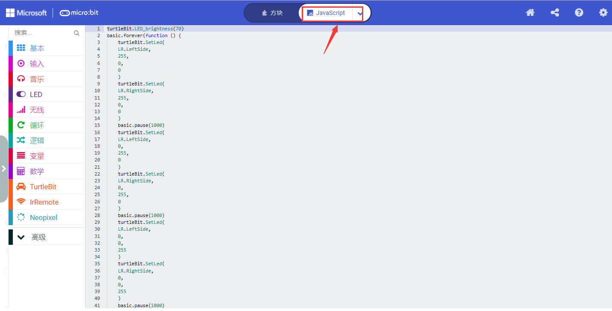

代码2：

RGB灯渐变显示不同颜色灯光

根据下表加载代码（如何加载？）如下图：

|文件类型|路径|文件名|
|-|-|-|
|Hex file|/1Makecode 教程\Micro bit测试程序完整版\814：RGB灯实验\Code-2|microbit-RGB实验-2hex|

也可以自己通过拖动代码块来编写代码程序，操作步骤如下：

（1）点击“TurtleBit”模块，找到并拖出“LED brightness 0”指令方块放入“当开机时”指令方块中，数字0可以改成0至255中任意一个数字，设置数字越大，RGB就越亮，在这里就把数字0改成200。

(2)先点击“变量”模块，再点击“设置变量”出现“新变量的名称：”对话框，在对话框中分别输入“led-r”，点击“OK”，建立了变量“led-r”。用同样的方法先后分别建立变量“led-g”和“led-b”，拖出指令方块“将
led-b 设为 0”放入“当开机时”指令方块中，复制指令方块“将 led-b 设为
0”2次并放入“当开机时”指令方块中，点击第1个led_b后面的下拉三角形按钮选择led_r，再点击第2个led_b后面的下拉三角形按钮选择led_g。

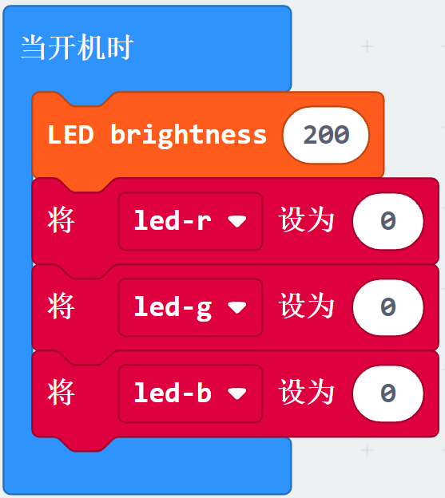

10 次
    执行”放入“无限循环”指令方块中。

11 先点击“TurtleBit”模块，找到并拖出“set RGBled     left_side R：0 G：0 B：0”指令方块2次并且都放入“repeat 4 times     do”指令方块中，点击第2个left_side后面的下拉三角形按钮选择right_side，再点击“变量”模块，找到并拖出变量指令方块“led-r”放入R后面的数字0处，其他的不变。

（5）点击“基础”模块，找到并拖出指令方块“暂停 (ms) 100”放入“repeat 4 times do”指令方块中，设置延时100毫秒。

（6）点击“变量”模块，找到并拖出变量指令方块以”1为幅度更改led-b”放入“重复
4 次
执行”指令方块中，点击led-b后面的下拉三角形按钮选择led-r。要使RGB红色灯逐渐变亮，R值的范围为0-255，这里设置变量“led-r”每次增加5，则需要增加51次，就将by后面的数字1改成5，把
重复 后面的数字4改成51。

(7)复制代码串

1次并放入“无限循环”指令方块中，要使RGB红色灯逐渐变暗，这里设置变量“led-r”每次减少5，则需要减少51次，就将by后面的数字5改成-5。

6  复制代码串

1次并放入“无限循环”指令方块中，将R后面的变量指令方块“led-r”移到G后面的数字0处，点击led-r后面的下拉三角形按钮选择led-g，4个led-r都要改成led-g。其他的保持不变。

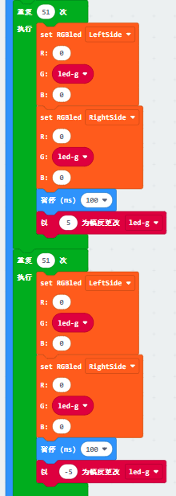

7  再次复制代码串

1次并放入“无限循环”指令方块中，将R后面的变量指令方块“led-r”移到B后面的数字0处，点击led-r后面的下拉三角形按钮选择led-b，4个led-r都要改成led-b。其他的保持不变。

完整的代码程序：

①“当开机时”指令方块仅运行一次以启动程序。

②设置小车2个RGB灯的亮度为200。

③将led-r设为0

④将led-g设为0

⑤将led-b设为0

⑥在“无限循环”指令方块之内，程序循环运行。

⑦do中的程序重复51次。

⑧设置左边RGB灯的R：led-r G：0 B：0

⑨设置右边RGB灯的R：led-r G：0 B：0

⑩延时时间100毫秒

⑪以5为幅度更改led-r

⑫do中的程序重复51次

⑬设置左边RGB灯的R：led-r G：0 B：0

⑭设置右边RGB灯的R：led-r G：0 B：0

⑮延时时间100毫秒

⑯以-5为幅度更改led-r

⑰do中的程序重复51次。

⑱设置左边RGB灯的R：0 G：led-g B：0

⑲设置右边RGB灯的R：0 G：led-g B：0

⑳延时时间100毫秒

㉑以5为幅度更改led-g

㉒do中的程序重复51次。

㉓设置左边RGB灯的R：0 G：led-g B：0

㉟延时时间100毫秒

㊱以-5为幅度更改led-b

㉔设置右边RGB灯的R：0 G：led-g B：0

㉕延时时间100毫秒

㉖以-5为幅度更改led-g

㉗do中的程序重复51次。

㉘设置左边RGB灯的R：0 G：0 B：led-b

㉙设置右边RGB灯的R：0 G：0 B：led-b

㉚延时时间100毫秒

㉛以5为幅度更改led-b

㉜do中的程序重复51次

㉝设置左边RGB灯的R：0 G：0 B：led-b

㉞设置右边RGB灯的R：0 G：0 B：led-b

㉟延时时间100毫秒

㊱以-5为幅度更改led-b

点击micro:
bit在线编程工具的“JSJavaScript”,你可以看到对应的JavaScript语言代码程序：

4实验结果：

按照之前的方式将代码1下载到micro：bit，确定已经将Micro:bit的电机驱动扩展板上的POWER拨码开关拨到ON一端。这样，乌龟车上2个RGB灯循环亮起红、绿、蓝、青、深红、黄、白7种颜色灯光。

按照之前的方式将代码2下载到micro：bit，确定已经将Micro:bit的电机驱动扩展板上的POWER拨码开关拨到ON一端。这样，乌龟车上2个RGB灯渐变显示不同颜色灯光。

### 15：4个WS2812 RGB灯亮起

1实验说明：

Micro:bit的电机驱动扩展板上自带4个WS2812 RGB灯，完全兼容micro bit控制板，是由micro bit的P8控制的。在这一课程中我们利用micro bit的P8控制端控制4个WS2812 RGB灯显示不同的状态。课程中，我们提供4个实验代码，让模块上4个WS2812 RGB灯分别显示4中不同的现象。

2  准备：

（1）将micro：bit主板正确插入keyes Micro:bit迷你智能乌龟车。

（2）将电池装入keyes Micro:bit迷你智能乌龟车。

（3）将Micro:bit的电机驱动扩展板上的POWER拨码开关拨到ON一端，开启电源。

（4）通过micro USB线连接micro：bit主板和电脑。

（5）打开Web版本的Makecode。

如果选择通过导入Hex文件来加载项目，则无需手动添加turtle-bit扩展库。

如果选择手动拖动代码，则首先需要添加turtle-bit扩展库。

3  实验代码：

代码1：

根据下表加载代码（如何加载？）如下图：

|文件类型|路径|文件名|
|-|-|-|
|Hex file|/1Makecode 教程\Micro bit 测试程序完整版\815：4个WS2812 RGB灯亮起\Code-1|microbit-Code-1hex|

也可以自己通过拖动代码块来编写代码程序，操作步骤如下：

（1）点击“Neopixel”模块，找到并拖出指令方块“将
strip 设为 引脚 P0初始化灯带 24 颗LED 模式 RGB(GRB
顺序)”放入指令方块“当开机时”中，由于4个WS2812 RGB灯的信号端P8对应的是由micro:bit的P8控制端控制的，所以点击P0后面的下拉三角形按钮选择P8。又因为只有4个WS2812 RGB灯，所以将leds前面的数字24改成4，点击RGB(GRB
顺序)后面的下拉三角形按钮选择RGB(GRB 顺序))。

（2）点击“Neopixel”模块，找到并拖出指令方块“strip清除显示”放入指令方块“当开机时”中。

（3）点击“Neopixel”模块，找到并拖出指令方块“strip
显示颜色 红”放入指令方块“无限循环”中。

（4）点击“基础”模块，找到并拖出指令方块“暂停 (ms) 100”放入“无限循环”指令方块中，设置延时1000毫秒。

（5）复制代码串

8次并放入“无限循环”指令方块中，点击red后面的下拉三角形按钮分别对应的选择橙、黄、绿、蓝、靛蓝、紫罗兰、紫、白其他的不变。

完整的代码程序：

①“当开机时”指令方块仅运行一次以启动程序。

②将strip设为引脚P8初始化灯带4颗LED（模式RGB（GRB顺序））

③关闭4个WS2812 RGB灯。

④在“无限循环”指令方块之内，程序循环运行。

⑤所有的RGB灯亮红色灯

⑥延时时间1000毫秒

⑦所有的RGB灯亮橙色灯

⑧延时时间1000毫秒

⑨所有的RGB灯亮黄色灯

⑩延时时间1000毫秒

⑪所有的RGB灯亮绿色灯

⑫延时时间1000毫秒

⑬所有的RGB灯亮蓝色灯

⑭延时时间1000毫秒

⑮所有的RGB灯亮靛蓝色灯

⑯延时时间1000毫秒

⑰所有的RGB灯亮紫罗兰色灯

⑱延时时间1000毫秒

⑲所有的RGB灯亮紫色灯

⑳延时时间1000毫秒

㉑所有的RGB灯亮白色灯

㉒延时时间1000毫秒

点击micro:
bit在线编程工具的“JSJavaScript”,你可以看到对应的JavaScript语言代码程序：

代码2：

根据下表加载代码（如何加载？）如下图：

|文件类型|路径|文件名|
|-|-|-|
|Hex file|/1Makecode 教程\Micro bit 测试程序完整版\815：4个WS2812 RGB灯亮起\Code-2|microbit-Code-2hex|

也可以自己通过拖动代码块来编写代码程序，操作步骤如下：

strip
设为 引脚 P0初始化灯带 24 颗LED 模式 RGB(GRB 顺序)(GRB
顺序)”放入指令方块“当开机时”中，由于4个WS2812 RGB灯的信号端P8对应的是由micro:bit的P8控制端控制的，所以点击P0后面的下拉三角形按钮选择P8。又因为只有4个WS2812 RGB灯，所以将leds前面的数字24改成4，点击RGB(GRB
顺序)后面的下拉三角形按钮选择RGB(GRB 顺序)。

至
4执行”放入指令方块“无限循环”中，并将数字4改成3。

（3）点击“Neopixel”模块，找到并拖出指令方块“strip清除显示”放入指令方块“对于从
0 至 3执行”中。

（4）先点击“Neopixel”模块，接着点击“Neopixel”模块下的“更多”，找到并拖出指令方块“strip
设置颜色 像素 0 为 红”放入指令方块“对于从 0 至
3执行”中，再点击“变量”模块，找到并拖出变量指令方块“index”放入指令方块“strip
设置颜色 像素 0 为 红”中的数字0处。

strip
刷新显示”放入指令方块“对于从 0 至 3执行”中。

（6）点击“基础”模块，找到并拖出指令方块“暂停 (ms) 100”放入“对于从 0 至 3执行”指令方块中，设置延时100毫秒。

（7）复制代码串

8次并都放入指令方块“无限循环”中，点击红后面的下拉三角形按钮分别对应的选择橙色、橙、黄、绿、蓝、靛蓝、紫罗兰、紫、白其他的不变。

完整的代码程序：

①“当开机时”指令方块仅运行一次以启动程序。

②将strip设为引脚P8初始化灯带4颗LED（模式RGB（GRB顺序））

③在“无限循环”指令方块之内，程序循环运行。

④对于从0至3的index，执行do中的程序

⑤关闭4个WS2812 RGB灯。

⑥将4个WS2812 RGB灯设置像素index亮红色灯

⑦strip刷新显示

⑧延时时间100毫秒

⑨对于从0至3的index，执行do中的程序

⑩关闭4个WS2812 RGB灯。

⑪将4个WS2812 RGB灯设置像素index亮橙色灯

⑫strip刷新显示

⑬延时时间100毫秒

⑭对于从0至3的index，执行do中的程序

⑮关闭4个WS2812 RGB灯。

⑯将4个WS2812 RGB灯设置像素index亮黄色灯

⑰strip刷新显示

⑱延时时间100毫秒

⑲对于从0至3的index，执行do中的程序

⑳关闭4个WS2812 RGB灯

㉑将4个WS2812 RGB灯设置像素index亮绿色灯

㉒strip刷新显示

㉓延时时间100毫秒

㉔对于从0至3的index，执行do中的程序

㉕关闭4个WS2812 RGB灯

㉖将4个WS2812 RGB灯设置像素index亮蓝色灯

㉗strip刷新显示

㉘延时时间100毫秒

㉙对于从0至3的index，执行do中的程序

㉚关闭4个WS2812 RGB灯

㉛将4个WS2812 RGB灯设置像素index亮靛蓝色灯

㉜strip刷新显示

㉝延时时间100毫秒

㉞变量index的值处于0-17之间，执行do中的程序

㉟关闭条带上所有的RGB灯。

㊱将条带上18个RGB灯设置亮紫罗兰色灯

㊲条带显示所有的变化

㊳延时时间100毫秒

㊴变量index的值处于0-17之间，执行do中的程序

㊵关闭条带上所有的RGB灯。

㊶将条带上18个RGB灯设置亮紫色灯

㊷条带显示所有的变化

㊸延时时间100毫秒

㊹变量index的值处于0-17之间，执行do中的程序

㊺关闭条带上所有的RGB灯。

㊻将条带上18个RGB灯设置亮白色灯

㊼条带显示所有的变化

㊽延时时间100毫秒

㉞对于从0至3的index，执行do中的程序

㉟关闭4个WS2812 RGB灯

㊱将4个WS2812 RGB灯设置像素index亮紫罗兰色灯

㊲strip刷新显示

㊳延时时间100毫秒

㊴对于从0至3的index，执行do中的程序

㊵关闭4个WS2812 RGB灯。

㊶将4个WS2812 RGB灯设置像素index亮紫色灯

㊷strip刷新显示

㊸延时时间100毫秒

㊹对于从0至3的index，执行do中的程序

㊺关闭4个WS2812 RGB灯

㊻将4个WS2812 RGB灯设置像素index亮白色灯

㊼strip刷新显示

㊽延时时间100毫秒

点击micro:
bit在线编程工具的“JSJavaScript”,你可以看到对应的JavaScript语言代码程序：

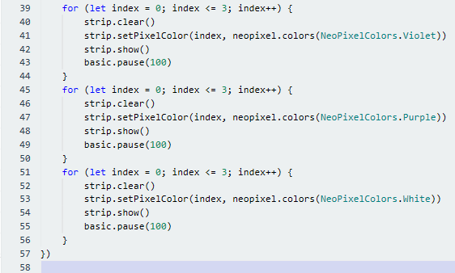

代码3：

根据下表加载代码（如何加载？）如下图：

|文件类型|路径|文件名|
|-|-|-|
|Hex file|/1Makecode 教程\Micro bit 测试程序完整版\815：4个WS2812 RGB灯亮起\Code-3|microbit-Code-3hex|

也可以自己通过拖动代码块来编写代码程序，操作步骤如下：

strip
设为 引脚 P0初始化灯带 24 颗LED 模式 RGB(GRB 顺序)(GRB
顺序)”放入指令方块“当开机时”中，由于4个WS2812 RGB灯的信号端P8对应的是由micro:bit的P8控制端控制的，所以点击P0后面的下拉三角形按钮选择P8。又因为只有4个WS2812 RGB灯，所以将leds前面的数字24改成4，点击RGB(GRB
顺序)后面的下拉三角形按钮选择RGB(GRB 顺序)。

（2）先点击“变量”模块，再点击“设置变量”出现“新变量的名称：”对话框，在对话框中输入R，点击“OK”，建立了变量“R”。用同样的方法分别建立变量“G”和“B”，拖出指令方块“set B to 0”放入“当开机时”指令方块中，复制指令方块“set B to 0”2次并放入“当开机时”指令方块中，点击第1个B后面的下拉三角形按钮选择R，再点击第2个B后面的下拉三角形按钮选择G。

（3）点击“循环”模块，找到并拖出指令方块“对于从
0至3的 index
执行”放入指令方块“无限循环”中，并将数字4改成3”放入指令方块“无限循环”中;

设为
0”放入“对于从 0至3 的 index
执行”指令方块中，点击B后面的下拉三角形按钮选择R。再点击“数学”模块，找到并拖出方块“选取随机数，范围为0至10”放入指令方块“将
R 设为 0”中的数字0处，将数字0改成10，数字10改成255。

（5）复制代码块

2次并放入“对于从
0至3 的 index
执行”指令方块中，点击R后面的下拉三角形按钮分别选择G和B，其他的不变。

（6）点击“Neopixel”模块，找到并拖出指令方块“strip
清除显示”放入指令方块“对于从 0 至 3执行”中。

（7）先点击“Neopixel”模块，接着点击“Neopixel”模块下的“更多”，找到并拖出指令方块“strip
设置颜色 像素 0 为 红”放入指令方块“对于从 0 至
3执行”中，接着又从“Neopixel”模块下的“更多”中找到并拖出指令方块“红
255 绿 255 蓝
255”放入红处，再点击“变量”模块，找到并拖出变量指令方块“index”放入指令方块“strip
设置颜色 像素 0 为
红”中的数字0处，接着又分别拖出变量指令方块“R”放入红后面的数字255处，变量指令方块“G”放入绿后面的数字255处，变量指令方块“B”放入
蓝 后面的数字255处。

（8）点击“基础”模块，找到并拖出指令方块“暂停 (ms) 100”放入“对于从 0 至 3执行”指令方块中，设置延时500毫秒。

strip
刷新显示”放入指令方块“对于从 0 至 执行”中。

完整的代码程序：

①“当开机时”指令方块仅运行一次以启动程序。

②将strip设为引脚P8初始化灯带4颗LED（模式RGB（GRB顺序））

③将变量R设为0

④将变量R设为0

⑤将变量R设为0

⑥在“无限循环”指令方块之内，程序循环运行。

⑦变量index的值处于0-3之间，执行do中的程序

⑧将变量R设为10至255中的随机数

⑨将变量G设为10至255中的随机数

⑩将变量B设为10至255中的随机数

⑪关闭条带上所有的RGB灯。

⑫将4个WS2812 RGB设置颜色像素index为RGB（红R绿G蓝B）

⑬延时时间500毫秒

⑭strip刷新显示

点击micro:
bit在线编程工具的“JSJavaScript”,你可以看到对应的JavaScript语言代码程序：

4实验结果：

按照以前的方式将代码1下载到micro：bit，确定已经将Micro:bit的电机驱动扩展板上的POWER拨码开关拨到ON一端。这样，micro:bit电机驱动扩展板上的4个WS2812RGB灯全亮，一种颜色变化，一直循环。

用同样的方法将代码2下载到micro：bit，确定已经将Micro:bit的电机驱动扩展板上的POWER拨码开关拨到ON一端。这样，micro:bit电机驱动扩展板上的4个WS2812RGB灯以流水灯的形式点亮，一条线一种颜色，一直循环；

用同样的方法将代码3下载到micro：bit，确定已经将Micro:bit的电机驱动扩展板上的POWER拨码开关拨到ON一端。这样，micro:bit电机驱动扩展板上的4个WS2812RGB灯以流水灯的形式点亮，每个灯亮起都是一种随机颜色，一直循环。

### 16：电机驱动 

1  实验说明：

 Keyes Micro：bit迷你智能乌龟车上配有两个直流减速电机，即[齿轮减速电机](https://baikebaiducom/item/%E9%BD%BF%E8%BD%AE%E5%87%8F%E9%80%9F%E7%94%B5%E6%9C%BA/3249233)，是在普通[直流电机](https://baikebaiducom/item/%E7%9B%B4%E6%B5%81%E7%94%B5%E6%9C%BA/2404223)的基础上，加上配套齿轮减速箱。齿轮减速箱的作用是，提供较低的转速，较大的力矩。同时，[齿轮箱](https://baikebaiducom/item/%E9%BD%BF%E8%BD%AE%E7%AE%B1/1059341)不同的[减速比](https://baikebaiducom/item/%E5%87%8F%E9%80%9F%E6%AF%94/5341327)可以提供不同的转速和力矩。这大大提高了，直流电机在自动化行业中的使用率。[减速电机](https://baikebaiducom/item/%E5%87%8F%E9%80%9F%E7%94%B5%E6%9C%BA/3750851)是指[减速机](https://baikebaiducom/item/%E5%87%8F%E9%80%9F%E6%9C%BA/873618)和电机（马达）的集成体。这种集成体通常也可称为[齿轮马达](https://baikebaiducom/item/%E9%BD%BF%E8%BD%AE%E9%A9%AC%E8%BE%BE/7911602)或[齿轮电机](https://baikebaiducom/item/%E9%BD%BF%E8%BD%AE%E7%94%B5%E6%9C%BA/3377578)。减速电机广泛应用于钢铁行业、机械行业等。使用减速电机的优点是简化设计、节省空间。

Micro:bit电机驱动扩展板上包含PCA9685PW芯片和TB6612FNG芯片等，为了节约IO口资源，我们使用PCA9685PW芯片部分引脚来控制TB6612FNG电机芯片，并且TB6612FNG电机芯片是用来控制两个直流减速电机的转动方向和速度。我们来看一下Micro:bit电机驱动扩展板的示意图和两个芯片的电路图：

PCA9685芯片由micro:bit板的llc端口控制，用于输出端口和扩展micro:bit板的IO端口。TB6612芯片由PCA9685芯片的LEDx引脚控制（引脚LED1和LED2控制左电机的方向，速度为LED0引脚；LED3和LED4引脚控制右电机的方向，速度为led5）

都已经插好在Micro:bit的电机驱动扩展板上（竖着方向），如下图所示，最好不要去改变它们的插入方向。这样，如果将我们提供的事例代码下载到microbit板后，电机转动的方向就与事例代码中设置的转动方向一致。

如果把8个跳线帽都横着插在Micro:bit的电机驱动扩展板上，如下图所示，这样就会导致电机转动方向和事例代码中设置的方向相反，那就需要更改代码了。

2  准备：

（1）将micro：bit主板正确插入keyes Micro:bit迷你智能乌龟车。

（2）将电池装入keyes Micro:bit迷你智能乌龟车。

（3）将Micro:bit的电机驱动扩展板上的POWER拨码开关拨到ON一端，开启电源。

（4）通过micro USB线连接micro:bit主板和电脑。

（5）打开Web版本的Makecode。

如果选择通过导入Hex文件来加载项目，则无需手动添加turtle-bit扩展库。

如果选择手动拖动代码，则首先需要添加turtle-bit扩展库。

3  实验代码：

代码1：

根据下表加载代码（如何加载？）如下图：

|文件类型|路径|文件名|
|-|-|-|
|Hex file|/1Makecode 教程\Micro bit测试程序完整版\816：电机驱动\Code-1|microbit-电机驱动-1hex|

也可以自己通过拖动代码块来编写代码程序，操作步骤如下：

（1）先点击“Led”模块，再点击“Led”模块下的“更多”，找到并拖出指令方块“led
启用
fasle”放入“当开机时”指令方块中，点击“false”后面的下拉三角形按钮选择“true”。

（2）点击“基础”模块，找到并拖出指令方块“显示箭头
北”放入“无限循环”指令方块中，点击 北
后面的下拉三角形按钮分别选择南。

0
%”放入“无限循环”指令方块中，数字0可以更改成0-100的任意数，这里将数字0改成100。

3  点击“基础”模块，找到并拖出指令方块“暂停 (ms)     100”放入指令方块“无限循环”中，设置延时时间为100毫秒。

4  复制代码串

1次并放入指令方块“无限循环”中，点击South后面的下拉三角形按钮选择North，又点击RunForward后面的下拉三角形按钮对应的选择RunBack，其他的不变。

（5）复制代码块“显示箭头
北”1次也放入指令方块“无限循环”中，并点击 北 后面的下拉三角形按钮选择
东 。

0
%”放入“无限循环”指令方块中，将数字0改成50；再复制代码块“LeftSide motor run Forward speed : 50
%”1次也放入“无限循环”指令方块中，点击LeftSide后面的下拉三角形按钮选择RightSide，并将数字50改成80。再复制指令方块“暂停
(ms) 1000”1次也放入指令方块“无限循环”中。

（7）复制代码串1次并放入“无限循环”指令方块中，先点击
东 后面的下拉三角形按钮选
西，再将LeftSide后面的数字50改成100，RightSide后面的数字100改成50，其他的不变。

南
后面的下拉三角形按钮分别选择东和西，又点击RunForward后面的下拉三角形按钮分别对应的选择TurnLeft、TurnRight，其他的不变。

（9）点击“基础”模块，找到并拖出指令方块“显示
LED”放入指令方块“无限循环”中，点击灰蓝色小方框组成倒立的“❤”图案。

（10）点击“K_Bit”模块，找到并拖出指令方块“car stop”放入“无限循环”指令方块中，接着复制指令方块“暂停 (ms) 1000”1次也放入指令方块“无限循环”中。

完整的代码程序：

①“当开机时”指令方块仅运行一次以启动程序。

②打开LED点阵屏。

③在“无限循环”指令方块之内，程序循环运行。

④LED点阵显示箭头朝南的图案

⑤小车以100%速度向前走

⑥延时时间1000毫秒

⑦LED点阵显示箭头朝北的图案

⑧小车以100%速度向后走

⑨延时时间1000毫秒

⑩LED点阵显示箭头朝东的图案

⑪小车的左轮以50%速度前进

⑫小车的右轮以100%速度前进

⑬延时时间1000毫秒

⑭LED点阵显示箭头朝西的图案

⑮小车的左轮以100%速度前进

⑯小车的右轮以50%速度前进

⑰延时时间1000毫秒

⑱LED点阵显示箭头朝东的图案

⑲小车以100%速度原地左旋

⑳延时时间1000毫秒

㉑LED点阵显示箭头朝西的图案

㉒小车以100%速度原地右旋

㉓延时时间1000毫秒

㉔LED点阵显示箭头朝东的图案

㉕小车停止

㉖延时时间1000毫秒

点击micro:
bit在线编程工具的“JSJavaScript”,你可以看到对应的JavaScript语言代码程序：

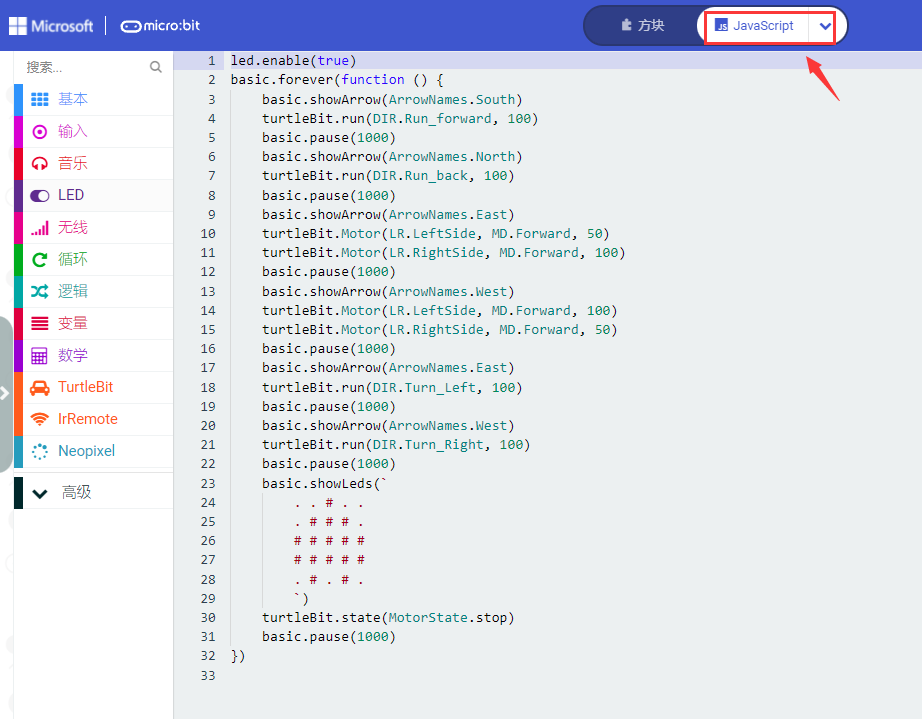

代码2：

路线图

根据下表加载代码（如何加载？）如下图：

|文件类型|路径|文件名|
|-|-|-|
|Hex file|/1Makecode 教程\Micro bit测试程序完整版\816：电机驱动\Code-2|microbit-电机驱动-2hex|

也可以自己通过拖动代码块来编写代码程序，操作步骤如下：

（1）先点击“Led”模块，再点击“Led”模块下的“更多”，找到并拖出指令方块“led
启用
fasle”放入“当开机时”指令方块中，点击“false”后面的下拉三角形按钮选择“true”。

（2）先点击“变量”模块，再点击“设置变量”出现“新变量的名称：”对话框，在对话框中分别输入“a”，点击“OK”，建立了变量“a”。用同样的方法再建立变量“b”，拖出指令方块“将
b 设为 0”放入“当开机时”指令方块中，复制指令方块“将 b 设为
0”1次并放入“当开机时”指令方块中，点击第1个指令方块的b后面的下拉三角形按钮选择a。

A
被按下时”，再点击“变量”模块，找到并拖出指令方块“以 1 为幅度更改
b”放入“当按钮 A
被按下时”指令方块中，点击b后面的下拉三角形按钮选择a，其他的不变。

（4）复制代码串

1次，点击A后面的下拉三角形按钮选择B，移除指令方块“以
1 为幅度更改 b”，再次点击“变量”模块，找到并拖出指令方块“将 b 设为
0”放入“当按钮 B 被按下时”指令方块中，将数字0改成1，其他的不变。

（5）先点击“逻辑”模块，找到并拖出指令方块“如果为
true
则”放入“无限循环”指令方块中，接着又找到并拖出“=”方块放入true处的方框中，再点击“变量”模块，找到并拖出变量指令方块“a”放入“=”左侧，将“=”右侧的数字0改成1。

（6）点击“基础”模块，找到并拖出指令方块“显示
led”放入then下，点击灰蓝色小方框组成“L”图案。

（7）先点击“逻辑”模块，找到并拖出指令方块“如果为
true
则”放入第一个then下，接着又找到并拖出“=”方块放入true处的方框中，再点击“变量”模块，找到并拖出变量指令方块“b”放入“=”左侧，将“=”右侧的数字0改成1。

0
%”放入第二个then下，将数字0改成80；再复制指令方块“暂停 (ms) 1000”1次也放入第二个then下。

（9）复制代码串

1次也放入第二个then下，点击RunForward后面的下拉三角形按钮选择TurnLeft，将数字80改成65，再将延时1000毫秒改成延时650毫秒。

（10）又复制代码串

1次放入第二个then下，其他的不变。

设为
0”也放入第二个 如果为 下。

（12）先点击“逻辑”模块，找到并拖出指令方块“如果为
true
则”放入“无限循环”指令方块中，接着又找到并拖出“=”方块放入true处的方框中，再点击“变量”模块，找到并拖出变量指令方块“a”放入“=”左侧，将“=”右侧的数字0改成2。

（13）点击“基础”模块，找到并拖出指令方块“刷新显示
leds”放入第三个then下，点击灰蓝色小方框组成“口”图案。

（14）先点击“逻辑”模块，找到并拖出指令方块“如果为
true
则”放入第三个then下，接着又找到并拖出“=”方块放入true处的方框中，再点击“变量”模块，找到并拖出变量指令方块“b”放入“=”左侧，将“=”右侧的数字0改成1。

（15）先点击“基础”模块，找到并拖出指令方块“暂停
(ms) 100”放入第四个then下，设置延时时间为1000毫秒；再点击“K_Bit”模块，找到并拖出指令方块“car RunForward speed: 0
%”放入第四个then下，将数字0改成80；再复制指令方块“暂停 (ms) 1000”1次也放入第四个then下。

（16）
复制代码串

1次也放入第四个then下，点击RunForward后面的下拉三角形按钮选择TurnLeft，将数字80改成65，再将延时1000毫秒改成延时620毫秒。

（17）复制代码串

2次也放入第四个then下，其他的不变。

（18）复制第二个then下的代码串

1次放入第四个then下。

（19）先点击“逻辑”模块，找到并拖出指令方块“如果为
true
则”放入“无限循环”指令方块中，接着又找到并拖出“=”方块放入true处的方框中，再点击“变量”模块，找到并拖出变量指令方块“a”放入“=”左侧，将“=”右侧的数字0改成3；再从“变量”模块中找到并拖出指令方块“set b to 0”放入第五个then下，点击b后面的下拉三角形按钮选择a，将数字0改成1。

完整的代码程序：

①“当开机时”指令方块仅运行一次以启动程序。

②打开LED点阵屏。

③将变量a设为0

④将变量b设为0

⑤当按钮A被按下时

⑥以1为幅度更改变量a

⑦当按钮A被按下时

⑧将变量b设为1

⑨在“无限循环”指令方块之内，程序循环运行。

⑩当变量a=1成立时，运行then下的程序

⑪LED点阵显示“L”图案

⑫当变量b=1成立时，运行then下的程序

⑬延时时间1000毫秒

⑭小车以80%速度向前走

⑮延时时间1000毫秒

⑯小车以65%速度向左旋

⑰延时时间650毫秒

⑱小车以80%速度向前走

⑲延时时间1000毫秒

⑳小车停止

㉑将变量b设为0

㉒当变量a=2成立时，运行then下的程序

㉓LED点阵显示“口”图案

㉔当变量b=1成立时，运行then下的程序

㉕延时时间1000毫秒

㉖小车以80%速度向前走

㉗延时时间1000毫秒

㉘小车以65%速度向左旋

㉙延时时间620毫秒

㉖小车以80%速度向前走

㉗延时时间1000毫秒

㉘小车以65%速度向左旋

㉙延时时间620毫秒

㉚小车以80%速度向前走

㉛延时时间1000毫秒

㉜小车以65%速度向左旋

㉝延时时间620毫秒

㉞小车以80%速度向前走

㉟延时时间1000毫秒

㊱小车停止

㊲将变量b设为0

㊳当变量a=3成立时，运行then下的程序

㊴将变量a设为1

点击micro:
bit在线编程工具的“JSJavaScript”,你可以看到对应的JavaScript语言代码程序：

4实验结果：

按照之前的方式将代码1下载到micro：bit，确定已经将Micro:bit的电机驱动扩展板上的POWER拨码开关拨到ON一端。这样，我们可以看到小车将前进1s，后退1s，左转1s，右转1s，原地左旋1s，原地左旋1s，停止1s，并且每种运动状态下LED点阵显示对应图案。一直循环。

用同样的方法将代码2下载到micro：bit，确定已经将Micro:bit的电机驱动扩展板上的POWER拨码开关拨到ON一端。这样，当我们第一次按A键时，LED点阵会显示“L”图案，再按B键，可以看到小车前进的路径是“L”；当我们第二次按A键时，LED点阵会显示“口”图案，再按B键，可以看到小车前进的路径是“口”；当我们第三次按A键时，LED点阵会显示“L”，再按B键，可以看到小车前进的路径是“L”；
；保持循环处于这种状态。

([How to download?](#A01) [How to quick download?](#快速下载))

### 17：循迹小车

#### 171：循迹传感器测试

1 实验说明：

keyes Micro:bit迷你智能乌龟车上包含一个3路循迹传感器模块，并且传感器模块上自带有三个电位器，用于调节循迹传感器敏感度。循迹传感器其实也是红外传感器，这里的循迹传感器模块用到的元件是TCRT5000红外对管，TCRT5000红外对管具有一个高发射功率红外发射二极管和一个高灵敏度红外接收管。当发射管的红外信号经反射被接收管接收后，接收管的电阻会发生变化，在电路上一般以电压的变化体现出来。电阻的变化取决于接收管所接收的红外信号强度，常表现在反射面的颜色和反射面接收管的距离。在检测的时候，黑色高电平有效，白色是为低电平有效。

红外对管寻迹：

当乌龟车在白色底面行驶时，装在车下的红外发射管发射红外信号，经白色发射后，被接收管接收，一旦接收管接收到信号，输出端将输出低电平（0）；当乌龟车行驶到黑线时，红外线信号被黑色吸收后，将输出高电平（1），从而实现了通过红外线检测信号的功能。将检测到的信号送到单片机的I/O口，当I/O口检测到的信号为高电平（1）时，表明乌龟车处于黑色的引线上；同理，当I/O口检测到的信号为低电平（0）时，表明乌龟车处于白色地面上。

根据上面的接线图可知，乌龟车上的3路循迹传感器模块集成端口是接在micro:bit
电机驱动扩展板上G 5V P14 P15 P16集合端口，是由micro:bit的P14、P15和P16控制的。3路循迹传感器模块上的左边TCRT5000红外对管是由micro bit的P14控制，中间TCRT5000红外对管是由micro bit的P15控制，右边TCRT5000红外对管是由micro bit的P16控制。在乌龟车底部放上白纸，我们通过旋转3路循迹传感器模块上自带的三个电位器，当传感器模块上的指示灯亮起时，再拿起小车使乌龟车上的两车轮离白纸的高度大概都是05cm，传感器模块上的指示灯熄灭，这时灵敏度就调节好了。

2  准备：

（1）将micro：bit主板正确插入keyes Micro:bit迷你智能乌龟车。

（2）将电池装入keyes Micro:bit迷你智能乌龟车。

（3）将Micro:bit的电机驱动扩展板上的POWER拨码开关拨到ON一端，开启电源。

（4）通过micro USB线连接micro：bit主板和电脑。

（5）打开Web版本的Makecode。

如果选择通过导入Hex文件来加载项目，则无需手动添加turtle-bit扩展库。

如果选择手动拖动代码，则首先需要添加turtle-bit扩展库。

3  实验代码：

代码1：

根据下表加载代码（如何加载？）如下图：

|文件类型|路径|文件名|
|-|-|-|
|Hex file|/1Makecode 教程\Micro bit测试程序完整版\817：循迹小车\8171：循迹传感器测试\Code-1|microbit-循迹传感器测试-1hex|

也可以自己通过拖动代码块来编写代码程序，操作步骤如下：

（1）点击“高级”下的“串行”模块，找到并拖出指令方块“串行
重定向到 USB”放入“当开机时”指令方块中。

（2）点击“高级”下的“串行”模块，找到并拖出指令方块“串行
写入数值“x”=0”放入“无限循环”指令方块中，再点击“引脚”模块，找到并拖出指令方块“数字读取引脚
P0 ”放入指令方块“串行 串行写入数值
“x”=0”中的0处，由于3路循迹传感器模块上的左边TCRT5000红外对管是由micro bit的P14控制，中间TCRT5000红外对管是由micro bit的P15控制，右边TCRT5000红外对管是由micro bit的P16控制，这里就以左边TCRT5000红外对管读取数字信号为例，点击P0后面的下拉三角形按钮选择P14，将“x”改成“digital signal”。

（3）点击“基础”模块，找到并拖出指令方块“暂停 (ms) 100”放入“无限循环”指令方块中，设置延时200毫秒。

完整的代码程序：

①“当开机时”指令方块仅运行一次以启动程序。

②串行重定向USB。

③在“无限循环”指令方块之内，程序循环运行。

④串行写入digital signal=P14读取的数字信号（1/0）

⑤延时时间200毫秒

点击micro:
bit在线编程工具的“JSJavaScript”,你可以看到对应的JavaScript语言代码程序：

按照之前的方式将代码1下载到microbit，micro USB线不要从micro：bit上拔下来，利用micro USB线上电，接下来点击显示数据(设备)按钮：

([How to quick download?](#快速下载))

显示数据(设备)中显示了乌龟车上3路循迹传感器模块的左边TCRT5000红外对管检测到的数字信号，当左边TCRT5000红外对管检测到白色物体时，串口监视器窗口显示低电平（0），同时传感器模块对应的左边指示灯亮起；当左边TCRT5000红外对管检测到黑色物体或未检测到物体时，串口监视器窗口显示高电平（1），同时传感器模块对应的左边指示灯不亮。如下图：

如果你的电脑系统是Windows7/8而不是Windows 10，则在Google Chrome中是不能进行设备配对，从而读取不了相应的数字信号或模拟信号，可是又需要读取相应的传感器/模块的数字信号或模拟信号，那怎么办呢？这里就可以使用CoolTerm软件来读取串口的。

打开CoolTerm，点击Options，选择串行Port，设置COM口和波特率，波特率设置为115200（经过测试，micro:bit的USB串口通讯波特率是115200），点击OK后，最后点击Connect。这样，CoolTerm串口监视器显示出3路循迹传感器模块上左边TCRT5000红外对管读取的数字信号。如下图：

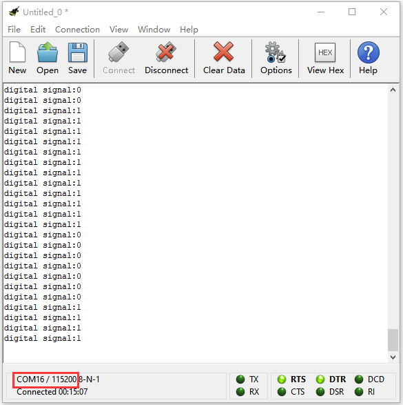

代码2：

根据下表加载代码（如何加载？）如下图：

|文件类型|路径|文件名|
|-|-|-|
|Hex file|/1Makecode 教程\Micro bit测试程序完整版\817：循迹小车\8171：循迹传感器测试\Code-2|microbit-循迹传感器测试-2hex|

也可以自己通过拖动代码块来编写代码程序，操作步骤如下：

（1）先点击“Led”模块，再点击“Led”模块下的“更多”，找到并拖出指令方块“led
启用
fasle”放入“当开机时”指令方块中，点击“false”后面的下拉三角形按钮选择“true”。

设为
0”2次并放入“当开机时”指令方块中，点击第1个RR后面的下拉三角形按钮选择LL，第2个RR后面的下拉三角形按钮选择CC。

设为
0”放入“无限循环”指令方块中，点击RR后面的下拉三角形按钮选择LL；再点击“高级”下的“引脚”模块，找到并拖出指令方块“数字读取引脚
P0”放入to后面的数字0处。复制代码块“set LL to 数字读取引脚
P0”2次也放入“无限循环”指令方块中，将第二个LL改成CC，第三个LL改成RR。由于3路循迹传感器模块上的左边TCRT5000红外对管是由micro bit的P14控制，中间TCRT5000红外对管是由micro bit的P15控制，右边TCRT5000红外对管是由micro bit的P16控制，所以把LL后面的P0改成P14，CC后面的P0改成P15，RR后面的P0改成P16。

true
则否则”放入“无限循环”指令方块中，点击“

”图案6次，接着找到并拖出一个“与”方块放入true处的方框中，再拖出一个“与”方块放入第一个
与 后面的方框中。

与
左侧，再点击“变量”模块，找到拖出变量指令方块“LL”放入“=”左侧，“=”右侧的数字0不变。接着复制代码块“LL=0”2次分别放入第一个
与
右侧的两个方框中，点击第二个LL后面的下拉三角形按钮选择CC，将数字0改成1；点击第三个LL后面的下拉三角形按钮选择RR，将数字0改成1。

（6）点击“基础”模块，找到并拖出指令方块“显示LED”放入第一个
如果为 下，点击右侧的灰蓝色小方框组成“I”图案。

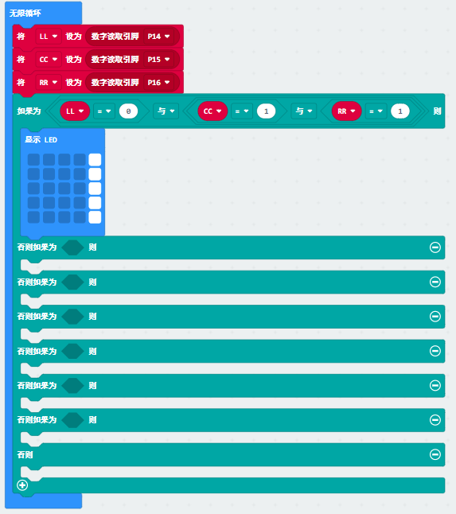

RR=1”1次放入第一个
否则如果为
后面的方框中，将LL后面的第一个数字0改成1，将CC后面的第一个数字1改成0，其他的不变。

（8）点击“基础”模块，找到并拖出指令方块“显示LED”放入第二个
如果为 下，点击中间的灰蓝色小方框组成“I”图案。

与
RR=1”1次放入第二个否则如果为
后面的方框中，将CC后面的第一个数字0改成1，再将RR后面的数字1改成0，其他的不变。

8  点击“基础”模块，找到并拖出指令方块“显示LED”放入第三个
    如果为 下，点击左侧的灰蓝色小方框组成“I”图案。

9  与
    RR=0”1次放入第三个否则如果为
    后面的方框中，将LL和CC后面数字1改成0，再将RR后面的数字0改成1，其他的不变。

10 点击“基础”模块，找到并拖出指令方块“显示图标”放入第四个
    如果为
    下，点击“❤”图案后面的下拉三角形按钮选择“

”图案。

11 与
    RR=1”1次放入第四个否则如果为
    后面的方框中，将CC后面的第一个数字0改成1，再将RR后面的数字1改成0，其他的不变。

12 点击“基础”模块，找到并拖出指令方块“显示图标”放入第五个
    如果为
    下，点击“❤”图案后面的下拉三角形按钮选择“

”图案。

13 与
    RR=0”1次放入第五个否则如果为
    后面的方框中，将LL后面的第一个数字0改成1，再将CC后面的第一个数字1改成0，其他的不变。

14 点击“基础”模块，找到并拖出指令方块“显示图标”放入第六个
    如果为
    下，点击“❤”图案后面的下拉三角形按钮选择“

”图案。

15 与
    RR=1”1次放入第六个否则如果为
    后面的方框中，将CC和RR后面的数字0改成1，其他的不变。

16 点击“基础”模块，找到并拖出指令方块“显示图标”放入第七个
    如果为
    下，点击“❤”图案后面的下拉三角形按钮选择“

”图案，再拖出指令方块“显示图标”放入
    否则 下，其他的不变。

完整的代码程序：

⑭当变量LL=1和CC=1和RR=0成立时，执行then下的程序

⑮LED点阵右边显示“I”图案

⑯当变量LL=0和CC=0和RR=1成立时，执行then下的程序

⑰LED点阵右边显示“”图案

⑱当变量LL=0和CC=1和RR=0成立时，执行then下的程序

⑲LED点阵右边显示“”图案

⑳当变量LL=1和CC=0和RR=0成立时，执行then下的程序

㉑LED点阵右边显示“”图案

㉒当变量LL=1和CC=1和RR=1成立时，执行then下的程序

㉓LED点阵右边显示“”图案

㉔当上述条件都不成立时，执行else下的程序

㉕LED点阵显示“❤”图案

①“当开机时”指令方块仅运行一次以启动程序。

②打开LED点阵。

③将变量LL设为0

④将变量CC设为0

⑤将变量RR设为0

⑥在“无限循环”指令方块之内，程序循环运行。

⑦将变量LL设为P14读取的数字信号（1/0）

⑧将变量CC设为P15读取的数字信号（1/0）

⑨将变量LL设为P16读取的数字信号（1/0）

⑩当变量LL=0和CC=1和RR=1成立时，执行then下的程序

⑪LED点阵左边显示“I”图案

⑫当变量LL=1和CC=0和RR=1成立时，执行then下的程序

⑬LED点阵中间显示“I”图案

点击micro:
bit在线编程工具的“JSJavaScript”,你可以看到对应的JavaScript语言代码程序：

代码3：

代码2看起来是不是有点儿复杂，能不能对它简化呢？回答是，可以的。我们可以利用外加的库文件中的指令方块“

”来简化它，我们已经通过代码1实验知道循迹传感器模块中的左边TCRT5000红外对管读取的数字信号（高电平（1）和低电平（0））。由于循迹传感器模块中的3个TCRT5000红外对管组成3路巡线，所以是可以用3位二进制数来表示循迹传感器模块的3路巡线值，但是我们把用3位二进制数来表示3路巡线值转化成用1位十进制数来表示3路巡线值就更好了，如下图。这样，代码就可以大大的简化。

<table style="width:100%;">

<td colspan="3">循迹传感器模块上的左、中、右TCRT5000红外对管（电平）|二进制|十进制|
|低电平（0）|低电平（0）|高电平（1）|001|1|
|低电平（0）|高电平（1）|低电平（0）|010|2|
|低电平（0）|高电平（1）|高电平（1）|011|3|
|高电平（1）|低电平（0）|低电平（0）|100|4|
|高电平（1）|低电平（0）|高电平（1）|101|5|
|高电平（1）|高电平（1）|低电平（0）|110|6|
|高电平（1）|高电平（1）|高电平（1）|111|7|
|低电平（0）|低电平（0）|低电平（0）|000|0|

根据下表加载代码（如何加载？）如下图：

|文件类型|路径|文件名|
|-|-|-|
|Hex file|/1Makecode 教程\Micro bit测试程序完整版\817：循迹小车\8171：循迹传感器测试\Code-3|microbit-循迹传感器测试-3hex|

也可以自己通过拖动代码块来编写代码程序，操作步骤如下：

（1）点击“高级”下的“串行”模块，找到并拖出指令方块“串行
重定向到 USB”放入“当开机时”指令方块中。

（2）先点击“变量”模块，再点击“设置变量”出现“新变量的名称：”对话框，在对话框中输入val，点击“OK”，建立了变量“val”，拖出指令方块“将
val 设为0”放入“当开机时”指令方块中。

设为
0”放入“无限循环”指令方块中，再点击“TurtleBit”模块，找到并拖出指令方块“Line Tracking”放入to后面的数字0处。

（4）点击“高级”下的“串行”模块，找到并拖出指令方块“串行
串行写入数值
“x”=0”放入“无限循环”指令方块中，再点击“变量”模块，找到并拖出变量指令方块“val”放入指令方块“串行
串行写入数值 “x”=0”中的数字0处。

true
则否则”放入“无限循环”指令方块中，点击“

”图案6次，接着找到并拖出“=”方块放入true处的方框中。

（6）点击“变量”模块，找到并拖出变量指令方块“val”放入“=”左侧方框，将“=”右侧的数字0改成3。

（7）点击“基础”模块，找到并拖出指令方块“显示LED”放入第一个
如果为 下，点击右侧的灰蓝色小方框组成“I”图案。

”1次放入第一个否则如果为
后面的方框中，将“=”右侧的数字3改成5。

（9）点击“基础”模块，找到并拖出指令方块“显示LED”放入第二个
如果为 下，点击中间的灰蓝色小方框组成“I”图案。

”1次放入第二个否则如果为
后面的方框中，将“=”右侧的数字5改成6。

（11）点击“基础”模块，先找到并拖出指令方块“显示LED”放入第三个then下，点击左侧的灰蓝色小方框组成“I”图案。

”1次放入第三个否则如果为
后面的方框中，将“=”右侧的数字6改成1。

13 点击“基础”模块，先找到并拖出指令方块“显示图标”放入第四个
    如果为
    下，点击“❤”图案后面的下拉三角形按钮选择“

”图案。

14 复制代码块“val=1”1次放入第四个否则如果为
    后面的方框中，将“=”右侧的数字1改成2。

15 点击“基础”模块，先找到并拖出指令方块“显示图标”放入第五个
    如果为
    下，点击“❤”图案后面的下拉三角形按钮选择“

”图案。

16 复制代码块“val=2”1次放入第五个否则如果为
    后面的方框中，将“=”右侧的数字2改成4。

17 点击“基础”模块，先找到并拖出指令方块“显示图标”放入第六个
    如果为
    下，点击“❤”图案后面的下拉三角形按钮选择“

”图案。

18 否则如果为
    后面的方框中，将“=”右侧的数字4改成7。

17 点击“基础”模块，找到并拖出指令方块“显示图标”放入第七个
    如果为
    下，点击“❤”图案后面的下拉三角形按钮选择“

”图案，再拖出指令方块“显示图标”放入
    否则 下，其他的不变。

完整的代码程序

①“当开机时”指令方块仅运行一次以启动程序。

②串行重定向USB。

③将变量val设为0

④在“无限循环”指令方块之内，程序循环运行。

⑤将变量val为Line Tracking

⑥串行写入数值x=val

⑦当变量val=3成立时，执行 如果为 下的程序

⑧LED点阵左边显示“I”图案

⑨当变量val=5成立时，执行 如果为 下的程序

⑩LED点阵中间显示“I”图案

⑪当变量val=6成立时，执行 如果为 下的程序

⑫LED点阵右边显示“I”图案

⑬当变量val=1成立时，执行 如果为 下的程序

⑭LED点阵显示“”图案

⑮当变量val=2成立时，执行 如果为 下的程序

⑯LED点阵显示“”图案

⑰当变量val=4成立时，执行 如果为 下的程序

⑱LED点阵显示“”图案

⑲当变量val=7成立时，执行 如果为 下的程序

⑳LED点阵显示“”图案

㉑当上述条件都不成立时，执行else下的程序

㉒LED点阵显示“❤”图案

点击micro:
bit在线编程工具的“JSJavaScript”,你可以看到对应的JavaScript语言代码程序：

3实验结果：

按照之前的方式将代码2下载到micro：bit，乌龟车上的循迹传感器模块只有左边的TCRT5000红外对管检测到白色物体时，micro bit LED点阵左边显示“I”图案，同时循迹传感器模块左边的指示灯亮起；

乌龟车上的循迹传感器模块只有中间的TCRT5000红外对管检测到白色物体时，micro bit LED点阵中间显示“I”图案，同时循迹传感器模块中间的指示灯亮起；

乌龟车上的循迹传感器模块只有右边的TCRT5000红外对管检测到白色物体时，micro bit LED点阵右边显示“I”图案，同时循迹传感器模块右边的指示灯亮起；

乌龟车上的循迹传感器模块只有左边的和中间的TCRT5000红外对管检测到白色物体时，micro bit LED点阵显示“

”图案，同时循迹传感器模块左边的和中间的指示灯都亮起；

乌龟车上的循迹传感器模块只有左边的和右边的TCRT5000红外对管检测到白色物体时，micro bit LED点阵显示“

”图案，同时循迹传感器模块左边的和右边的指示灯都亮起；

乌龟车上的循迹传感器模块只有中间的和右边的TCRT5000红外对管检测到白色物体时，micro bit LED点阵显示“

”图案，同时循迹传感器模块中间的和右边的指示灯都亮起；

乌龟车上的循迹传感器模块左边的、中间的和右边的TCRT5000红外对管都检测到黑色物体或都未检测到物体时，micro bit LED点阵左边显示“

”图案，同时循迹传感器模块左边的、中间的和右边的指示灯都不亮；

乌龟车上的循迹传感器模块左边的、中间的和右边的TCRT5000红外对管都检测到白色物体时，micro bit LED点阵显示“❤”图案，同时循迹传感器模块左边的、中间的和右边的指示灯都亮起。

用同样的方法，将代码3下载到micro：bit，micro USB线不要从micro：bit上拔下来，利用micro USB线上电，接下来点击显示数据(设备)按钮：

([How to quick download?](#快速下载))

乌龟车上的循迹传感器模块只有左边的TCRT5000红外对管检测到白色物体时，显示数据(设备)中显示3（如下图），micro bit LED点阵左边显示“I”图案，同时循迹传感器模块左边的指示灯亮起；

乌龟车上的循迹传感器模块只有中间的TCRT5000红外对管检测到白色物体时，显示数据(设备)中显示5（如下图），micro bit LED点阵中间显示“I”图案，同时循迹传感器模块中间的指示灯亮起；

乌龟车上的循迹传感器模块只有右边的TCRT5000红外对管检测到白色物体时，显示数据(设备)中显示6（如下图），micro bit LED点阵右边显示“I”图案，同时循迹传感器模块右边的指示灯亮起；

乌龟车上的循迹传感器模块只有左边的和中间的TCRT5000红外对管检测到白色物体时，显示数据(设备)中显示1（如下图），micro bit LED点阵显示“

”图案，同时循迹传感器模块左边的和中间的指示灯都亮起；

乌龟车上的循迹传感器模块只有左边的和右边的TCRT5000红外对管检测到白色物体时，显示数据(设备)中显示2（如下图），micro bit LED点阵显示“

”图案，同时循迹传感器模块左边的和右边的指示灯都亮起；

乌龟车上的循迹传感器模块只有中间的和右边的TCRT5000红外对管检测到白色物体时，显示数据(设备)中显示4（如下图），micro bit LED点阵显示“

”图案，同时循迹传感器模块中间的和右边的指示灯都亮起；

乌龟车上的循迹传感器模块左边的、中间的和右边的TCRT5000红外对管都检测到黑色物体或都未检测到物体时，显示数据(设备)中显示7（如下图），micro bit LED点阵左边显示“

”图案，同时循迹传感器模块左边的、中间的和右边的指示灯都不亮；

乌龟车上的循迹传感器模块左边的、中间的和右边的TCRT5000红外对管都检测到白色物体时，micro bit LED点阵显示“❤”图案，同时循迹传感器模块左边的、中间的和右边的指示灯都亮起。

如果你的电脑系统是Windows7/8而不是Windows 10，则在Google Chrome中是不能进行设备配对，从而读取不了相应的数字信号或模拟信号，可是又需要读取相应的传感器/模块的数字信号或模拟信号，那怎么办呢？这里就可以使用CoolTerm软件来读取串口的。

打开CoolTerm，点击Options，选择串行Port，设置COM口和波特率，波特率设置为115200（经过测试，micro:bit的USB串口通讯波特率是115200），点击OK后，最后点击Connect。这样，CoolTerm串口监视器显示出3路循迹传感器读取的1位十进制数。

#### 172：循迹小车

1实验说明：

前面的部分我们学习了循迹传感器和电机驱动的原理和应用，下面我们要结合这两个基本的循迹传感器和电机驱动来做一款循迹小车。

循迹，意思就是循着轨迹，也就是我们经常会看到的走黑线的循迹小车，原理是利用循迹传感器对路面黑色轨迹进行检测，并将路面检测信号反馈给micro bit主板。micro bit主板对采集到的信号予以分析判断，及时控制驱动电机以调整小车转向，从而使小车能够沿着黑色轨迹自动行驶，实现循迹小车自动寻迹的目的。

循迹小车行驶原理：循迹小车根据3路循迹传感器传输的巡线值采取不同的行动。

<td colspan="3">循迹传感器模块上的左、中、右TCRT5000红外对管（电平）|二进制|十进制|乌龟车的行动|
|低电平（0）|低电平（0）|高电平（1）|001|1|向右转|
|低电平（0）|高电平（1）|低电平（0）|010|2|前进|
|低电平（0）|高电平（1）|高电平（1）|011|3|前进|
|高电平（1）|低电平（0）|低电平（0）|100|4|向左转|
|高电平（1）|低电平（0）|高电平（1）|101|5|前进|
|高电平（1）|高电平（1）|低电平（0）|110|6|前进|
|高电平（1）|高电平（1）|高电平（1）|111|7|前进|
|低电平（0）|低电平（0）|低电平（0）|000|0|停止|

根据上面的接线图可知，乌龟车上的3路循迹传感器模块集成端口是接在micro:bit
电机驱动扩展板上G 5V P14 P15 P16集合端口，是由micro:bit的P14、P15和P16控制的。

2  准备：

（1）将micro：bit主板正确插入keyes Micro:bit迷你智能乌龟车。

（2）将电池装入keyes Micro:bit迷你智能乌龟车。

（3）将Micro:bit的电机驱动扩展板上的POWER拨码开关拨到ON一端，开启电源。

（4）通过micro USB线连接micro：bit主板和电脑。

（5）打开Web版本的Makecode。

如果选择通过导入Hex文件来加载项目，则无需手动添加turtle-bit扩展库

如果选择手动拖动代码，则首先需要添加turtle-bit扩展库。

[警告：3路循迹传感器应避免在阳光等有红外干扰的环境中使用。阳光中含有大量的不可见光，如红外线和紫外线。在阳光强烈的环境下，3路循迹传感器不能正常工作。](#M11)

3  编程思路：

程序流程图：

4  实验代码：

根据下表加载代码（如何加载？）如下图：

|文件类型|路径|文件名|
|-|-|-|
|Hex file|/1Makecode 教程\Micro bit测试程序完整版\817：循迹小车\8172：循迹小车|microbit-循迹小车hex|

也可以自己通过拖动代码块来编写代码程序，操作步骤如下：

1  点击“基础”模块，找到并拖出指令方块“显示图标
    ♥”放入“当开机时”指令方块中，点击“❤”图案后面的下拉三角形按钮选择“

”图案。

2  点击“Neopixel”模块，找到并拖出指令方块“将 strip     设为 引脚 P0初始化灯带 24 颗LED 模式 RGB(GRB 顺序)(GRB     顺序)”放入指令方块“当开机时”中，由于4个WS2812RGB灯的信号端P8对应的是由micro：bit的P8控制端控制的，所以点击P0后面的下拉三角形按钮选择P8。又因为只有4个WS2812     RGB灯，所以将led前面的数字24改成4，点击 RGB(GRB     顺序)后面的下拉三角形按钮选择RGB(GRB 顺序)。

（4）又点击“Neopixel”模块，找到并拖出指令方块“strip清除显示”放入指令方块“当开机时”中。

设为
0”放入“无限循环”指令方块中。再点击“TurtleBit”模块，找到并拖出“Line Tracking”指令方块放入 设为 后面的数字0处。

true
则否则”放入“无限循环”指令方块中，点击“

”图案2次，接着找到并拖出1个“or”方块放入true处方框中，再拖出1个“or”方块放入or右侧方框中，拖出2个“or”方块叠在一起放入第2个or右侧方框中。

或
左侧方框中，再点击“变量”模块，找到并拖出变量指令方块“tracking values”放入“=”的左侧，将“=”右侧的数字0改成2。然后复制代码块“tracking values=2”4次依次放入第1个 或
右侧4个方框中，将后面4个数字2从左到右依次改为3、5、6、7。

如果为
下，将数字0改成60；再点击“Neopixel”模块，找到并拖出指令方块“stri显示颜色
红”也放入第一个 如果为 下，并点击 红 后面的下拉三角形按钮选择 绿
。

（9）复制代码块“tracking values=2”1次放入第一个否则如果为后面的方框中，将数字2改成4。

如果为
下，点击Forward后面的下拉三角形按钮选择Back，又将数字0改成80；复制代码块“LeftSide motor run Back speed:
80%”1次也放入第二个then下，点击LeftSide后面的下拉三角形按钮选择RightSide，再点击Back后面的下拉三角形按钮选择Forward；再复制指令方块“strip
显示颜色 绿”1次也放入第二个 如果为 下，并点击 绿
后面的下拉三角形按钮选择 蓝 ，其他的不变。

11 复制代码块“tracking     values=4”1次放入第二个否则如果为后面的方框中，将数字4改成1。

（12）复制代码串

1次放入第三个
如果为
下，将LeftSide后面的Back改成Forward，再将RightSide后面的Forward改成Back，点击
蓝 后面的下拉三角形按钮选择 黄 ，其他的不变。

stop”放入
否则 下，复制指令方块“strip 显示颜色 黄”1次也放入 否则 下，并点击 黄
后面的下拉三角形按钮选择红 。

完整的代码程序：

①“当开机时”指令方块仅运行一次以启动程序。

②LED点阵显示“”图案。

③将strip设为引脚P8初始化灯带4颗LED（模式RGB（GRB顺序））

④关闭条带上所有的RGB灯。

⑤在“无限循环”指令方块之内，程序循环运行。

⑥将变量tracking values设为3路循迹传感器读取的巡线值。

⑦当变量tracking values=2or3or5or6or7成立时，执行then下的程序

⑧乌龟车以60%速度前进

⑨strip上4个WS2812RGB灯亮绿色灯

⑩当变量tracking values=4成立时，执行then下的程序

⑪乌龟车的左轮以80%速度后退

⑫乌龟车的右轮以80%速度前进

⑬strip上4个WS2812RGB灯亮蓝色灯

⑭当变量tracking values=1成立时，执行then下的程序

⑮乌龟车的左轮以80%速度前进

⑯乌龟车的右轮以80%速度后退

⑰strip上4个WS2812RGB灯亮黄色灯

⑱当上述变量tracking values的值都未成立时，执行else下的程序

⑲乌龟车停止

⑳strip上4个WS2812RGB灯亮红色灯

点击micro:
bit在线编程工具的“JSJavaScript”,你可以看到对应的JavaScript语言代码程序：

5实验结果：

按照之前的方式将代码下载到micro：bit，确定已经将Micro:bit的电机驱动扩展板上的POWER拨码开关拨到ON一端。这样，循迹小车能随着黑色轨迹前行。同时，点亮乌龟车上的4个WS2812 RGB灯。

特别注意：（1）小车循迹轨道，黑线的宽度必须大于等于3路循迹传感器模块的宽度。

（2）测试小车时，不要在阳光明媚的太阳底下测试。测试过程中，如果出现问题，可在暗一点的环境中测试。

### 18：超声波跟随小车

#### 181：超声波测距

1 实验说明：

自然界有一种叫蝙蝠的动物，蝙蝠在夜间飞行不是靠眼睛看的，而是靠耳朵和发音器官飞行的。蝙蝠在飞行时，会发出一种尖叫声，这是一种超声波信号，是人类无法听到的，因为它的音频很高。这些超声波的信号若在飞行路线上碰到其他物体，就会立刻反射回来，在接收到返回的信息之后，蝙蝠于振翅之间就完成了听、看、计算与绕开障碍物的全部过程。

超声波传感器模块的原理跟上面的原理是一样的，超声波传感器模块一触发信号后发射超声波，当超声波投射到物体而反射回来时，模块输出一回响信号，以触发信号和回响信号间的时间差，来判定物体的距离。超声波传感器有敏感范围大，无视觉盲区，不受障碍物干扰等特点，这项技术已经在商业和安全领域被使用25年多了，已经被证明是检测小物体运动最有效的方法。

我们看下超声波传感器模块的图片，两个像眼睛一样的东西，一个就是信号发射端（TRIG），一个就是信号接收端（ECHO）。

根据上面的接线图可知，超声波传感器模块集成端口是接在micro:bit
电机驱动扩展板上5V G P1 P2集合端口，Trig（T）引脚是接在P1处，对应的是micro:bit的P1控制的；Echo（E）引脚是接在P2处，对应的是micro:bit的P2控制的。

2工作原理：

10us
的高电平信号去触发；

40KHZ
的方波，并自动检测是否有信号返回；

ECHO（E）
输出一个高电平，高电平持续的时间便是超声波从发射到接收的时间。那么测试距离=高电平持续时间\*340m/s\*05。

3规格参数：

工作电压：3-55V（DC）

工作电流：15mA

工作频率：40khz

最大探测距离：3m左右

最小探测距离：2-3cm

高精度可达 02cm

感应角度：不大于15度

输入触发脉冲：10us 的 TTL 电平

TTL
电平信号（高），与射程成正比

4准备：

（1）将micro：bit主板正确插入keyes Micro:bit迷你智能乌龟车。

（2）将电池装入keyes Micro:bit迷你智能乌龟车。

（3）将Micro:bit的电机驱动扩展板上的POWER拨码开关拨到ON一端，开启电源。

（4）通过micro USB线连接micro:bit主板和电脑。

（5）打开Web版本的Makecode。

如果选择通过导入Hex文件来加载项目，则无需手动添加turtle-bit扩展库。

如果选择手动拖动代码，则首先需要添加turtle-bit扩展库。

5  实验代码：

根据下表加载代码（如何加载？）如下图：

|文件类型|路径|文件名|
|-|-|-|
|Hex file|/1Makecode 教程\Micro bit测试程序完整版\818：超声波跟随小车\8181：超声波测距|microbit-超声波测距hex|

也可以自己通过拖动代码块来编写代码程序，操作步骤如下：

（1）点击“高级”下的“串行”模块，找到并拖出指令方块“串行
重定向到 USB”放入“当开机时”指令方块中。

1  先点击“变量”模块，再点击“设置变量”出现“新变量的名称：”对话框，在对话框中输入i，点击“OK”，建立了变量“i”，拖出指令方块“将1设为
    0”放入“当开机时”指令方块中。

2  点击“变量”模块，找到并拖出指令方块“set i to     0”放入“无限循环”指令方块中。

3  先点击“高级”下的“串行”模块。找到并拖出指令方块“串行
    串行写入数值
    x=0”放入“无限循环”指令方块中，再点击“K_Bit”模块，找到并拖出“Ultrasonic”放入指令方块“串行
    串行写入数值
    x=0”中的“=”右侧的数字0处，将“=”左侧的x改成distance。

（5）点击“逻辑”模块，先找到并拖出指令方块“如果为则”放入“无限循环”指令方块中，再找到并拖出“=”方块放入true处方框中。

4  再点击“K_Bit”模块，找到并拖出“Ultrasonic”指令方块放入“=”左侧，点击“=”后面的下拉三角形按钮选择“\<”，再将“\<”右侧的数字0改成10。

（6）先点击“循环”模块，找到并拖出指令方块“当条件为
true
执行”放入then下，再点击“逻辑”模块，找到并拖出“=”方块放入true处方框中。

5  点击“变量”模块，找到并拖出变量指令方块“i”放入“=”左侧，点击“=”后面的下拉三角形按钮选择“\<”，再将“\<”右侧的数字0改成1。

6  先点击“音乐”模块，找到并拖出“播放音乐 中 C 持续 1     节拍”指令方块放入执行中，再点击“基础”模块，找到并拖出指令方块“暂停(ms)100”点击100后面的下拉三角形按钮选择200。

7  复制代码串

1次也放入执行中。

8  点击“变量”模块，找到并拖出指令方块“以一为幅度更改i”放入
    执行 中。

完整的程序代码：

①“当开机时”指令方块仅运行一次以启动程序。

②串行重定向USB

③将变量i设为0

④在“无限循环”指令方块之内，程序循环运行。

⑤将变量i设为0

⑥串行写入数值distance=Ultrasonic

⑦当Ultrasonic\<10成立时，执行then下程序

⑧当条件为变量i\<1成立时，执行do中程序

⑨播放音调中C持续1节拍

⑩延时时间200毫秒

⑪播放音调中C持续1节拍

⑫延时时间200毫秒

⑬以1为幅度更改i

点击micro:
bit在线编程工具的“JSJavaScript”,你可以看到对应的JavaScript语言代码程序：

6  实验结果：

按照之前的方式将代码下载到micro：bit，micro USB线不要从micro：bit上拔下来，利用micro USB线上电，这里还必须确定已经将Micro:bit的电机驱动扩展板上的POWER拨码开关拨到ON一端。否则超声波传感器是读不了距离数字。接下来点击显示数据(设备)按钮：

显示数据(设备)中显示了障碍物与超声波传感器模块之间的距离（如下图），并且当障碍物与超声波传感器模块的距离小于10cm时，小车控制板上无源蜂鸣器响起声音。

如果你的电脑系统是Windows7/8而不是Windows 10，则在Google Chrome中是不能进行设备配对，从而读取不了相应的数字信号或模拟信号，可是又需要读取相应的传感器/模块的数字信号或模拟信号，那怎么办呢？这里就可以使用CoolTerm软件来读取串口的。

打开CoolTerm，点击Options，选择串行Port，设置COM口和波特率，波特率设置为115200（经过测试，micro:bit的USB串口通讯波特率是115200），点击OK后，最后点击Connect。这样，CoolTerm串口监视器显示结果，显示如下图：

#### 182：超声波避障小车

1  实验说明：

前面的课程我们结合了循迹传感器和乌龟车等结合，制作了一款循迹小车；在这课程中，我们利用超声波传感器模块和乌龟车等结合，制作一个超声波避障小车。它的原理就是，通过超声波传感器测量乌龟车与前方障碍物之间的距离，
根据测试距离控制乌龟车的避障动作。这样，当乌龟车靠近前方障碍物时，让其转弯避开障碍物行走。

2  准备：

（1）将micro：bit主板正确插入keyes Micro:bit迷你智能乌龟车。

（2）将电池装入keyes Micro:bit迷你智能乌龟车。

（3）将Micro:bit的电机驱动扩展板上的POWER拨码开关拨到ON一端，开启电源。

（4）通过micro USB线连接micro:bit主板和电脑。

（5）打开Web版本的Makecode。

如果选择通过导入Hex文件来加载项目，则无需手动添加turtle-bit扩展库。

如果选择手动拖动代码，则首先需要添加turtle-bit扩展库。

3  编程思路：

程序流程图：

4  实验代码：

根据下表加载代码（如何加载？）如下图：

|文件类型|路径|文件名|
|-|-|-|
|Hex file|/1Makecode 教程\Micro bit测试程序完整版\818：超声波跟随小车\8182：超声波避障小车|microbit-超声波避障小车hex|

也可以自己通过拖动代码块来编写代码程序，操作步骤如下：

（1）点击“基础”模块，找到并拖出指令方块“显示图标
♥”放入“当开机时”指令方块中，点击“❤”图案后面的下拉三角形按钮选择“

”图案。

（2）点击“TurtleBit”模块，找到并拖出指令方块“LED brightness 0”放入“当开机时”指令方块中，将数字0改成200。

（3）先点击“变量”模块，再点击“设置变量”出现“新变量的名称：”对话框，在对话框中输入distance，点击“OK”，建立了变量“distance”，拖出指令方块“将
distance 设为 0”放入“当开机时”指令方块中。

distance
设为0”放入“无限循环”指令方块中。再点击“TurtleBit”模块，找到并拖出“Ultrasonic”指令方块放入是“设为”后面的数字0处。

true
则否则”放入“无限循环”指令方块中，接着又找到并拖出“=”放入true方框中，再点击“变量”模块，找到并拖出变量指令方块“distance”放入“=”左侧方框中，点击“=”后面的下拉三角形按钮选择“＞”，接着将“大于”后面的数字0改成15。

如果为
下，点击red后面的下拉三角形按钮选择green，再复制指令方块“set left_side RGBled green”1次也放入“则”下，点击left_side后面的下拉三角形按钮选择right_side，其他的不变。

speed:
0%”放入“否则”下，点击forward后面的下拉三角形按钮选择back，并将数字0改成60；再复制指令方块“LeftSide motor run back speed:
60%”也放入else下，点击LeftSide后面的下拉三角形按钮选择RightSide，接着点击back后面的下拉三角形按钮选择forward，并将数字60改成80。

（7）复制代码串

1次也放入“否则”下，点击green后面的下拉三角形按钮选择blue。

完整的代码程序

点击micro:
bit在线编程工具的“JSJavaScript”,你可以看到对应的JavaScript语言代码程序：

5  实验结果：

按照之前的方式将代码下载到micro：bit，确定已经将Micro:bit的电机驱动扩展板上的POWER拨码开关拨到ON一端。这样，乌龟车在离前方障碍物的距离大于15cm时，乌龟车向前走，同时2个RGB灯亮绿色灯；反之，乌龟车向左转，同时2个RGB亮蓝色灯。

#### 183：超声波跟随小车

1  实验说明：

前面的课程我们结合了循迹传感器和乌龟车等结合，制作了一款循迹小车；在这课程中，我们利用超声波模块和乌龟车等结合，制作一个超声波跟随小车。它的原理就是，通过超声波传感器模块，测试出乌龟车和前方障碍物的距离，然后根据测试距离控制小车运动状态。

2  准备：

（1）将micro：bit主板正确插入keyes Micro:bit迷你智能乌龟车。

（2）将电池装入keyes Micro:bit迷你智能乌龟车。

（3）将Micro:bit的电机驱动扩展板上的POWER拨码开关拨到ON一端，开启电源。

（4）通过micro USB线连接micro：bit主板和电脑。

（5）打开Web版本的Makecode。

如果选择通过导入Hex文件来加载项目，则无需手动添加turtle-bit扩展库。

如果选择手动拖动代码，则首先需要添加turtle-bit扩展库。

3  编程思路：

程序流程图：

4  实验代码：

根据下表加载代码（如何加载？）如下图：

<table style="width:100%;">

|文件类型|路径|文件名|
|-|-|-|
|Hex file|/1Makecode 教程\Micro bit测试程序完整版\818：超声波跟随小车\8183：超声波跟随小车|microbit-超声波跟随小车hex|

也可以自己通过拖动代码块来编写代码程序，操作步骤如下：

（1）点击“基础”模块，找到并拖出指令方块“显示图标
♥”放入“当开机时”指令方块中，点击“❤”图案后面的下拉三角形按钮选择“

”图案。

strip
设为 引脚 P0初始化灯带 24 颗LED 模式 RGB(GRB 顺序)(GRB
顺序)”放入指令方块“当开机时”中，由于4个WS2812 RGB灯的信号端P8是micro bit的P8控制端控制的，所以点击P0后面的下拉三角形按钮选择P8。又因为只有4个WS2812 RGB灯，所以将leds前面的数字24改成4，点击RGB(GRB
顺序)后面的下拉三角形按钮选择RGB(GRB 顺序)。

3  点击“Neopixel”模块下的“更多”,找到并拖出指令方块“strip     设置亮度为 255”指令方块“当开机时”中，要使4个WS2812     RGB灯亮度减弱，可以将数字255改成100。

（4）又点击“Neopixel”模块，找到并拖出指令方块“strip清除显示”放入指令方块“当开机时”中。

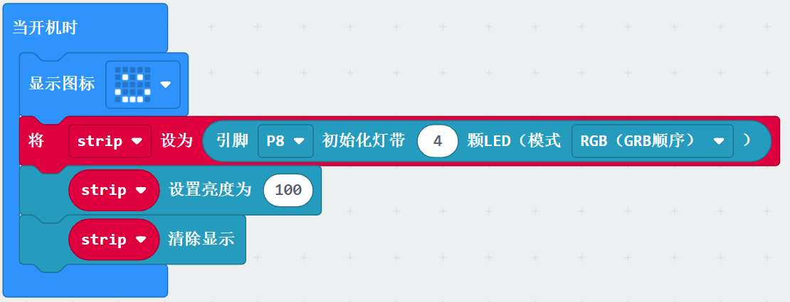

（5）先点击“变量”模块，再点击“设置变量”出现“新变量的名称：”对话框，在对话框中输入distance，点击“OK”，建立了变量“distance”，拖出指令方块“将
distance 设为 0”放入“当开机时”指令方块中。

5  设为
    0”放入“无限循环”指令方块中。再点击“TurtleBit”模块，找到并拖出“Ultrasonic”指令方块放入设为
    后面的数字0处。

6  点击“逻辑”模块，先找到并拖出指令方块“如果为 true     则”放入“无限循环”指令方块中，接着找到并拖出“and”方块放入true处方框中。

（7）先点击“逻辑”模块，找到并拖出“=”放入“与”左侧方框中，再点击“变量”模块，找到并拖出变量指令方块“distance”放入“=”左侧方框中，点击“=”后面的下拉三角形按钮选择“≥”，接着将“≥”后面的数字0改成10，再复制代码块“distance≥10”1次放入“与”右侧的方框中，点击“≥”后面的下拉三角形按钮选择“≤”，将“≤”后面的数字10改成30。

0
%”放入“则”下，将数字0改成80；再点击“Neopixel”模块，找到并拖出指令方块“strip show color red”放入“则”下。

9  复制代码串

1次放入“无限循环”指令方块中，删除代码块“distance≥10”和“与”方块，将代码块“distance≤30”放入true处方框中，将“≤”后面的数字30改成6，点击Run_forward后面的下拉三角形按钮选择Run_back，再将再Run_back后面的数字80改成60，点击“红”后面的下拉三角形按钮选择“黄”。

10 先复制代码串
    ”，点击“TurtleBit”模块，找到并拖出指令方块“car     stop”放入“则”下，点击“黄”后面的下拉三角形按钮选择“白”。

完整的代码程序：

①“当开机时”指令方块仅运行一次以启动程序。

②LED点阵显示“”图案。

③将strip设为引脚P5初始化灯带4颗LED（模式RGB（GRB顺序））

④设置4个WS2812 RGB亮度（PWM）为100

⑤关闭条带上所有的RGB灯。

⑥将变量distance设为0

⑦在“无限循环”指令方块之内，程序循环运行。

⑧将变量distance设为超声波传感器读取的距离值。

⑨当10cm≤distance≤30cm成立时，执行then下的程序

⑩小车以80%速度前进

⑪strip上4个WS2812 RGB都亮红色灯

⑫当distance≤6cm成立时，执行“则”下的程序

⑬小车以60%速度后退

⑭strip上4个WS2812RGB都亮黄色灯

⑮当6cm\<distance\<10cm或distance\>30cm成立时，执行“则”下的程序

⑯小车停止

⑰strip上4个WS2812RGB都亮白色灯

点击micro:
bit在线编程工具的“JSJavaScript”,你可以看到对应的JavaScript语言代码程序：

5  实验结果：

按照之前的方式将代码下载到micro：bit，确定已经将Micro:bit的电机驱动扩展板上的POWER拨码开关拨到ON一端。这样，小车可以跟随前方障碍物的移动而移动。小车不同的运动状态，4个WS2812 RGB灯亮起不同的颜色。

注意：障碍物只能在小车的正前方移动，不能拐弯。

### 19：红外控制小车

#### 191：红外遥控解码

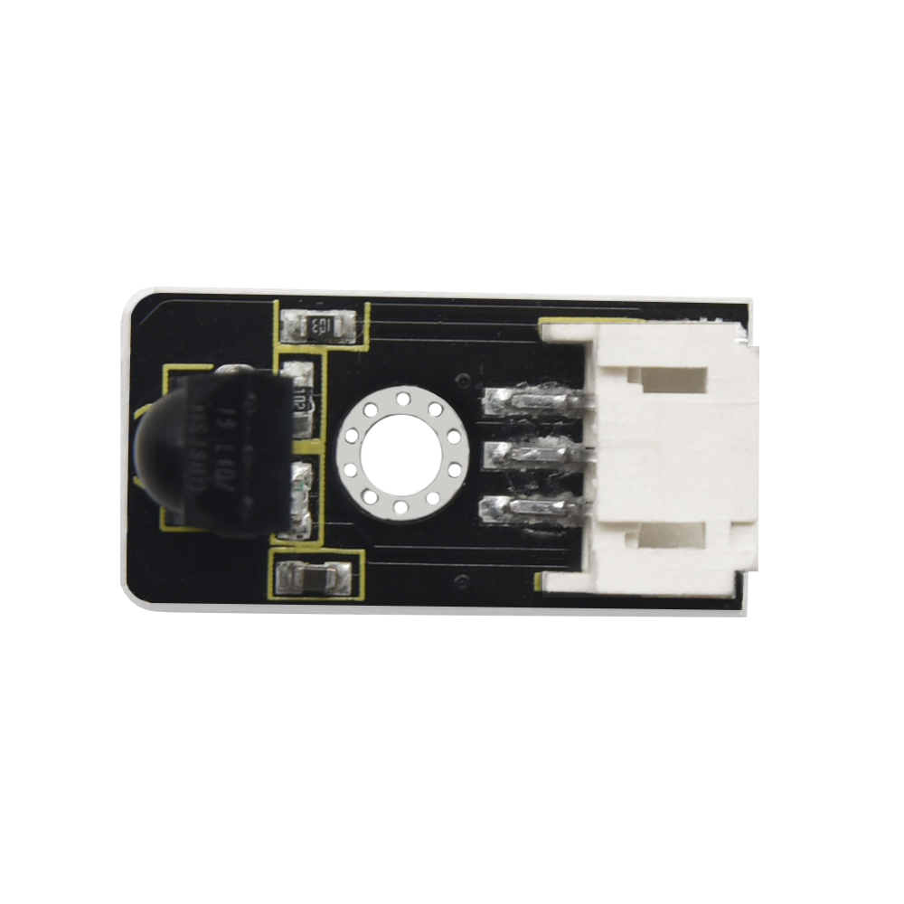

1 实验说明：

毫无疑问，红外遥控在日常生活中随处可见，以至于很难想象没有它世界会变得怎样。它被用来控制各种家电，如电视、音响、录影机和卫星信号接收器。红外遥控是由红外发射和红外接收系统组成的，也就是一个红外遥控器和红外接收模块和一个能解码的单片机组成的，我们看图示。

红外发射的遥控器发射的38K红外载波信号是由遥控器里的编码芯片对其进行编码。它是以一段引导码，用户码，数据码，数据反码组成，利用脉冲的时间间隔来区别是信号0还是信号1(高电平低电平之比约为1:1时被认为是信号0)，而编码就是由这些0
、1信号组成。同一个遥控器的用户码是不变的，用数据码不同来分辨遥控器按的键不同。当按下遥控器按键时，遥控器发送出红外载波信号，红外接收器接收到信号时程序对载波信号进行解码，通过数据码的不同来判断按下的是哪个键。单片机由接收到的0、1信号进行解码，由此判断遥控器按下的是什么键。

红外接收就是扩展板上自带的红外接收模块，主要由红外接收头组成，它是集接收、放大、解调一体的器件，它内部IC就已经完成了解调，能够完成从红外线接收到输出与TTL电平信号兼容的所有工作，输出的就是数字信号。它适用于红外线遥控和红外线数据传输。

根据上面的接线图可知，乌龟车上的红外接收模块的集成端口是接在micro:bit电机驱动扩展板上P11 5V G集合端口，由micro:bit的P11控制的。

2  规格参数：

工作电压：33-5V（DC）

接口：3PIN接口

输出信号：数字信号

接收角度：90度

频率：38khz

遥控范围：5米左右

3  准备：

（1）将micro：bit主板正确插入keyes Micro:bit迷你智能乌龟车。

（2）将电池装入keyes Micro:bit迷你智能乌龟车。

（3）将Micro:bit的电机驱动扩展板上的POWER拨码开关拨到ON一端，开启电源。

（4）通过micro USB线连接micro:bit主板和电脑。

（5）打开Web版本的Makecode。

如果选择通过导入Hex文件来加载项目，则无需手动添加turtle-bit扩展库。

如果选择手动拖动代码，则首先需要添加turtle-bit扩展库。

4  实验代码：

根据下表加载代码（如何加载？）如下图：

|文件类型|路径|文件名|
|-|-|-|
|Hex file|/1Makecode 教程\Micro bit测试程序完整版\819：红外控制小车\8191：红外遥控解码|microbit-红外遥控解码hex|

也可以自己通过拖动代码块来编写代码程序，操作步骤如下：

（1）点击“高级”下的“串行”模块，找到并拖出指令方块“串行
重定向到 USB”放入“当开机时”指令方块中。

（3）点击“IrRemote”模块，找到并拖出指令方块“connect IR receiver at P0”放入“当开机时”指令方块中，由于乌龟车上的红外接收模块由micro:bit的P11控制的，所以点击P0后面的下拉三角形按钮选择P11。

4  点击“变量”模块，再点击“设置变量”出现“新变量的名称：”对话框，在对话框中输入“val”，点击“OK”，建立了变量“val”,拖出指令方块“将
    val 设为0”放入指令方块“无限循环”中。

5  点击“IrRemote”模块，找到并拖出指令方块“IR     button”放入指令方块“将 val 设为 0”中的to 后面的0处。

6  先点击“高级”下的“串行”模块，找到并拖出指令方块“串行
    串行写入数值
    “x”=0”放入“无限循环”指令方块中，将“x”改成“IR”,再点击点击“变量”模块，找到并拖出变量指令方块“val”放入“=”右侧的数字0处。

（7）点击“基础”模块，找到并拖出指令方块“暂停 (ms) 100”放入“无限循环”指令方块中，设置延时时间为1000毫秒。

完整的代码程序：

①“当开机时”指令方块仅运行一次以启动程序。

②串行重定向USB。

③将IR接收器接在P11

④在“无限循环”指令方块之内，程序循环运行

⑤将val设为IR button

⑥串行写入数值IR=val

⑦延时时间1000毫秒

点击micro:
bit在线编程工具的“JSJavaScript”,你可以看到对应的JavaScript语言代码程序：

代码说明：没有按下红外遥控器上的按键时，串口监视器不断地刷新显示数字0。当按下红外遥控器上的按键时，串口监视器中显示出对应的按键键值。

特别注意：

1、有些红外遥控不带电池，需要自己配置，电池型号为CR2025。

2、测试前需要确保红外遥控是OK的，有一个小诀窍测试红外遥控是否OK。

打开手机摄像头拍照，红外遥控多准手机摄像头按下按键。如果在手机上看到有紫光闪烁，就代表红外遥控是OK的。

按照之前的方式将代码下载到micro:bit，micro USB线不要从micro：bit上拔下来，利用micro USB线上电，接下来点击显示数据(设备)按钮：

红外遥控器对准小车扩展板上的红外接收器，按下对应按键，显示数据(设备)窗口中就可以显示出对应按键的键值，显示如下图。

如果你的电脑系统是Windows7/8而不是Windows 10，则在Google Chrome中是不能进行设备配对，从而读取不了相应的数字信号或模拟信号，可是又需要读取相应的传感器/模块的数字信号或模拟信号，那怎么办呢？这里就可以使用CoolTerm软件来读取串口的。

打开CoolTerm，点击Options，选择串行Port，设置COM口和波特率，波特率设置为115200（经过测试，micro:bit的USB串口通讯波特率是115200），点击OK后，最后点击Connect。这样，CoolTerm串口监视器显示对应按键的键值，显示如下图。

我们通过得出的数值，做了一个红外遥控器按键值表，方便以后使用。

#### 192：红外控制小车

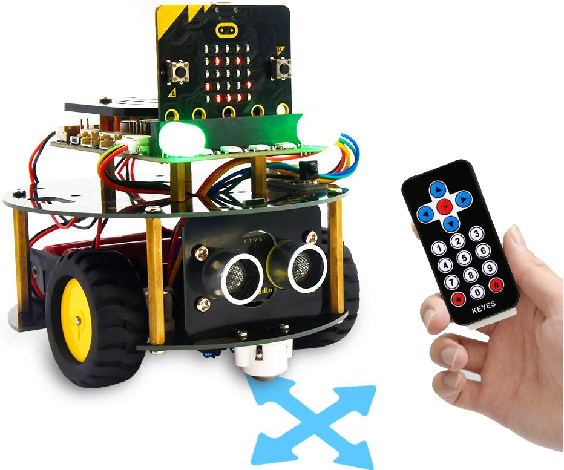

1  实验说明：

红外遥控小车的实现主要靠的是红外信号的传递，小车接收到红外信号后经过解码会得到具体的数值，小车再依据相应的数值来执行相对应的操作。

前面的课程我们结合了循迹传感器和小车扩展板等结合，制作了一款循迹小车；在这课程中，我们利用红外遥控和小车扩展板等结合，制作一个红外控制小车。

它的原理就是，通过红外遥控发送按键信号，小车扩展板上红外接收模块接收到对用的按键信号，从而控制小车进行对应的运动状态。

2  准备：

（1）将micro：bit主板正确插入keyes Micro:bit迷你智能乌龟车。

（2）将电池装入keyes Micro:bit迷你智能乌龟车。

（3）将Micro:bit的电机驱动扩展板上的POWER拨码开关拨到ON一端，开启电源。

（4）通过micro USB线连接micro：bit主板和电脑。

（5）打开Web版本的Makecode。

如果选择通过导入Hex文件来加载项目，则无需手动添加turtle-bit扩展库。

如果选择手动拖动代码，则首先需要添加turtle-bit扩展库。

警告：红外接收传感器和红外遥控器应避免在阳光等有红外干扰的环境中使用。阳光中含有大量的不可见光，如红外线和紫外线。在阳光强烈的环境下，红外接收传感器不能正常工作。

3  编程思路：

编程流程图：

4  实验代码:

根据下表加载代码（如何加载？）如下图：

|文件类型|路径|文件名|
|-|-|-|
|Hex file|/1Makecode 教程\Micro bit测试程序完整版\819：红外控制小车\8192：红外控制小车|microbit-红外遥控小车hex|

也可以自己通过拖动代码块来编写代码程序，操作步骤如下：

（1）点击“Ir Remote”模块，找到并拖出指令方块“connect IR receiver at P0”放入“当开机时”指令方块中，由于乌龟车上的红外接收器是由micro:bit的P11控制的，所以点击P0后面的下拉三角形按钮选择P11。

strip
设为 引脚 P0初始化灯带 24 颗LED 模式 RGB(GRB 顺序)(GRB
顺序)”放入指令方块“当开机时”中，由于4个WS2812RGB灯的信号端P8对应的是由micro:
bit的P8控制端控制的，所以点击P0后面的下拉三角形按钮选择P8。又因为只有4个WS2812 RGB灯，所以将leds前面的数字24改成4，点击RGB(GRB
顺序)后面的下拉三角形按钮选择RGB(GRB 顺序)。

（3）先点击“变量”模块，再点击“设置变量”出现“新变量的名称：”对话框，在对话框中分别输入“val”，点击“OK”，建立了变量“val”。用同样的方法再建立变量“val2”，找到并拖出指令方块“将
val2 设为
0”放入“当开机时”指令方块中并复制1次也放入“当开机时”指令方块中，点击第一个val2后面的下拉三角形按钮选择val。

val2
设为
0”放入“无限循环”指令方块中，点击val2后面的下拉三角形按钮选择val，再点击“IrRemote”模块，找到并拖出指令方块“IR button”放入“设为”后面的数字0处。

true
则”放入“无限循环”指令方块中，接着找到并拖出“=”方块放入“true”处方框中。再点击“变量”模块，找到并拖出变量指令方块“val”放入“=”左侧，“=”右侧的数字0不变，再点击“=”后面的下拉三角形按钮选择“≠”。

val2
设为 0”放入“则”的下方，再找到并拖出变量指令方块“val”放入指令方块“将 val2
设为 0”中的“设为”后面的0处。

7  点击“逻辑”模块，先找到并拖出指令方块“如果为则否则”放入“则”的下方，接着点击指令方块“如果为则否则”的“

”图案4次，再点击“否则”后面的“

”图案1次删除“否则”，又再次找到并拖出“=”方块放入“true”处方框中。

（8）点击“变量”模块，找到并拖出变量指令方块“val2”放入“=”左侧，将“=”右侧的数字0改成70。

speed:
0%”放入第二个“则”下，将数字0改成90；再点击“Neopixel”模块，找到并拖出指令方块“strip
显示颜色红”也放入第二个“则”下，点击“红”后面的下拉三角形按钮选择“绿”。

（10）复制代码块“val2=70”1次放入第一个否则如果为
后面方框中，将“=”后面的数字70改成68。

speed:
0%”放入第三个then下，将数字0改成60，接着复制指令方块“LeftSide motor run Forward speed:
60%”1次也放入第三个“则”下，点击LeftSide后面的下拉三角形按钮选择RightSide，并将数字60改成85；再点击“Neopixel”模块，找到并拖出指令方块“strip show color red”也放入第三个“则”下，点击‘红’后面的下拉三角形按钮选择“蓝”。

（12）先复制代码块“val2=68”1次放入第二个否则如果为
后面方框中，将“=”后面的数字68改成67；再复制代码块串

1次放入第四个“则”下
，将LeftSide后面的数字60改成85，RightSide后面的数字85改成60，点击“蓝”后面的下拉三角形按钮选择“黄”。

（13）先复制代码块“val2=67”1次放入第三个否则如果为
后面方框中，将“=”后面的数字67改成21；在复制第二个“则”下的代码串

1次放入第五个“则”下，点击Run_forward后面的下拉三角形按钮选择Run_back，点击“绿”后面的下拉三角形按钮选择”紫”，其他的不变。

（14）先复制代码块“val2=21”1次放入第四个否则如果为
后面方框中，将“=”后面的数字21改成64；接着点击“TurtleBit”模块，找到并拖出指令方块“car stop”放入第五个“则”下，复制第五个“则”下的指令方块“strip show color purple”1次放入第六个“则”下，点击”紫”后面的下拉三角形按钮选择“红”。

完整的代码程序：

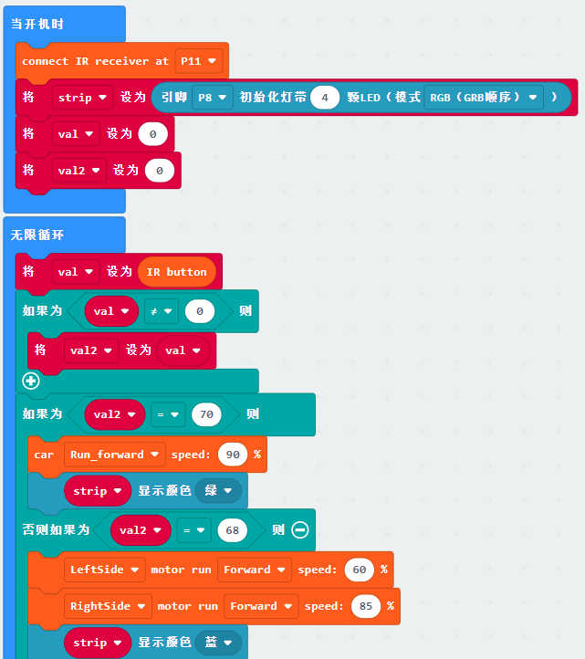

①“当开机时”指令方块仅运行一次以启动程序。

②将IR接收器接在P16

③将strip设为引脚P5初始化灯带18颗LED（模式RGB（GRB顺序））

④将变量val设为0

⑤将变量val2设为0

⑥在“无限循环”指令方块之内，程序循环运行

⑦将val设为IR button

⑧当变量val≠0成立时，执行“则”下程序

⑨将变量val2设为val

⑩当val2=70成立时，执行“则”下的程序

⑪小车以40%速度前进

⑫strip上18个RGB亮绿色灯

⑬当val2=68成立时，执行“则”下的程序

⑭小车的左轮以15%速度前进

⑮小车的右轮以35%速度前进

⑯strip上18个RGB亮蓝色灯

⑰当val2=67成立时，执行“则”下的程序

⑱小车的左轮以35%速度前进

⑲小车的右轮以15%速度前进

⑳strip上18个RGB亮黄色灯

㉑当val2=21成立时，执行“则”下的程序

㉒小车以40%速度后退

㉓strip上18个RGB亮紫色灯

㉔当val2=64成立时，执行“则”下的程序

㉕小车停止

㉖strip上18个RGB亮红色灯

点击micro:
bit在线编程工具的“JSJavaScript”,你可以看到对应的JavaScript语言代码程序：

5实验结果：

按照之前的方式将代码下载到micro:bit，确定已经将Micro:bit的电机驱动扩展板上的POWER拨码开关拨到ON一端。这样，红外遥控对准扩展板的红外接收头，按下按键，即可控制小车运动。其中，

按键控制小车后退，

按键控制小车停止，同时4个WS2812RGB灯亮起对应的颜色灯。

注意：测试时，红外遥控需正对小车扩展板后面的红外接收头，距离最好不超过5米左右。

### 20：蓝牙多功能小车

#### 201：读取蓝牙数据

1  实验说明：

在micro:bit控制板上自带有蓝牙，可以通过蓝牙方式与Micro:bit通讯，可以用蓝牙控制Micro:bit，或者Micro:bit通过蓝牙把信号传回手机或者电脑，我们可以利用micro:bit上自带的蓝牙和手机蓝牙APP通信，利用蓝牙手机APP控制micro:bit外接设备工作。Micro:bit上自带的蓝牙既支持安卓系统手机，也支持IOS系统设备（手机或iPad）。我们为您提供两种蓝牙APP，适用于安卓系和IOS系统。这两种APP连接Micro:bit蓝牙的方法是类似的。在这一课程中，我们主要介绍蓝牙APP的使用和APP界面上各按钮的功能，并且通过蓝牙APP连接Micro:bit上的蓝牙来读取了APP界面上各按钮发送的控制字符。

2  准备：

（1）将micro:bit主板正确插入keyes Micro:bit迷你智能乌龟车。

（2）将电池装入keyes Micro:bit迷你智能乌龟车。

（3）将Micro:bit的电机驱动扩展板上的POWER拨码开关拨到ON一端，开启电源。

（4）通过micro USB线连接micro:bit主板和电脑。

（5）打开Web版本的Makecode。

如果选择通过导入Hex文件来加载项目，则无需手动添加turtle-bit扩展库。

如果选择手动拖动代码，则首先需要添加turtle-bit扩展库。

由于micro:bit的硬件原因，蓝牙和无线电不能同时工作，所以它们的扩展库互不兼容。安装蓝牙扩展库时，系统将提示您删除无线电扩展。只需确认移除就行。

3 实验代码：

根据下表加载代码（如何加载？）如下图：

|文件类型|路径|文件名|
|-|-|-|
|Hex file|/1Makecode 教程\Micro bit测试程序完整版\820：蓝牙多功能小车\8201：读取蓝牙数据|microbit-读取蓝牙数据hex|

也可以自己通过拖动代码块来编写代码程序，操作步骤如下：

（1）先移除指令方块“无限循环”，再点击“高级”下的“串行”模块，找到并拖出指令方块“串行
重定向到 USB”放入“当开机时”指令方块中。

（2）点击“蓝牙”模块，找到并拖出指令方块“通过蓝牙连接时”。

（3）点击“基础”模块，找到并拖出指令方块“显示图标”放入“通过蓝牙连接时”指令方块。

（4）点击“变量”模块，再点击“设置变量”出现“新变量的名称：”对话框，在对话框中输入“connected”，点击“OK”，建立了变量“connected”。找到并拖出指令方块“将
connected 设为 0”放入“通过蓝牙连接时”指令方块，将 设为
后面的数字0改成1。

（5）先点击“循环”模块，找到并拖出指令方块“当条件为
true
执行”放入“通过蓝牙连接时”指令方块，接着点击“逻辑”模块，找到并拖出“=”方块；再点击“变量”模块，找到并拖出变量指令方块“connected”放入“=”左侧方框，将右侧方块中的数字0改成1。

（6）先点击“变量”模块，再点击“设置变量”出现“新变量的名称：”对话框，在对话框中输入“rec_data”，点击“OK”，建立了变量“rec_data”。找到并拖出指令方块“将
rec_data 设为 0”放入代码块“当条件为 connected=1
执行”中；再点击“蓝牙”模块下的“更多”，找到并拖出指令方块“读取蓝牙 uart
直至遇到 执行”放入指令方块“将 rec_data 设为 0”中 设为
后面的数字0处，并点击 执行 后面的下拉三角形按钮选择 \#。

（7）先点击“高级”下的“串行”模块，找到并拖出指令方块“串行写入字符串”放入代码块“当条件为
connected=1
执行”中；再点击点击“变量”模块，找到并拖出变量指令方块“rec_data”放入指令方块“串行写入字符串”的文本框中。

（8）再次点击“高级”下的“串行”模块，找到并拖出指令方块“串行写入字符串”放入代码块“当条件为
connected=1 执行”中。

（9）点击“蓝牙”模块，找到并拖出指令方块“断开蓝牙连接时”。

（10）点击“基础”模块，找到并拖出指令方块“显示图标”放入“断开蓝牙连接时”指令方块，点击“❤”图案后面的下拉三角形按钮选择“

”图案。

完整的代码程序

①“当开机时”指令方块仅运行一次以启动程序。

②串行重定向USB。

③通过蓝牙连接到micro:bit时就运行里面的代码

④LED点阵显示“❤”图案

⑤将变量connected设为1

⑥当条件为connected=1时就执行do中代码

⑦将变量rec_data设为读取蓝牙uart，直至遇到#

⑧串行写入字符串rec_data

⑨向串口写入一行空格

⑩断开蓝牙连接到micro:bit时就运行里面的代码

⑪LED点阵显示“”图案

点击micro:
bit在线编程工具的“JSJavaScript”,你可以看到对应的JavaScript语言代码程序：

5实验结果：

（1）实验代码编完之后需要设置，先点击右上角的齿轮图标（设置），再单击“Project Settings”，在文本框中输入“Read the data of Bluetooth”后，将“无需配对”设置为打开状态。（如果是直接导入实验代码的就不需要此操作，而自己拖动代码块编写实验代码的就需要此操作）

（2）设置完之后，按照之前的方式将实验代码下载到micro：bit
，micro USB线不要从micro：bit上拔下来，利用micro USB线上电，下载之后开始下载安装手机/iPad蓝牙APP。

 IOS系统设备（手机/iPad）APP

a打开App Store。

b在搜索框输入keyes Bit Car，点击搜索，再点击“

”，就可以下载keyes Bit Car的蓝牙APP。

c下载完APP后，点击“OPEN”或点击手机/iPad桌面上的应用程序keyes Bit Car就可以打开APP，APP界面出现对话框，在对话框中点击“OK”。

d先开启手机/iPad蓝牙，再点击APP界面左上角的connect按钮（控件）进行蓝牙搜索，在搜索结果中点击“BCC micro:bit”，几秒钟后，蓝牙已连接。

安卓系统APP

1  用浏览器中的扫描功能对着二维码扫描识别，识别成功后点击“go     to website”就可以进入下载keyes_Bit_Carapk页面，点击“Download     immediately”下载keyes Bit Car应用程序。

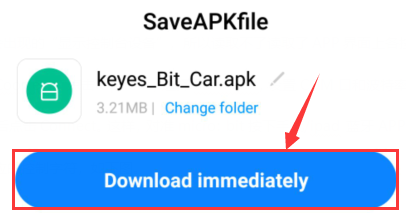

2  点击“Allow     allow”进入安装界面，点击“install”就可以安装好keyes Bit     Car应用程序。

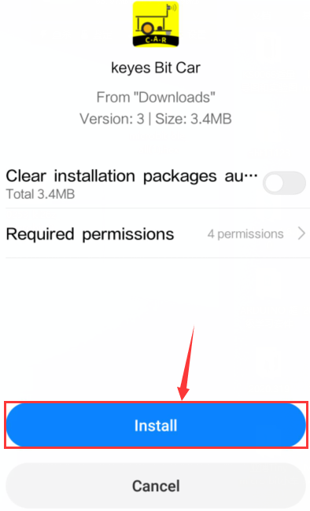

3  点击“Open”或点击手机桌面上的应用程序keyes Bit     Car打开APP，出现对话框，在对话框中点击“Allow”打开手机蓝牙。也可以在打开APP之前先打开手机蓝牙。

4  点击APP界面左上角的“CONNECT”按钮（控件）进行蓝牙搜索，在蓝牙搜索结果中点击“BCC     micro:bit”对话框中的“connect”，几秒钟后，蓝牙已连接。

（3）由于实验代码原因，在MakeCode编辑器中不会出现的“显示控制台设备”，所以读取不了读取了APP界面上各按钮发送的控制字符，这里需要使用CoolTerm程序来读取APP界面上各按钮发送的控制字符。打开CoolTerm，点击Options，选择串行Port，设置COM口和波特率，波特率设置为115200（经过测试，micro:bit的USB串口通讯波特率是115200），点击OK后，最后点击Connect。这样，对准micro：bit按下手机/ipad
蓝牙APP界面上的各按钮（控件），可以看到CoolTerm串口监视器显示出蓝牙APP界面上各按钮（控件）对应的控制字符，如下图。

经过测试，我们得出了手机/ipad
蓝牙APP上各个按钮（控件）对应的功能，如下图：

#### 202：蓝牙多功能小车

1  实验说明：

在上一课程中，我们已经介绍了蓝牙APP的使用和各按钮的功能，并且通过蓝牙APP连接Micro:bit上的蓝牙来读取了APP界面上各按钮发送的控制字符，在本课程中，主要是通过蓝牙APP连接Micro:bit上的蓝牙实现APP控制小车多种功能。

2  准备：

（1）将micro:bit主板正确插入keyes Micro:bit迷你智能乌龟车。

（2）将电池装入keyes Micro:bit迷你智能乌龟车。

（3）将Micro:bit的电机驱动扩展板上的POWER拨码开关拨到ON一端，开启电源。

（4）通过micro USB线连接micro：bit主板和电脑。

（5）打开Web版本的Makecode。

如果选择通过导入Hex文件来加载项目，则无需手动添加turtle-bit和蓝牙扩展库。

如果选择手动拖动代码，则首先需要添加turtle-bit和蓝牙扩展库。

由于micro:bit的硬件原因，蓝牙和无线电不能同时工作，所以它们的扩展库互不兼容。安装蓝牙扩展库时，系统将提示您删除无线电扩展。只需确认移除就行。

3 实验代码：

根据下表加载代码（如何加载？）如下图：

|文件类型|路径|文件名|
|-|-|-|
|Hex file|/1Makecode 教程\Micro bit测试程序完整版\820：蓝牙多功能小车\8202：蓝牙多功能小车|microbit-蓝牙多功能小车hex|

由于这个代码程序比较复杂，步骤比较多，这里我们就不提供编写代码程序的详细操作步骤，如果你自己有兴趣的话，可以自己拖动代码块来操作下。

完整的代码程序

点击micro:
bit在线编程工具的“JSJavaScript”,你可以看到对应的JavaScript语言代码程序：

5实验结果：

micro:bit迷你智能乌龟车执行相应的动作。
先在“项目设置”中，将“无需配对”设置为“打开”状态（如果是直接导入实验代码的就不需要此操作，自己拖动代码块编写代码就需要这里此操作）。按照之前的方式将代码下载到micro：bit，确定已经将Micro:bit的电机驱动扩展板上的POWER拨码开关拨到ON一端。这样，下载之后打开手机/ipad应用程序keyes Bit Car，然后按照前面的方法完成蓝牙连接，那你就可以操作keyes Bit Car蓝牙APP页面上的按钮（控件）来控制Keyes micro:bit迷你智能乌龟车。（因程序比较大，micro:bit的内存无法容纳，程序编译时会报错，需自己删掉一下自己用不到的功能块，方能编译下载）
