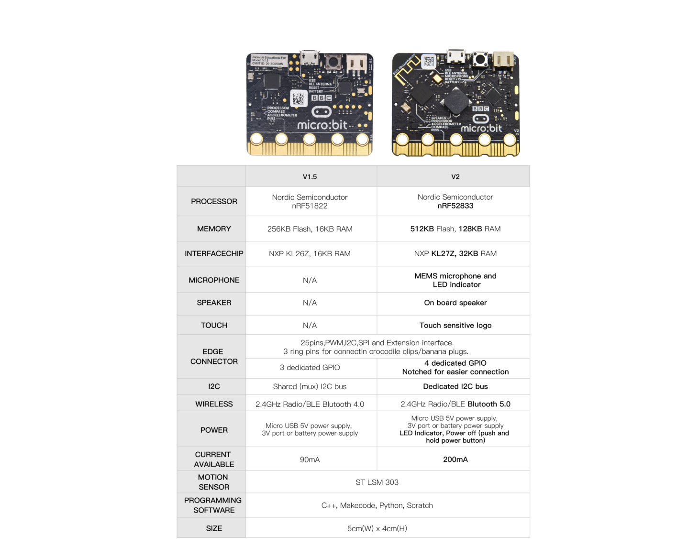
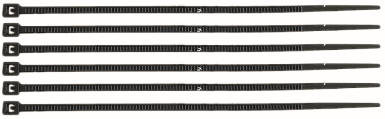
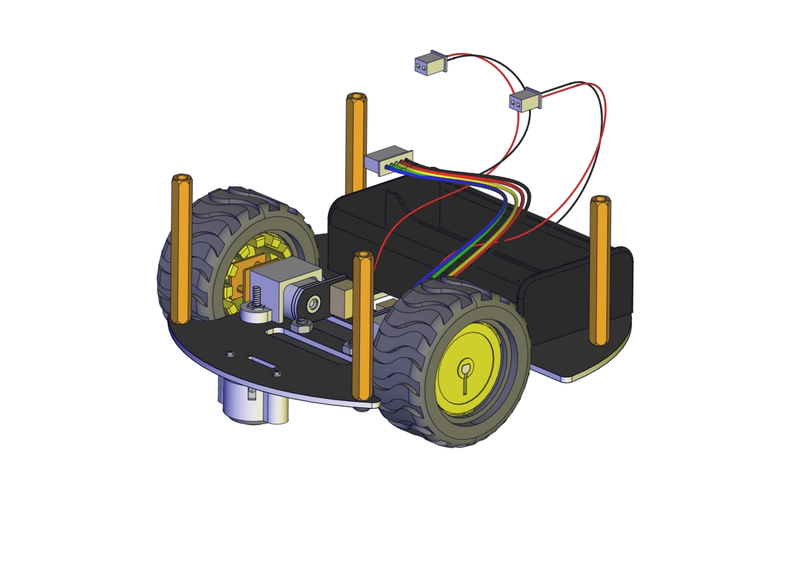
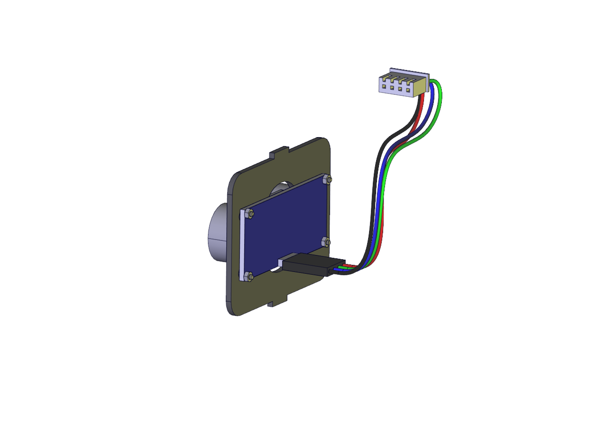
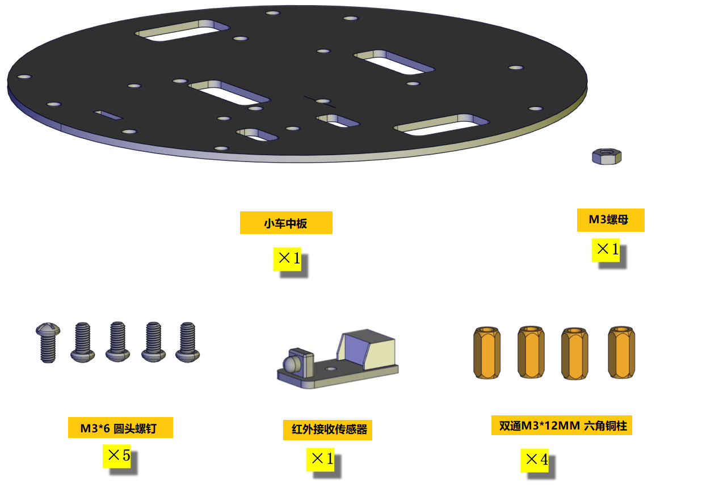
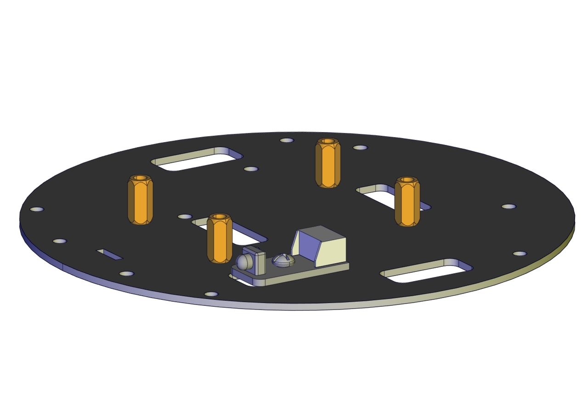

# 清单

当收到这个套件的时候，首先看到是一个包装精美的外盒，每个配件被安全且有序的装在外盒里面的小盒子里，先来清点一下：

Micro:bit 迷你智能乌龟车

电子组件

|No|规格型号|数量|图片|
|-|-|-|-|
|0|Micro:bit V2主板|1||
|1|Keyestudio microbit乌龟车电机驱动扩展板（配有跳线帽）|1||
|2|Keyesquick connectors 红外接收传感器|1||
|3|Keyes quick connectors 循迹传感器|1||
|4|HC-SR04超声波传感器|1||
|5|micro USB线 AM/MK5P(micro)黑色 OD：3.5 L=1M PVC过粉|1||
|6|JMP-1 17键86*40*6.5MM|1||

结构部分
|1|KeyesSmart small turle robot V2.0 底板|1||
|-|-|-|-|
|2|KeyesSmart small turle robot V2.0 中板|1||
|3|microbit乌龟车亚克力板顶板|1||
|4|microbit乌龟车超声波模块固定架|1||
|5|Keyesquick connectors 12FN20电机连接板A|1||
|6|Keyesquick connectors 12FN20电机连接板B|1|
|7|N20电机 白色短 U型 支架 塑胶|2||
|8|N20马达专用车轮|2||
|9|Arduino 3PI miniQ小车万向球 304不锈钢|2||
|10|双头JST-PH2.0MM-5P 24AWG 蓝绿黄红黑线 15CM 反向|1||
|11|PH2.0MM-4P转2.54杜邦母单 绿蓝红黑线 26AWG线长150MM|1||
|12|双头JST-PH2.0MM-3P 24AWG 黄红黑线 8CM 反向|1||
|13|双头JST-PH2.0MM-2P 24AWG红黑线 16CM|2||
|14|18650双节15CM露线适用DIY小车+双头PH2.0MM-2P红黑线(总线长11.5CM)|1||
|15|18650电池|2||

螺丝螺母
|1|M2*12MM 圆头螺钉|6||
|-|-|-|-|
|2|M2 镀镍 螺母|6||
|3|M1.4 镀镍 螺母|4||
|4|M1.4*6MM螺钉|4||
|5|塑胶螺丝垫片|4||
|6|M3*6MM 圆头螺钉|20||
|7|M3*8MM 圆头螺钉|4||
|8|M3*10MM 平头 螺钉|4||
|9|M3 镀镍 螺母|8||
|10|单通M3*15+6MM六角铜柱|4|  |
|11|双通M3*12MM 六角铜柱|4||
|12|双通M3*40MM 六角铜柱|4||

工具及循迹图
|13|3.0*40MM 红黑色 十字螺丝刀 刀头加粗|1||
|-|-|-|-|
|14|循迹轨迹图|1||
|15|黑色 3*100MM扎带|5||

# 功能介绍

RGB灯和其他外围设备。丰富的硬件资源将使您掌握更多的知识和技能，您可以利用自己的想象力创造更多的科技发明。

特征

keyes micro:bit迷你智能乌龟车的功能:

|传感器/元件|可控RGB灯|减速直流电机|无源蜂鸣器|超声波传感器|循迹传感器|红外接收模块|WS2812 RGB灯|电源开关|
|-|-|-|-|-|-|-|-|-|
|数量|2|2|1|1|1|1|4|1|

keyes micro:bit迷你智能乌龟车和micro:bit引脚之间的连接：

|Micro:bit 引脚|keyes micro:bit迷你智能乌龟车上的传感器/元件|
|-|-|
|P0|无源蜂鸣器|
|P1|超声波传感器触发端口Trig（T）|
|P2|超声波传感器接收端口Echo（E）|
|P8|4个WS2812RGB灯|
|P11|红外接收器|
|P14|3路循迹传感器的左侧TCRT5000红外对管|
|P15|3路循迹传感器的中间TCRT5000红外对管|
|P16|3路循迹传感器的右侧TCRT5000红外对管|

供电电池

keyes micro:bit迷你智能乌龟车由2个18650电池供电，小车的电池座可以与任何类型的18650锂电池（可充电）兼容。可以使用通用电池充电器为18650锂电池充电的。

# 安装

1. 安装乌龟车底板和循迹传感器模块

准备以下部分：

完成效果图：

1.  安装电机和电池盒

准备以下部分：

安装：

完成效果图：

2.  安装车轮和双通六角铜柱

    准备以下部分：

    

    安装：

    

    完成效果图：

    

3.  安装超声波模块

    准备以下部分：

    

    安装：

    

    完成效果图：

    

|传感器/模块|模块上引脚|底板上引脚|
|-|-|-|
|HC-SR04超声波传感器模块|Gnd|G|
|Echo|P2|
|Trig|P1|
|Vcc|5V|

4.  安装中板和红外接收器

    准备以下部分：

    

    安装：（注意：安装时需要注意中板的正反面，这里将中板正面上标有“Keyes”字样的一面朝上）

    

    完成效果图：

    

5.  将底板部分、超声波固定架部分和中板部分组合

    准备以下部分：

    

    安装：

    

    完成效果图：

    

6.  安装microbit TB6612电机驱动扩展板

    准备以下部分：

    

    安装：

    

    完成效果图：

    

7.  安装顶板

    准备以下部分：

    

    安装：

    

    完成效果图：

    

8.  安装micro:bit主板

    

    完成效果图：

    

9.  接线

    注意：这里再添加一根3P线，规格：“双头JST-PH2.0MM-3P     24AWG黄红黑线8CM反向”，是用来接红外接收器模块的。

    接线端的黑线对应接在G（-），红线对应接在5V（+）。

|传感器模块/元件|电池盒|电机A（左）|电机B（右）|循迹传感器模块|红外接收器模块|超声波模块|
|-|-|-|-|-|-|-|
|Microbit电机驱动扩展板对应接口|7-12V IN（+ -）|A1|B1|P16 P15 P14 5V G|P11 5V G|P2 P1 5V G|

超声波模块接线 电机A（左）接线

电机B（右）接线 电池盒接线

循迹传感器模块接线 红外接收器接线

总的安装接线图
